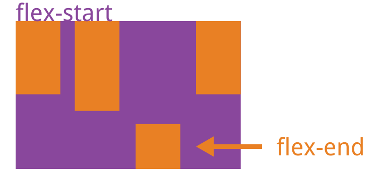

---
{
  "title": "flex布局align-self使用场景",
  "staticFileName": "align_self.html",
  "author": "guoqzuo",
  "createDate": "2019/11/21",
  "description": "一般flex布局，使用algin-items: center垂直居中后，item子项某一个高度比较高，其他子项的高度也会是高度最高的子项高度。设置border时会特别明显。如果需要让item高度适应内容，就可以使用 align-self: flex-start。",
  "keywords": "align-self,flex align-self使用场景",
  "category": "CSS"
}
---

# flex布局align-self使用场景

一般flex布局，使用algin-items: center垂直居中后，item子项某一个高度比较高，其他子项的高度也会是高度最高的子项高度。设置border时会特别明显。如果需要让item高度适应内容，就可以使用 align-self: flex-start。

参考之前的笔记：[align-self（item独立对齐方式）- flex与grid布局](https://www.yuque.com/guoqzuo/js_es6/kg7660#45717a91)