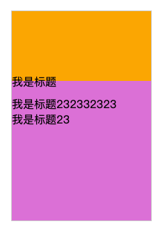

# position:absolute元素高度自适应，换成relative设置top试试

一般元素设置position:absolute后，就已经脱离了文档流，用css是无法计算其高度的，只能用js获取dom来计算。另外不要把自己限制死了，对于自适应高度的，为什么一定要使用position:absolute呢？**换position:relative也可以设置top、left等css属性**，如果自己真的想不到好的方法，问问其他同事或社群里的人试试？下面来看看我之前由于知识盲点踩的一个坑

## 一个例子
```html
<!--
页面布局：
顶部背景图 // 非透明   
中间主内容 // 中间内容也有背景，内容里的title需要有一部分放到top背景区域
底部背景图
-->
<div class="container">
  <!-- 顶部背景区域 -->
  <section class="top"></section>
  <!-- 中间主要内容-->
  <section class="main">
    <div class="main-title" id="autoHeightTitle">我是标题</div>
    <div id="autoMarginTop">产品信息</div>
  </section>
  <!-- 顶部背景区域-->
  <section class="bottom"></section>
</div>
```
最开始的思路：
1. 直接将main-title 设置margin-top: -20px，但这样会导致中间主内容整体上移，覆盖顶部部分内容，不可行
2. 然后想到使用background-position属性将中间部分内容背景顶部开始位置设置20px左右，这样margin上去后，部分内容使用的就会是顶部的背景。但中间部分内容又设置了backgroud-repeat属性，导致background-position设置失效。不可行
3. 换个思路，将main-title再用一层div包裹，外层div position设置为relative, main-title设置为position:absolute，这样 top:-20px 即可实现需求。

但问题来了。标题如果过长，会分行显示(可能是2行，3行，4行)，这样会覆盖下面的产品信息。所以需要知道标题的高度。但标题是position：absolute的，已经脱离的文档流，无法对现有文档布局造成影响。

貌似没有css的解决方法，只能通过dom，计算title高度，然后将产品信息设置对应的margin-top，js计算div高度
```js
let heigt = document.getElementById('autoHeightTitle').clientHeight - relatvie包裹元素高度 + 'px'
document.getElementById('autoMarginTop').style.marginTop = height
```



## 更好的方法position:relative
标题使用 position:relative; top:-10px 就可以了，之前一直不知道position:relative也可以设置top等属性，看来基础还是欠缺


完整demo源码: [css将部分内容放到其他区域 - github](https://github.com/zuoxiaobai/fedemo/blob/master/src/DebugDemo/css%E5%B0%86%E9%83%A8%E5%88%86%E5%86%85%E5%AE%B9%E6%94%BE%E5%88%B0%E5%85%B6%E4%BB%96%E5%8C%BA%E5%9F%9F/index.html)

demo地址：[css将部分内容放到其他区域 - 在线演示](https://zuoxiaobai.github.io/fedemo//src/DebugDemo/css%E5%B0%86%E9%83%A8%E5%88%86%E5%86%85%E5%AE%B9%E6%94%BE%E5%88%B0%E5%85%B6%E4%BB%96%E5%8C%BA%E5%9F%9F/index.html)