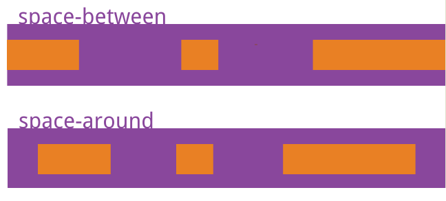

---
{
  "title": "space-between与space-around的区别",
  "staticFileName": "flex_justify.html",
  "author": "guoqzuo",
  "createDate": "2019/11/15",
  "description": "flex布局justify-content属性值区别，space-between 最左、最右item贴合左侧或右侧边框，item与item之间间距相等。space-around 每个item 左右方向的margin相等。两个item中间的间距会比较大",
  "keywords": "space-between 间距,space-around怎么使用,space-between与space-around的区别,space-around什么意思,space-around,space-around 三个 不居中,space-around调距离,",
  "category": "CSS"
}
---

# space-between与space-around的区别

flex布局justify-content属性值区别

- space-between 最左、最右item贴合左侧或右侧边框，item与item之间间距相等。
- space-around 每个item 左右方向的margin相等。两个item中间的间距会比较大

参考之前的笔记：[justify-content(主轴对齐) - flex与grid布局](https://www.yuque.com/guoqzuo/js_es6/kg7660#fab40284)