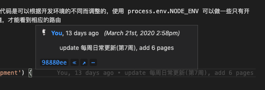
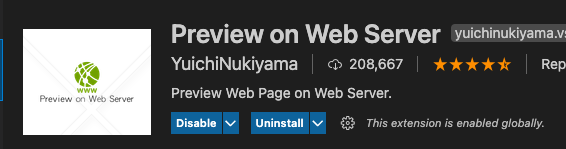
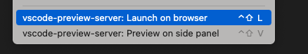

---
{
  "title": "vscode 插件推荐，前端开发 vscode 常用插件",
  "staticFileName": "vscode_plugin.html",
  "author": "guoqzuo",
  "createDate": "2019/11/12",
  "description": "vscode 好用的插件推荐，在前端开发中，一般使用 vscode 来做开发，下面是一些开发中用的较多的插件推荐：Vetur、Vue VSCode snippets、GitLens、Preview on Web Server、ESLint 等",
  "keywords": "vscode好用的插件,vscode实用插件",
  "category": "计算机基础与开发工具"
}
---

# vscode 插件推荐，前端开发 vscode 常用插件

vscode 好用的插件推荐，在前端开发中，一般使用 vscode 来做开发，下面是一些开发中用的较多的插件推荐：Vetur、Vue VSCode snippets、GitLens、Preview on Web Server、ESLint 等

## Vetur
Vue 语法高亮、错误检查，Vue 开发必备

## Vue VSCode snippets
v 系列指令可以快速写功能。不用手动去敲。比如基本结构 vbase 回车即可创建基本 vue 单文件结构, vdata 可以快速创建 data，vmethods 可以快速创建 methods，等等

## GitLens
vscode插件名称: "GitLens -- Git supercharged"，安装后点击某一行代码，都会显示最近的 git 提交记录，在维护代码时，可以很快的知道代码最近是谁修改的，做了哪些更改等。

## Preview on Web Server
使用 http 方式（非默认的文件方式）快速调试单个 html 文件。在 html 文件编辑区域，右键 => Launch on browser，可以快速以 http 的方式打开 html 并实时更新，不需要自己搭建 node 服务或 nginx 

右键可以选择浏览器打开，或者在 vscode 侧边栏预览

## ESLint

对于依赖 eslint/prettier 的项目，安装该插件后，可以配置保存后，自动 fix，参考：[2020 vscode配置eslint保存后自动fix | 左小白的技术日常](http://www.zuo11.com/blog/2019/10/devtools_autofix.html)