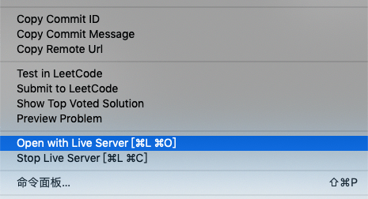
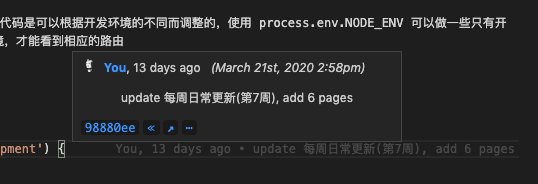

# vscode好用的插件

在前端开发中，一般使用vscode开发工具，我一般比较推荐两款vscode插件，下面来看看

## live server

在html文件编辑区域，右键 => open With live server，可以开启http服务，不需要自己搭建node服务或nginx

## GitLens

vscode插件名称: "GitLens -- Git supercharged"，安装后点击某一行代码，都会显示最近的git提交记录，非常好的一个git插件

