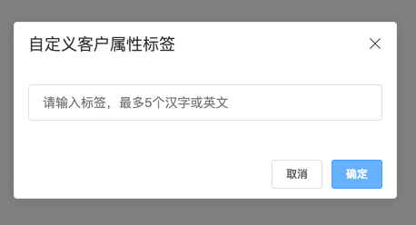
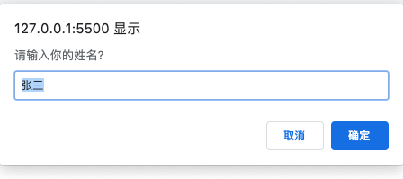

---
{
  "title": "原生JS封装prompt组件",
  "staticFileName": "custom_prompt.html",
  "author": "guoqzuo",
  "createDate": "2019/11/09",
  "description": "自定义prompt组件，原生JS封装prompt，就项目中要用到prompt功能，但需要优化下UI，整体导入elementUI不合适，就自己用原生JS写了个。样式、div结构，直接从elementUI message-box审查元素里面抽离，相关点击事件，校验，自己封装。",
  "keywords": "自定义prompt,原生js自定义prompt组件",
  "category": "JavaScript"
}
---

# 原生JS封装prompt组件

旧项目中要用到prompt功能，但需要优化下UI，整体导入elementUI不合适，就自己用原生JS写了个。样式、div结构，直接从elementUI message-box审查元素里面抽离，相关点击事件，校验，自己封装。

先来看看效果：[自定义prompt组件 - 在线演示](https://zuoxiaobai.github.io/fedemo/src/DebugDemo/prompt/)



## 系统默认window.prompt()样式
先来看原生的prompt
```js
// prompt打开一个对话框，里面包含一个文本输入框，第一个参数为提示内容，第二个参数为输入框的默认值
// 当点击取消返回null，更改内容后返回对应输入框的内容，如果填写为空，返回""
alert(prompt('请输入你的姓名?', '张三'));
```


## 自己封装一个prompt组件
为什么我们要自己封装呢？原生prompt的不足:
1. 标题会附带网站url信息
2. 无法提示校验错误信息
3. 各个浏览器的弹窗样式不统一，与UI稿设计给的不一致

### 封装函数
```js
/**
 * 向window挂载 elcustomPrompt 函数，代替系统的prompt
 * window.elCustomPrompt  IE9+
 * 从 element UI中抽出messagebox样式结构
 */
(function() {
  /**
   * @description elementUI风格自定义propmt封装
   * @param { String } title  标题propmt第一个参数
   * @param { String } placeholder input的placeholder
   * @param { Function } validateFunc 动态校验值函数
   *   - 点击确认后，执行的函数，参数为当前值， 
   *   - return格式:
   *     { result: true, msg: '成功'}
   *     { result: false, msg: '自定义错误信息' }
   * 考虑到阻塞程序向下执行，兼容性问题，不使用promise，使用回调函数。
   * @param { Function } callback 获取到值后的回调
   */
  function elCustomPrompt(title, placeholder, validateFunc, callback) {
    console.log('show elCustomPrompt')
    var deleteImgUrl = 'delete.png' // 16 * 16
    var errMsg = '' // 错误信息

    // 创建dom并挂载
    var domStr = '<!--遮罩--><div class="v-modal" tabindex="0" style="z-index:2054;"></div><!--弹窗_start--><div id="elCustomPromptMain" tabindex="-1" role="dialog" class="el-message-box__wrapper" style="z-index:2055;"><!--消息盒子_Start--><div class="el-message-box" id="elCustomPromptMessageBox"><!--顶部title以及关闭按钮--><div class="el-message-box__header"><div class="el-message-box__title"><span>'+title+'</span></div><button type="button" aria-label="Close" class="el-message-box__headerbtn" id="elCustomPromptCloseBtn"></button></div><!--内容--><div class="el-message-box__content"><div class="el-message-box__input"><div class="el-input"><input type="text" id="elCustomPromptInput" autocomplete="off" placeholder="'+placeholder+'" class="el-input__inner"></div><div class="el-message-box__errormsg" id="elCustomPromptErrMsgDiv" style="visibility:hidden;">'+errMsg+'</div></div></div><!--底部按钮--><div class="el-message-box__btns"><button type="button" class="el-button el-button--default el-button--small" id="elCustomPromptCancelBtn"><span>取消</span></button><button type="button" class="el-button el-button--default el-button--small el-button--primary" id="elCustomPromptOkBtn" disabled="disabled"><span>确定</span></button></div></div><!--消息盒子_end--></div><!--弹窗_end-->'

    var div = document.createElement('div')
    div.setAttribute('id', 'elCustomPromptDiv')
    div.innerHTML = domStr
    document.body.appendChild(div)

    // 移除弹窗框
    function removeDiv() {
      document.body.removeChild(div)
    }

    // 绑定事件
    var elCustomPromptErrMsgDiv = document.getElementById('elCustomPromptErrMsgDiv'), 
        elCustomPromptCloseBtn = document.getElementById('elCustomPromptCloseBtn'),
        elCustomPromptCancelBtn = document.getElementById('elCustomPromptCancelBtn'),
        elCustomPromptOkBtn = document.getElementById('elCustomPromptOkBtn'),
        elCustomPromptInput = document.getElementById('elCustomPromptInput'),
        elCustomPromptMain = document.getElementById('elCustomPromptMain')
        elCustomPromptMessageBox = document.getElementById('elCustomPromptMessageBox')

    // 关闭弹窗、取消事件
    elCustomPromptCloseBtn.onclick = function() {
      removeDiv()
    }
    elCustomPromptCancelBtn.onclick = function() {
      removeDiv()
    }

    // 点击确定后的操作
    elCustomPromptOkBtn.onclick = function() {
      console.log('点击了确定')

      // 再次校验
      let tempResult = validateFunc(elCustomPromptInput.value)
      if (!tempResult.result) {
        elCustomPromptErrMsgDiv.style.visibility = 'visible'
        elCustomPromptErrMsgDiv.innerHTML = tempResult.msg
        elCustomPromptOkBtn.setAttribute('disabled', 'disabled')
        return
      }

      // 关闭 弹窗，调用callback
      removeDiv()
      callback(elCustomPromptInput.value)
    }

    // 输入事件
    elCustomPromptInput.oninput = function(e) {
      console.log(elCustomPromptInput.value)

      // 校验并显示信息
      var tempResult = validateFunc(elCustomPromptInput.value)
      console.log(tempResult)
      if (tempResult.result) {
        console.log('成功')
        // 校验成功
        elCustomPromptErrMsgDiv.style.visibility = 'hidden'
        elCustomPromptErrMsgDiv.innerHTML = ''
        elCustomPromptOkBtn.removeAttribute('disabled')
      } else {
        // 校验失败
        console.log('失败')
        elCustomPromptErrMsgDiv.style.visibility = 'visible'
        elCustomPromptErrMsgDiv.innerHTML = tempResult.msg
        elCustomPromptOkBtn.setAttribute('disabled', 'disabled')
      }
    }

    // 空白位置点击关闭弹窗
    elCustomPromptMain.onclick = function() {
      removeDiv()
    }
    elCustomPromptMessageBox.onclick = function(e) {
      event.stopPropagation()
    }
  }

  window.elCustomPrompt = elCustomPrompt
})()

```

### 调用示例
```html
<button onclick="showMsg()">弹窗</button>
<script>
var title = '自定义客户属性标签',
    placeholder = '请输入标签，最多5个汉字或英文'

// 校验函数    
var validateFunc = function() {
  var that = this
  return function(text) {
    var MSG_FORMAT_ERROR = '格式错误，只能是1-5个汉字或字符串'
    var MSG_TAG_EXIST = '该客户属性已存在，无法添加'
    var MSG_NOT_EMPTY = '内容不能为空'

    // 格式校验
    if (text === '') {
      return { result: false, msg: MSG_NOT_EMPTY }  
    }
    if (!/^[\u4E00-\u9FA5a-zA-Z]{1,5}$/.test(text)) {
      return { result: false, msg: MSG_FORMAT_ERROR } 
    }

    // 是否有重复
    return { result: true, msg: '成功' }
  }
}

// 回调
var callback = function() {
  var that = this
  return function(text) {
    // 执行后续操作
    console.log('执行成功', text)
  }
}

// elCustomPrompt(title, placeholder, validateFunc, callback)
function showMsg() {
  elCustomPrompt(title, placeholder, validateFunc(), callback())
}
</script>

```

### github完整代码

上面是没有element样式的，完整demo参见 [自定义prompt | github](https://github.com/zuoxiaobai/fedemo/blob/master/src/DebugDemo/prompt/index.html)

