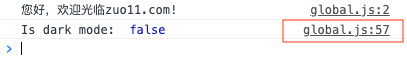
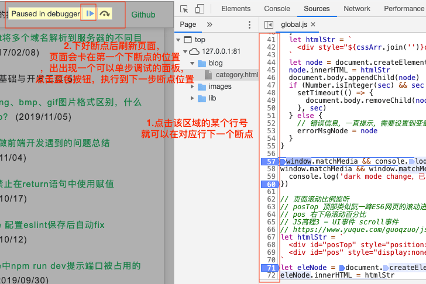

---
{
  "title": "怎么使用Chrome断点调试功能，断点调试使用场景",
  "staticFileName": "breakpoint.html",
  "author": "guoqzuo",
  "createDate": "2019/11/07",
  "description": "在前端开发中，我们调试时一般都会使用console.log在控制台打log看程序执行情况，断点调试的功能好像用的比较少，那什么情况下就需要使用断点调试功能了呢？下面来讨论下",
  "keywords": "怎么使用Chrome断点调试功能,断点调试使用场景",
  "category": "计算机基础与开发工具"
}
---

# 怎么使用Chrome断点调试功能，断点调试使用场景

在前端开发中，我们调试时一般都会使用console.log在控制台打log看程序执行情况，断点调试的功能好像用的比较少，那什么情况下就需要使用断点调试功能了呢？下面来讨论下

## 断点调试功能介绍
断点调试可以在某个js代码位置加断点，刷新页面后，会停留在断点位置，点击下一步会执行到下面的断点，这样可以追踪代码的执行情况。对调试复杂的逻辑非常有帮助

## chrome断点调试功能使用

1. 在逻辑异常前一句js位置，加一个console.log

打开console，点击log后面的文件会直接进入chrome源码位置

2. 点击源码行号区域位置打断点

3. 下好断点后刷新页面，页面会卡在第一个下断点的位置，页面出现一个可以单步调试的面板，点击蓝色按钮，就可以往下执行到下一个断点位置

## 断点调试使用场景
一般如果是自己写的代码逻辑很清晰易懂、代码量不是非常大的情况是完全没必要使用断点调试功能，console.log就可以了，但有下面几种情况，断点调试才会真正发挥它的威力

1. 如果代码功能异常且业务逻辑复杂，用console.log也找不到具体异常逻辑时
2. 代码改动后不方便实时调试时，意味着每次加console.log都很麻烦
3. 了解源码执行过程

总结，如果是调试复杂代码，console.log不方便或搞不定时再使用断点调试；如果想快速了解源码执行具体执行顺序逻辑，直接用断点调试，单步执行
