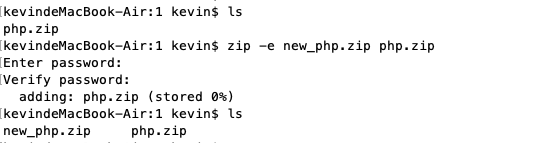
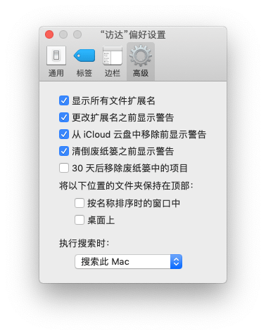
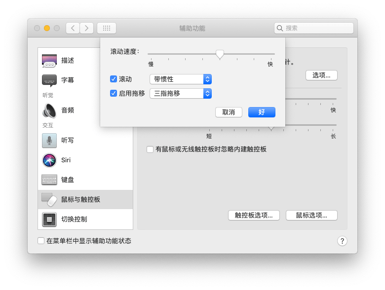
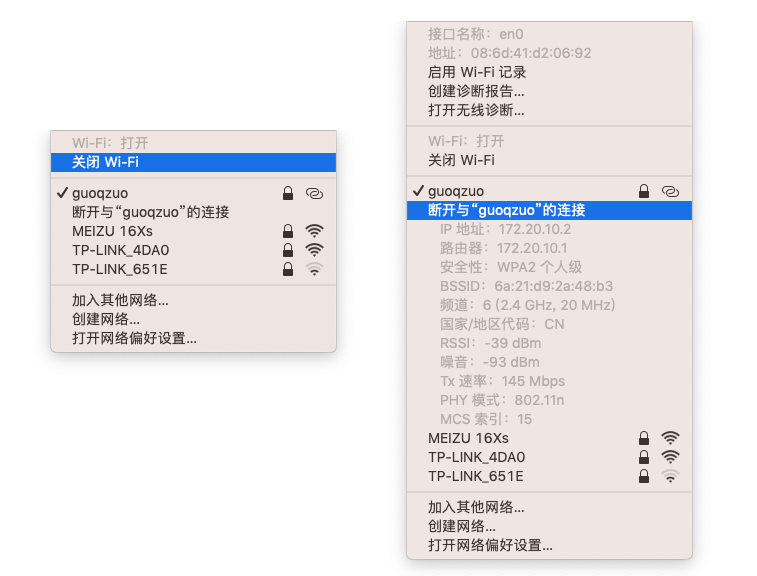

---
{
  "title": "用mac做前端开发遇到的问题总结",
  "staticFileName": "mac_dev.html",
  "author": "guoqzuo",
  "createDate": "2019/11/04",
  "description": "在用mac开发的过程中，会遇到过一些问题，比如怎么显示文件的扩展名；mac隐藏文件 .DS_Store 对node遍历文件产生的影响；mac怎么修改环境变量；mac安装yarn的方法；mac加密zip文件；mac使用触控板来进行复制和拖动窗口等，下面来逐一介绍下。",
  "keywords": "小白用mac做前端,mac 隐藏文件 .DS_Store 对node遍历文件产生的影响,mac export PATH 后关闭termial就失效了,mac修改环境变量,macos安装Yarn方法,mac安装yarn方法,mac zip文件加密,mac显示文件扩展名,mac使用触控板拖动复制、移动窗口,mac三指拖动",
  "category": "计算机基础与开发工具"
}
---
# 用mac做前端开发遇到的问题总结

在用mac开发的过程中，会遇到过一些问题，比如怎么显示文件的扩展名；mac隐藏文件 .DS_Store 对node遍历文件产生的影响；mac怎么修改环境变量；mac安装yarn的方法；mac加密zip文件；mac使用触控板来进行复制和拖动窗口等，下面来逐一介绍下。

## mac 隐藏文件 .DS_Store 对node遍历文件产生的影响
node遍历文件夹下的文件名再require对应的文件出错，在使用koa mock接口时，一个模块有很多接口，就写了十几个js，每个js对应一个接口数据。如果每增加一个接口，再添加一个require就很麻烦，于是写了个index.js来遍历文件夹，进行动态引入。以后写好js，就不用再手动require了。之前都运行正常的，最近再运行时发现一直报错，require异常。后来打印遍历的fileName，发现居然有 .DS_Store 文件，require这个文件时错误。这个文件属于mac系统自动生成的文件，之前都没有的。在程序中过滤调这个文件即可。

```bash
# 目录结构
mock
├── pm
│   ├── index.js # 入口
│   ├── 接口1.js
│   ├── 接口2.js
│   └── 接口n.js
├── user 
├── product
└── sever.js # 入口文件，require('./pm/index.js')(router) 将接口添加到路由
```
pm/index.js 代码如下：
```js
const fs = require('fs')

module.exports = router => {
  fs.readdirSync(__dirname).forEach(fileName => {
    if (fileName === 'index.js' || fileName.startsWith('.')) return
    require('./' + item)(router)
  })
}
```

## mac export PATH 后关闭termial就失效了
mac 修改环境变量，以便能在任何地方使用 mongod 命令
```bash
# 运行该命令后，当前terminal生效了，但关闭后，打开其他terminal就无效
export PATH=/usr/local/mongodb/bin:$PATH
```
这种情况需要在 .bash_profile 文件里，加入 export PATH=/usr/local/mongodb/bin:$PATH 才行，**上面是旧的方法，新mac系统，bash是zsh，文件不再是.bash_profile，而是.zshrc**
```bash
# 打开主目录下的 .bash_profile 文件
vi ~/.bash_profile
```
修改后的 .bash_profile 文件，之前还修改过mysql的环境变量
```js
export PATH=${PATH}:/usr/local/mysql/bin
export PATH="$HOME/.rbenv/bin:$PATH"
export PATH=/usr/local/mongodb/bin:$PATH
if which rbenv > /dev/null; then eval "$(rbenv init -)"; fi
```

## macos安装Yarn方法
注意尽量不要卸载xcode，这样问题会少很多
```bash
# 使用brew安装yarn
brew install yarn
```

## mac zip压缩加密
```bash
zip -e 目标文件名.zip 需要加密的zip文件
# 输入上面的命令后，会提示输入两次密码
```
更多zip命令相关用法，可以在控制台使用 **man zip** 查看文档



## mac显示文件扩展名

点击屏幕下方第一个图标：访达(Finder) => 屏幕左上方苹果logo右侧 点击 访达(Finder) => 偏好设置 =>  高级 => 勾选显示所有文件扩展名



## mac使用触控板拖动复制、移动窗口
今天才意识到，每次要复制一段文字或移动某个应用窗口，我都是点击触控板再拖动。而且Mac Air的触控板按的声音比较响，于是找了下是否有手势可以支持。

发现可以设置使用 三指拖移 复制文字和拖动窗口，三个手指放上去拖动就可以了。

设置方法：打开系统统偏好设置 => 点 “辅助功能” => 点 “鼠标与触控板” => 点 “触控板选项” => 先勾上启用拖移，然后选择“三指拖移”，点击 “好”



图文详情参考: [MacBook触控板选中/复制](https://jingyan.baidu.com/article/bea41d43b236feb4c51be639.html)

## macos 查看ip
按住option，再点击右上角wifi图标即可看到本机局域网ip、路由ip


