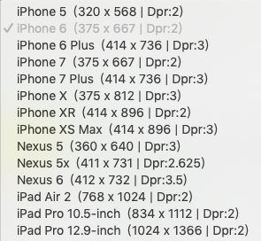

---
{
  "title": "移动端屏幕尺寸大小",
  "staticFileName": "screen_size.html",
  "author": "guoqzuo",
  "createDate": "2019/11/11",
  "description": "在开发中，我们一般需要知道常用手机型号的屏幕尺寸，这样才能更好的适配移动端，下面来看看小程序开发工具中提供的各个手机型号尺寸，对于全面屏来讲，宽度和 ihpone 7/8 一致，但页面长度却长很多，一般 高度 / 宽度 >=2 的就是全面屏，页面布局需要特殊处理下",
  "keywords": "移动端屏幕尺寸大小,常用手机屏幕大小,怎么判断是全面屏",
  "category": "CSS"
}
---

# 移动端屏幕尺寸大小

在开发中，我们一般需要知道常用手机型号的屏幕尺寸，这样才能更好的适配移动端，下面来看看小程序开发工具中提供的各个手机型号尺寸

一般我认为比较标准的是 iphone 6/7/8

对于全面屏来讲，宽度和 ihpone 7/8 一致，但页面长度却长很多，一般 高度 / 宽度 >=2 的就是全面屏，页面布局需要特殊处理下

