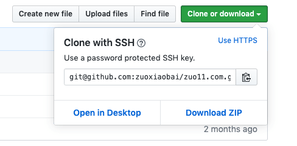

# git clone大文件仓库超时问题

当远程仓库比较大，或者弱网的情况，可能会出现git clone超时的问题，一直clone不下来，一般可以用两种方法来解决：一是git clone时使用 depth参数；二是使用ssh拉取方式

## 使用depth参数
```bash
git clone --depth=1 git://someserver/somerepo

# depth用于指定克隆深度，为1即表示只克隆最近一次commit.

# 参考:
# https://segmentfault.com/q/1010000007700727
```

## 使用ssh方式clone



参考：[Cloning with SSH URLs](https://help.github.com/en/github/using-git/which-remote-url-should-i-use#cloning-with-ssh-urls)
