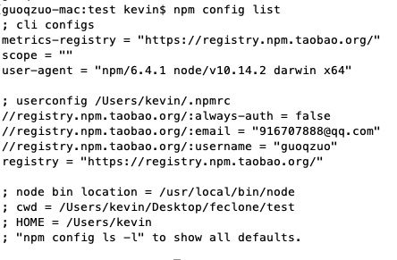

---
{
  "title": "npm设置下载源",
  "staticFileName": "npm_resource.html",
  "author": "guoqzuo",
  "createDate": "2019/12/04",
  "description": "npm设置下载源，在设置npm下载源之前，我们先来看看怎么查看当前npm的下载源，npm config list 可以查看当前npm配置项，包括源(registry)信息，npm config set命令可以设置对应npm源",
  "keywords": "npm设置下载源,npm查看当前配置",
  "category": "前端工程化"
}
---

# npm设置下载源

在设置npm下载源之前，我们先来看看怎么查看当前npm的下载源

```bash
npm config list # 查看当前npm配置项，包括源(registry)信息
```



**修改源**

```bash
# 设置源
npm config set registry http://registry.npm.taobao.org

# 查看帮助文档
kevindeMacBook-Air:svnclone kevin$ npm config -h
npm config set <key> <value>
npm config get [<key>]
npm config delete <key>
npm config list [--json]
npm config edit
npm set <key> <value>
npm get [<key>]

alias: c

# 根据上面的命令，查看源
guoqzuo-mac:test kevin$ npm config get registry 
https://registry.npm.taobao.org/
```