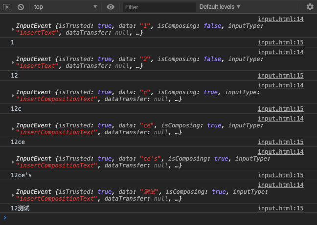

# v-model为什么不能监听中文输入法实时输入，内部是怎么实现的？

在看vue文档时，有备注说 v-model 不会在输入法组合文字的过程中得到更新，这是为什么呢？内部是怎么实现的，我们来看看

> 对于需要使用输入法 (如中文、日文、韩文等) 的语言，你会发现 v-model 不会在输入法组合文字过程中得到更新。如果你也想处理这个过程，请使用 input 事件。

## v-model本质是语法糖
我们知道v-model其实是语法糖，等价于绑定value属性，以及当输入改变时再次赋值给value，以input text为例
```html
<input v-model="name">
<!-- 可以理解为 等价于 -->
<input :value="name" @input="e => { name =  e.target.value }">
```
唯一的不同是，非v-model的写法是支持检测输入法组合文字的过程的，但v-model内部加了处理，双向绑定的值不会在输入法组合文字的过程中得到更新

## input相关基础知识
input text change事件只有在输入框失去焦点时才会触发，而v-model是实时双向绑定的，那应该用的是input

input text input事件触发时，其事件对象e里的data属性不是当前input完整的输入内容，而是当前的字符，来看个原生input的例子
```html
<body>
  <input id="input" type="text">
  <script>
    let inputEl = document.querySelector('#input')
    inputEl.addEventListener('input', (e) => {
      console.log(e) // e.data 只是拿到的 当前输入的字符，而不是input里输入的整体内容
      console.log(inputEl.value) // 这个才是整体内容
    })
  </script>
</body>
```
实时输入内容测试




## v-model为什么不监听输入法的组合文字的过程呢？
通过上面的例子我们知道，其实监听输入法组合文字的过程是非常容易的，但为什么vue在v-model的处理时加了逻辑来不实时更新输入法组合文字的过程呢？

我的理解是，输入法组合文字的过程中更新值是比较鸡肋的，一般用户在输入法组合文字的过程中是不需要实时校验输入内容准确性的。

如果不过滤，输入法组合文字的过程也会触发输入内容校验的逻辑，所以才会加入对应的逻辑

## v-model 是怎么实现在输入法组合文字的过程中不更新值的
在下面的示例里，是可以实时检测输入法输入过程的，那我们要怎么加逻辑来处理，在输入法未组合完文字前不更新value的值
```html
<input :value="name" @input="e => { name =  e.target.value }">
```

我们需要了解一个知识点：输入法组合文字过程监听

他们是 compositionstart, compositionend 两个事件，输入法开始组合文字事件，以及输入法停止组合事件，注意，输入法在组合文件结束时，需要手动触发一次设置value的值。我们需要用一个中间变量 compositioin 来存储当前是否处于组合文字的过程，如果是，就不更新value，等组合文字结束后再更新value

v-model 在监听input type为text的输入过程时，等价于下面的实例，不监听输入法的组合文字过程

```html
<!-- 需要在data里面定义一个 compositioin 属性，默认值为false -->
<input :value="name" @input="e => { !compositioin && (name =  e.target.value) }" @compositionstart="compositioin = true" @compositionend="(e) => { compositioin = false; name = e.target.value }">
```

## 完整demo
```html
<!DOCTYPE html>
<html>
  <head>
    <meta charset="utf-8">
    <title>vue</title>
    <script src="https://cdn.jsdelivr.net/npm/vue/dist/vue.js"></script>
  </head>
  <body>
    <div id="app">
      {{message}}     
      <div>{{name}}</div>
      <!-- <div><input v-model="name"></div> -->
      <!-- <input :value="name" @input="e => { name =  e.target.value }"> -->
      {{compositioin}}
      <input :value="name" @input="e => { !compositioin && (name =  e.target.value) }" @compositionstart="compositioin = true" @compositionend="(e) => { compositioin = false; name = e.target.value }">
      <div>{{name2}}</div>
      <div><input :value="name2" @input="inputChange"></div>
    </div>
   
    <script>
      var app = new Vue({
        el: '#app',
        data: {
          message: 'Hello Vue',
          name: '',
          name2: '',
          compositioin: false,
        },
        methods: {
          inputChange(e) {
            console.log(e.target.value)
            this.name2 = e.target.value
          }
        }
      })
    </script>
  </body>
</html>
```

参考：
- [v-model基础用法 | Vue.js基础用法](https://cn.vuejs.org/v2/guide/forms.html#%E5%9F%BA%E7%A1%80%E7%94%A8%E6%B3%95)
- [输入法组合文字过程监听](https://www.cnblogs.com/gaidalou/p/10593667.html)


