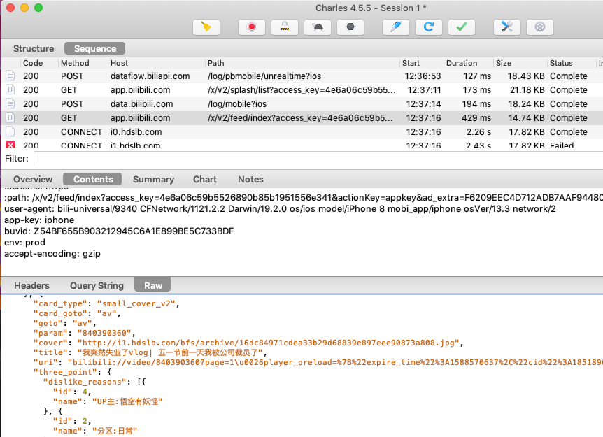
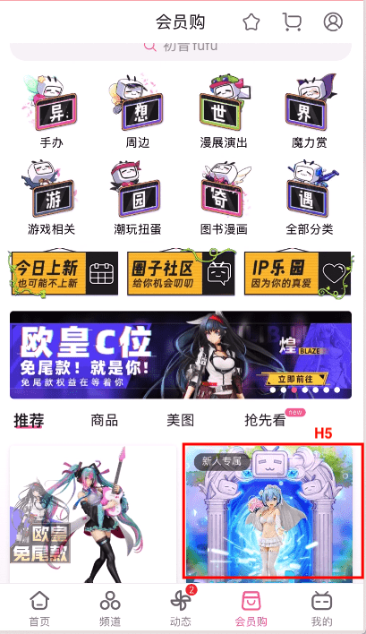
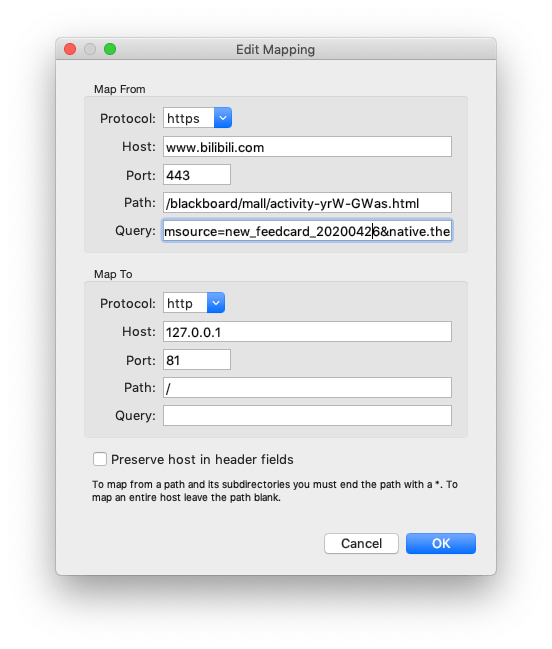
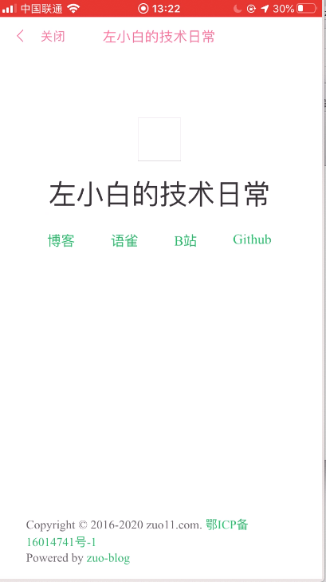

# 以B站app为例实战Charles抓包以及将本地的H5代理到app内嵌H5运行

当我们在开发app内嵌的H5页面时，怎么调试是一个问题。看内嵌H5运行时，接口的返回情况，可以使用Charles进行抓包查看，另外charles也可以将我们本地的H5页面直接代理到app内嵌H5里运行。这里以B站app为例，来进行相应的测试

这里有两个前提条件
1. 有现成的app，且app里面访问了一个H5页面，我们拿到这个页面的URL，将这个url代理到局域网内我们本地的H5页面
2. 手机和电脑需要连接到同一个局域网

来看下具体步骤

## 使用Charles抓包
这里注意，需要将手机和运行charles的电脑连接到同一个局域网里

- 打开charles软件
- 查看运行charles软件电脑的本地ip地址，我这个是 192.168.31.67
- 将手机的网络代理到电脑的ip地址上，以iPhone为例
  - 设置 - 点击无线局域网 - 点击连接上的wifi右侧的 i 图标，进入详情页 - 往下翻，点击配置代理 - 手动 - 输入服务器/端口
  - 服务器输入刚才记录的电脑的ip：192.168.31.67，端口设置为8888（一般设置为这个，具体的端口可以在 Charles的菜单栏 Proxy - Proxy Settings... - Proxies - HTTP Proxy Port 里面可以看到）
- 打开B站app，可以看到Charles软件捕捉到了很多b站的请求

## 使用charles将本地H5代理到app内嵌h5执行
以bilibili app为例，我们通过charles看哪些功能使用了内嵌的H5，通过测试发现会员购 - 新人专属，使用的是内嵌H5

链接为：https://www.bilibili.com/blackboard/mall/activity-yrW-GWas.html?msource=new_feedcard_20200426&native.theme=1&night=0

我们现在把Charels配置下，当bilibili app访问这个链接时，直接代理到我们电脑本地的 http://127.0.0.1:81/ 页面，这样可以让本地的页面在B站的app里面运行

配置代理方法：使用charles 顶部菜单 Tools - Map remote，配置将访问的内嵌H5地址，代理到局域网内本地网页路径即可，如下图

当我们点击会员购 - 新人专属 就可以访问电脑本地的页面了，如下图

这样就可以看本地的H5在app内嵌时运行的效果了，如果想要看console里面打印了什么，推荐在页面中引入 vconsole 模块，这样就可以查看console的信息了。

## 实时调试app内嵌H5的样式、DOM
使用web调试代理工具Whistle, 可查看dom样式，这是一个思路

## 使用Charles抓包或代理时可能会出现的一些问题
**问题1：Connection established**

不同的电脑，对同一台手机抓包，需要安装不同的证书
- 证书安装: help - SSL Proxying - install Charles Root Certificate，然后信任
- 手机证书安装 help - SSL Proxying - install Charles Root Certificate on a Mobile Device …, 代理到本地后，访问chls.pro/ssl 下载安装，然后再Settings > General > About > Certificate Trust Testings 信任证书

**问题2：SSL handshake with client failed - Remote host terminated the handshake**

一般是证书信任问题: Settings > General > About > Certificate Trust Testings

**问题3: 使用Charles抓包时，需要关闭电脑的vpn代理**

使用Charles抓包，设置了网络代理，一切设置都正常，但是电脑上还是接收不到请求，发现vpn开启了，关掉后，就可以接收到请求的数据了。

## 参考
- [charles官网](https://www.charlesproxy.com/)
- [mac下charles使用简介(包含破解方法)](https://www.jianshu.com/p/82f63277d50f
问题)