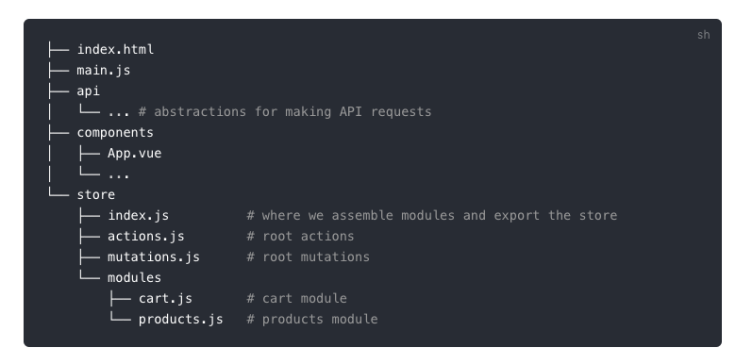

---
{
  "title": "文件结构目录树自动生成",
  "staticFileName": "file_struct.html",
  "author": "guoqzuo",
  "createDate": "2019/12/05",
  "description": "在我们写README.md时，如果需要描述一个文件的目录结构，就需要使用可以自动生成文件目录树的工具了，这里总结下一些实践经验",
  "keywords": "文件结构生成,文件目录树生成",
  "category": "计算机基础与开发工具"
}
---

# 文件结构目录树自动生成

在我们写README.md时，如果需要描述一个文件的目录结构，就需要使用可以自动生成文件目录树的工具了，这里总结下一些实践经验

## 使用treer npm命令行工具
```bash
npm install treer -g # 全局安装treer
```
安装成功后，系统里就会多出一个treer命令，使用方法
```js
$ treer --help

  Usage: treer [options]

  Options:

    -h, --help             output usage information
    -V, --version          output the version number
    -d, --directory [dir]  Please specify a directory to generate structure tree
    -i, --ignore [ig]      You can ignore specific directory name
    -e, --export [epath]   export into file
```
示例: 查看指定目录的目录树
```bash
$ treer -d ./src/notes/2019/12 # 查看目录结构
12
├─:not和:nth 混用的问题.md
├─ES2020 '?.' 与 '??' 操作符.md
├─_info.json
├─can't find module node_sleep.node.md
├─failed at the phantomjs-prebuilt@2.1.16  intsall script.md
├─git clone大文件仓库超时问题.md
├─iconfont icon是如何加载成功的.md
├─npm设置下载源.md
├─sessionStorage和localstorage的区别.md
├─vue路由懒加载时import里面不能是变量的问题.md
├─使用URLSearchParams将对象转为url查询字符串.md
└文件结构目录树自动生成.md
```

## 更好看的一种风格
上面的样式不怎么好看，且不支持js引用操作，有时间可以优化下，好的样式



## 实例
在 zuo11.com的README.md里就是结合上面两种方法来生成的目录树结构，效果查看: [zuo11.com - github](https://github.com/zuoxiaobai/zuo11.com)

```bash
├── src # 写博客文章的目录
│   ├── _config.json # 全局配置文件
│   ├── global.js # 全局js
│   ├── global.css # 全局css 
│   ├── images # 图片目录
│   │   ├── blog # 专门放博客图片的目录
│   │   └── favicon.ico # 站点icon
│   └── notes # 博客文章，按年月分目录
│       ├── 2016
│       │   ├── 10 # 每个月份目录下放当月写的文章及当前月的配置文件
│       │   │   ├── _info.json # 配置文件记录了当前目录下每篇文章的配置、seo参数等
│       │   │   ├── xxx1.md # 博客文章
│       │   │   └── xxx2.md
│       │   ├── 11
│       │   └── 12
│       ├── ...
│       └── 2020 # 2020年目录
│           ├── 1 # 2020年1月目录
│           │   ├──  _info.json
│           │   └──  xx45.md
│           └── 2 
├── LICENSE # 开源协议 Apache 2.0
└── README.md # 说明文档
```

## 参考 
- [treer | github](https://github.com/derycktse/treer)
- [vux官网 - 好的目录结构样式](https://vuex.vuejs.org/guide/structure.html)
