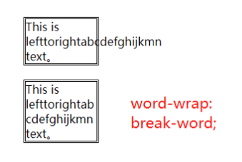
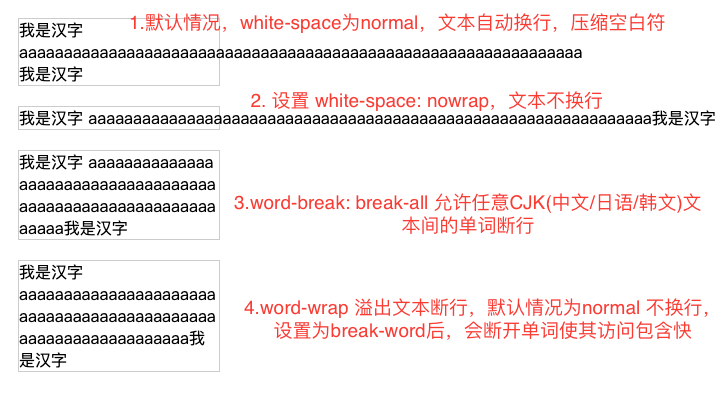

# 长英文单词不换行的问题

关于换行问题，属于文本类的css样式，在css中有三个和换行有关的属性他们分别是：white-space、word-break、word-wrap，由于他们有点类似且特性比较怪，不容易理解，这里来总结下

## white-space
主要用于处理空白符，但它也可以用于换行

```css
span {
  white-space: normal; /* 默认值 */
  white-space: nowrap; /* 不换行，在一行显示 */
}
```

white-space默认值为normal：文本超出父容器后，会自动换行，压缩空白符(当多个空白时，只显示一个空白符)。

**white-space设置为nowrap时**，文本不会换行，在一行显示，更多细节参考之前的笔记 [white-space 处理空白 | HTML权威指南笔记](https://www.yuque.com/guoqzuo/js_es6/xd5io5#ba923c63)

white-space: nowrap 常结合 overflow:hidden; text-overflow: ellipsis; 用于实现单行文本截断。

## word-wrap 溢出文本断行
当一个单词的长度超出包含块的宽度时如何处理
- normal 默认，单词不断开，即使无法完全放入包含块。
- break-word 断开单词，使其放入包含块。



## word-break
文本换行截断处理
- normal: 使用默认的换行规则
- break-all: 允许任意非CJK(Chinese/Jpanese/Korean)文本间的单词断行


## 通过一个demo来看他们之间的区别
```html
<head>
  <style>
    .sec {
      width: 200px;
      margin: 20px;
      border: 1px solid #ccc;
    }
    .fix1 {
      word-break: break-all;
    }
    .fix2 {
      word-wrap: break-word;
    }
    .nowrap {
      white-space: nowrap;
    }
  </style>
</head>
<body>
  <div class='sec'>
    我是汉字 aaaaaaaaaaaaaaaaaaaaaaaaaaaaaaaaaaaaaaaaaaaaaaaaaaaaaaa我是汉字
  </div>
  <div class='sec nowrap'>
    我是汉字 aaaaaaaaaaaaaaaaaaaaaaaaaaaaaaaaaaaaaaaaaaaaaaaaaaaaaaa我是汉字
  </div>
  <div class='sec fix1'>
    我是汉字 aaaaaaaaaaaaaaaaaaaaaaaaaaaaaaaaaaaaaaaaaaaaaaaaaaaaaaa我是汉字
  </div>
  <div class='sec fix2'>
    我是汉字 aaaaaaaaaaaaaaaaaaaaaaaaaaaaaaaaaaaaaaaaaaaaaaaaaaaaaaa我是汉字
  </div>
</body>

```




word-break: break-all 和 word-wrap: break-word 同样都是换行，前者不会在单词前或后面换行，而后者会

word-break和word-warp比较相似，容易混淆，在CSS3规范中，word-wrap 改为了 overflow-wrap，但浏览器兼容性不好，现在还是使用word-wrap

参考：
- 《CSS世界 | 张鑫旭》 264页 第8章 强大的文本处理能力
- [CSS word-wrap | MDN](https://developer.mozilla.org/zh-CN/docs/Web/CSS/word-wrap)


