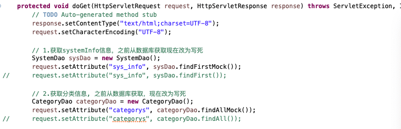
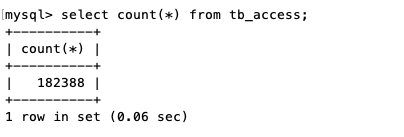
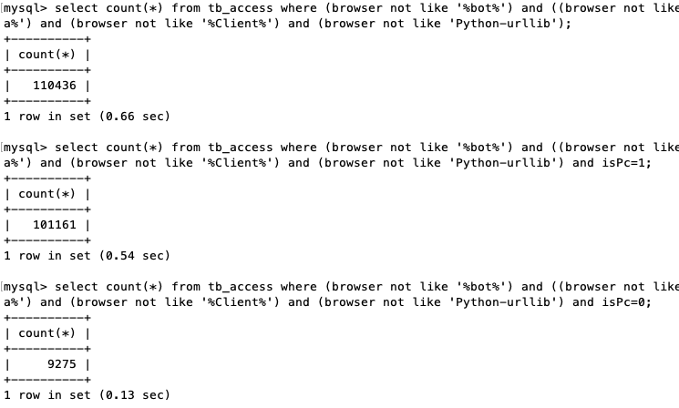
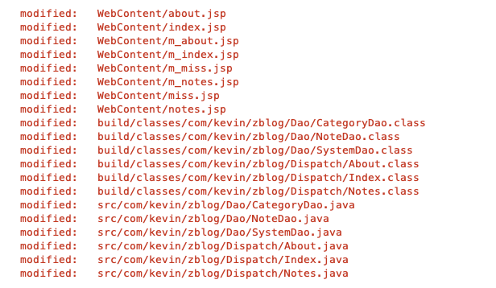
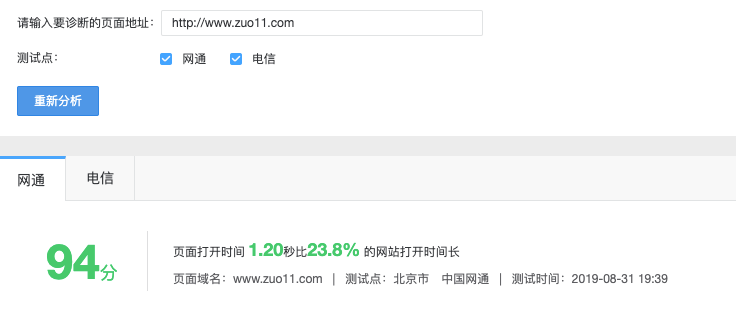

# 站点优化 页面打开较慢处理

> 最近发现打开速度太慢，由于后台是java写的，好久没碰了，基本忘干净了。就一直拖着没处理，现在有时间了，还是硬着头皮优化了下，打开速度提升了很多。



## 背景
博客的代码是2017年初完成的，后面基本没怎么维护了。两年多了，当时的技术栈还是java + jQuery，现在早已放弃了java，主要还是往前端方向发展。后台相关只研究node。这次发现网页太慢了，新的博客版本还没规划好，暂时先优化下这个博客。

## 代码托管
之前的代码都是现在Eclipse里完成，然后导出，再通过ftp传到服务器。再手动更新。版本控制都没用到，这次在本地git init，初始化了一个git仓库。然后在gitlab创建了一个私有库，和本地的仓库关联，把代码放到gitlab就好多了。至少不用怕代码丢失了。

## 速度慢的原因分析
准备把代码跑起来看看原因，发现代码跑不起来，提示本地myblog数据库不存在。由于mac重装了mysql，之前是5.6的版本，现在升级为8.0了。之前的数据库貌似丢了。从服务器dump了一份数据，本地创建了myblog数据库，然后通过source导入数据（大概33M，主要是tb_access的数据，记录了蜘蛛抓取及正常访客的所有ua、ip的信息）。数据导入后就可以正常访问了。发现本地都很慢，那就不是服务器配置的问题了。跟代码有关。



### 代码分析
先找到主页的入口页面。index.woe，发现有几个问题
- 代码写的很乱，命名不规范
- 频繁查询数据库，影响速度

### index页面代码问题1
之前不知道怎么想的，把systemInfo也就是网页的title、keywords，description都放到数据库，每次都从数据库读取，每次都会都一次数据库查询，现在改为写死。因为这种基本不怎么更新。分类信息比较少，每次从数据库找也耗时，就写死了。提高速度。
```java
// 1.获取systemInfo信息，之前从数据库获取现在改为写死
SystemDao sysDao = new SystemDao();
request.setAttribute("sys_info", sysDao.findFirstMock());
// request.setAttribute("sys_info", sysDao.findFirst());

// 2.获取分类信息, 之前从数据库获取，现在改为写死
CategoryDao categoryDao = new CategoryDao();
request.setAttribute("categorys", categoryDao.findAllMock());
// request.setAttribute("categorys", categoryDao.findAll());
```

### index页面代码问题2
获取笔记信息之前是分4条sql去取 。现改为用一条sql取，然后根据类型自动分配到4个变量。（由于前端代码不想改动，尽量按原来的数据格式输出），另外发现再将数据库查询的Map数据转为List\<Node\>时，居然每次都去数据表用分类id来换分类名称，，太恐怖了。不知道之前为啥会这么写，也修改为本地获取。
```java
// 3.获取笔记信息
NoteDao noteDao = new NoteDao();
Map<String, Object> noteall = noteDao.findAllNew();
request.setAttribute("notes_c", noteall.get("notes_c"));
request.setAttribute("notes_web", noteall.get("notes_web"));
request.setAttribute("notes_apue", noteall.get("notes_apue"));
request.setAttribute("notes_ios", noteall.get("notes_ios"));
//		List<Note> notes_c = is3.findC();
//		request.setAttribute("notes_c", notes_c);
//		List<Note> notes_web = is3.findWeb();
//		request.setAttribute("notes_web", notes_web);
//		List<Note> notes_apue = is3.findAPUE();
//		request.setAttribute("notes_apue", notes_apue);
//		List<Note> notes_ios = is3.findIOS();
//		request.setAttribute("notes_ios", notes_ios);
	
//		if(request.getParameter("action") != null) {
//			request.getRequestDispatcher("m_index.jsp").forward(request, response);
//		} else {
//			request.getRequestDispatcher("index.jsp").forward(request, response);
//		}
```
修改后的部分NoteDao代码
```java
	Map<String, String> cate = new HashMap<String, String>();
	cate.put("32","C语言&&C");
	cate.put("33","UNIX高级编程&&APUE");
	cate.put("34","Web&&Web");
	cate.put("36","iOS&&iOS");
	...
	
	note.setCategory(cate.get(map.get("category_id")+""));
	note.setRelay_count(Integer.parseInt(map.get("relay_count")+""));
	note.setStatus(Integer.parseInt(map.get("status")+""));
	
	switch(map.get("category_id")+"") {
		case "32":
			notes_c.add(note);
			break;
		case "33":
			notes_apue.add(note);
			break;
		case "34": 
			notes_web.add(note);
			break;
		case "36":
			notes_ios.add(note);
			break;
	}
}
Map<String, Object> allNote = new HashMap<String, Object>();
allNote.put("notes_c", notes_c);
allNote.put("notes_apue", notes_apue);
allNote.put("notes_web", notes_web);
allNote.put("notes_ios", notes_ios);
```

### index页面代码问题3
访问量这里也是查了4次数据，由于过滤了部分有蜘蛛特征的数据，且数据已经18W了，每次查询都挺耗时的，而且还是分几次查询，本地查询都要1s多.....暂时没想到好的办法，访问数据直接按之前的访问量写死了。待后续优化表结构，来处理这个问题。
```sh
select count(*) from tb_access where (browser not like '%bot%') and ((browser not like '%spider%')) and (browser not like '%sitemap%') and (browser not like '%Alibaba%') and (browser not like '%Client%') and (browser not like 'Python-urllib');
```



### 总访问量
```java
//		int access_total = accessDao.findCountAll();
//		int access_pc = accessDao.findCountWithPC();
//		int access_mobile = accessDao.findCountWithMobile();
//		int notes_reply = is3.findRelayCountAll();
//		request.setAttribute("access_total", access_total);
//		request.setAttribute("access_pc", access_pc);
//		request.setAttribute("access_mobile", access_mobile);
//		request.setAttribute("notes_reply", notes_reply);
	request.setAttribute("access_total", 110434);
	request.setAttribute("access_pc", 101159);
	request.setAttribute("access_mobile", 9275);
	request.setAttribute("notes_reply", 5);
	//System.out.println(access_pc);
	
	String url = "index.jsp";
	if (user.getIsPc() == 0) { // 判断是否为移动端
		url = "m_index.jsp";
	}
	request.getRequestDispatcher(url).forward(request, response);	
}
```

### 其他页面的问题
和index页面类似，改改就好了。

## 评论的广告问题
畅言评论系统居然弹广告了，貌似充钱才能去。果断把评论的代码弄掉了。怀恋 “多说” 的那个时候。后面自己有时间一定要写一个评论系统。

## 修改完成后，准备发布


把相关改动提交到git，然而发布时还是选择了手动更改文件后发布，主要是ueditor编辑器存的图片目录就在工程文件夹内部，不好处理。发布后发现无法运行，看tomcat的log发现，jre的路径找不到，jre自动更新了。导致路径有问题。直接重装了jre。后面发现还有问题。原来copy到服务器的更改文件是绿色的，带加密的，需要修改为不加密。重装jre重启系统后，发现连不上数据库，原来是mysql80服务自动关了，可能和重启有关系。后面手动开启了。

## 速度测试
感觉比之前快多了，用了百度统计的速度测试，还可以，后面还有优化的空间，还是想做成纯静态的，不用JSP服务端渲染。那样就可以秒开了，待写一个类似hexo的静态博客生成系统。

