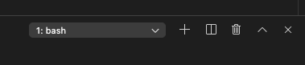
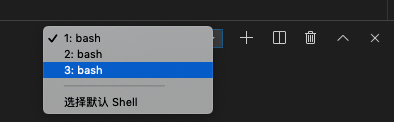

# vscode中npm run dev提示端口被占用的问题

vscode 提示端口被占用，vscode编辑器中npm run dev退出后依旧占用端口，vscode的console，有时候可能没关闭就开了新的terminal。

## 排查问题

1. 在vscode编辑器的右下方，看是否开启了多个终端(bash)，可能原来的npm run dev还没有关闭






2. 把vscode整体退出，再打开看是否OK。


以后可以不依赖vscode的终端，使用系统自带的terminal


## mac 查看端口占用情况
对于端口占用的情况，可以使用系统的命令查看占用端口的进程，然后将该进程关闭，mac下可以使用如下命令来查看端口占用情况：
```bash
lsof -i :7000 # 查看7000端口是否被占用
sudo kill -9 716 # 如果进程 ID为 716 占用了该端口，关闭该进程。
# -9后面加一个空格，然后加上占用端口的进程PID，就可以杀掉占用端口的进程。最后重启terminal就ok。
```

参考: [Mac 查看端口占用情况及杀死进程](https://www.jianshu.com/p/9216b6127a82)