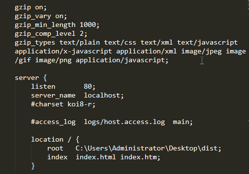

---
{
  "title": "nginx怎么开启gzip以及怎么判断nginx是否成功开启了gzip？",
  "staticFileName": "nginx_gzip.html",
  "author": "guoqzuo",
  "createDate": "2020/01/29",
  "description": "nginx是比较好的一个运行静态http服务的容器。当我们把静态网站部署到nginx上后，我们怎么设置开启zip，让网页资源体积更小，传输更快呢？下面来看看",
  "keywords": "nginx怎么开启gzip,怎么判断nginx是否成功开启了gzip,怎么判断nginx开启gzip生效",
  "category": "运维部署与版本控制"
}
---

# nginx怎么开启gzip以及怎么判断nginx是否成功开启了gzip？

nginx是比较好的一个运行静态http服务的容器。当我们把静态网站部署到nginx上后，我们怎么设置开启zip，让网页资源体积更小，传输更快呢？下面来看看

## nginx开启gzip
首先复习下windows下，nginx怎么使用：
1. 在[nginx官网](https://nginx.org/en/download.html)下载nginx，稳定版，现在是nginx/Windows-1.16.1，下载后是一个zip文件
2. 解压后放到桌面，进入解压后的目录 nginx-1.16.1，先修改nginx的root文件夹，也就是80端口指向的目录。修改 conf 目录下的 nginx.conf文件，如下图，将静态项目路径设置到root后



3. 运行nginx

```bash
# 进入到nginx目录，shift + 鼠标右键，在此处打开命令窗口，将nginx.exe拖到窗口，再打一个空格 -c 配置文件，类似下面的命令
nginx.exe -c conf/nginx.conf
# 关闭nginx服务，注意 nginx.exe 是将nginx.exe文件拖到terminal时产生的
nginx.exe -s stop
```

在上面的图中，已经有开启gzip的代码了。默认情况下 gzip on 是注释掉的，我们打开这个注释再添加几个属性即可。对于额外增加的几个属性这里说明下:
- gzip_types是指定需要开启gzip压缩的文件类型
- gzip_comp_level 指定压缩等级
- gzip_min_length 当超过多少字节时就压缩，我上面设置的是1K
- gzip_vary 增加响应头”Vary: Accept-Encoding”

```js
gzip on;
gzip_vary on;
gzip_min_length 1000;
gzip_comp_level 2;
gzip_types text/plain text/css text/xml text/javascript application/x-javascript application/xml image/jpeg image/gif image/png application/javascript;
```

## 怎么判断nginx是否成功开启gzip
打开chrome访问对应的站点，F12，点击network. 在Name，Priority 那一栏的最右侧空白位置，右键，勾选 Content-Encoding，如下图，设置好后刷新页面就可以看到Content-Encoding那一列了，如果有gzip就说明开启了gzip，需要结合Size这个属性看，如果没有超过设定大小的文件，是不会开启gzip压缩的。

