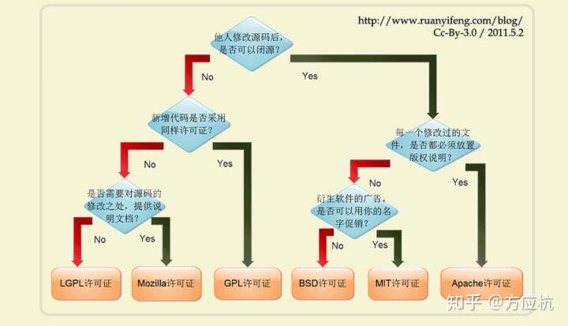

---
{
  "title": "开源许可MIT等具体含义",
  "staticFileName": "os_licence.html",
  "author": "guoqzuo",
  "createDate": "2020/01/30",
  "description": "一般新建一个开源仓库时，需要确定开源协议。之前习惯是MIT，就是别人拿去干什么都可以。对于一些需要控制他人使用的就需要其他协议了。阮一峰博客里有一张图来解释很清晰明了",
  "keywords": "开源许可MIT等具体含义,开源许可licence含义",
  "category": "计算机基础与开发工具"
}
---
# 开源许可MIT等具体含义

一般新建一个开源仓库时，需要确定开源协议。之前习惯是MIT，就是别人拿去干什么都可以。对于一些需要控制他人使用的就需要其他协议了。阮一峰博客里有一张图来解释很清晰明了

- 他人修改源码后是否可以闭源?
  - 可以闭源，没一个修改过的文件是否都必须放置版权说明?
    - 需要放置版权说明 **Apache许可证**
    - 不需要放版权说明，衍生软件的广告是否可以使用你的名字促销?
      - 可以用你的名字促销  **MIT许可证**
      - 不可以用你的名字促销 **BSD许可证**
  - 只能开源，那新增代码后是否采用同样的许可证(不能闭源)?
    - 新增代码后也只能开源 **GPL许可证**
    - 新增代码后可以闭源，需要对源码的修改之处提供说明文档吗？
      - 需要对源码的修改之处提供说明文档 **LGPL许可证**
      - 不需要提供说明文档 **Mozilla许可证**

结合实际情况，zuo11.com个人站点blog部分的开源可以使用 Apache许可证，如果是后面开源生成静态页面的程序，可以使用MIT协议

参考：[如何选择开源许可证？| 阮一峰](http://www.ruanyifeng.com/blog/2011/05/how_to_choose_free_software_licenses.html)