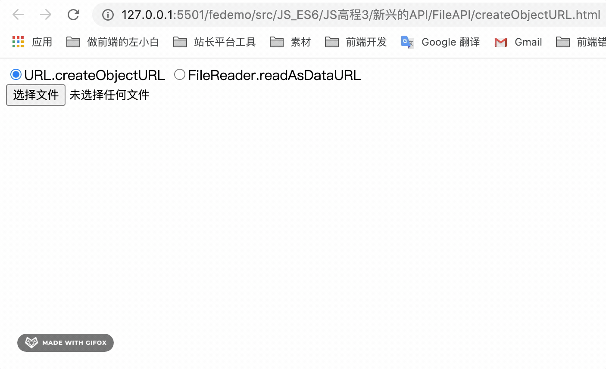

---
{
  "title": "FileReader.readAsDataURL与URL.createObjectURL的区别",
  "staticFileName": "file_preview_download.html",
  "author": "guoqzuo",
  "createDate": "2020/10/25",
  "description": "在前端开发中，这两个函数都是可以用于处理文件二进制数据的，一般用于上传文件时预览图片，或者在下载、导出文件时使用。下面来以上传图片、前端预览图片的功能为例，比较两个函数的的区别。下面的代码中，我们使用一个 radio 来切换使用两种方法。当检测到上传文件的 input 内容 change 后，根据当前 radio 的值，调用不同的方法来预览图片。运行效果如上图",
  "keywords": "文件预览,文件下载函数,createObjectURL,readAsDataURL",
  "category": "JavaScript"
}
---

# FileReader.readAsDataURL与URL.createObjectURL的区别

在前端开发中，这两个函数都是可以用于处理文件二进制数据的，一般用于上传文件时预览图片，或者在下载、导出文件时使用。

下面来以上传图片、前端预览图片的功能为例，比较两个函数的的区别



下面的代码中，我们使用一个 radio 来切换使用两种方法。当检测到上传文件的 input 内容 change 后，根据当前 radio 的值，调用不同的方法来预览图片。运行效果如上图

```js
<div>
  <form id="form">
    <label><input type="radio" name="type" value="a" checked>URL.createObjectURL</label>
    <label><input type="radio" name="type" value="b">FileReader.readAsDataURL</label>
  </form>
</div>
<input type="file" id="file">
<div></div>
<div id="imgSrc"></div>
<script>
  let file = document.getElementById('file')
  file.onchange = function (e) {
    let funcType = document.getElementById('form').type.value
    if (funcType === 'a') {
      // 方法1 
      // blob:http://127.0.0.1:5501/dffc0dee-93e7-4b8f-bee2-8a3b8671aeb2
      let dataUrl = window.URL.createObjectURL(this.files[0])
      document.getElementById('img').src = dataUrl
      document.querySelector('#imgSrc').innerHTML = dataUrl
    } else {
      // 方法2 
      // data:image/png;base64,iVBORw0KGgoAAA....
      let reader = new FileReader();
      reader.readAsDataURL(this.files[0])
      reader.onload = function (e) {
        document.getElementById('img').src = reader.result
        document.querySelector('#imgSrc').innerHTML = reader.result
      }
    }
  }
</script>
```

有上面的例子可以得出 

- readAsDataURL 它是将二进制文件数据转成了 URI，base64数据。
- createObjectURL 它是二进制文件数据转成了临时的 URL，是 URL 链接。 

这里假设我们拿到数据后，进行下载，一般使用 a 标签，再 click。如果是 IE，使用 window.navigator.msSaveBlob。假设我们使用下面的函数来进行下载。如果createObjectURL 生成的 URL，是没问题的，但如果是 readAsDataURL 生成的 base64 就会出现兼容性问题、卡顿问题。

因此在图片预览时可以使用 FileReader.readAsDataURL，但下载文件时，就需要使用 URL.createObjectURL 了。

```js
    function downloadFile(dataUrl) {
      // 如果是IE，特殊处理，防止IE下提提示 "拒绝访问"
      // blob拒绝访问文件 fix
      if (window.navigator.msSaveBlob) {
        try {
          // 根据实际情况加后缀名
          window.navigator.msSaveBlob(dataUrl, '下载文件.zip')
        } catch(e) {
          console.log('msSaveBlob异常', e)
        }
        return
      } 
      const downloadEl = document.createElement('a')
      downloadEl.href = dataUrl
      downloadEl.download = '下载文件' // download文件名
      document.body.appendChild(downloadEl)
      downloadEl.click() 
    }
```

参考：
- [FileReader.readAsDataURL() | MDN](https://developer.mozilla.org/zh-CN/docs/Web/API/FileReader/readAsDataURL)
- [URL.createObjectURL() | MDN](https://developer.mozilla.org/zh-CN/docs/Web/API/URL/createObjectURL)
- [File API - 新兴的API | JS高程3笔记](https://www.yuque.com/guoqzuo/js_es6/nocthb#97824fad)