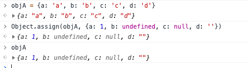

# Object.assgin时是否会忽略null,undefined,空字符串
一般我们在需要设置某个对象的多个值时Object.assgin是一种很好的方法，但又怕当某个属性的值为空字符串、null或undefined时，会自动跳过的情况。这里来做一个简单的测试

```js
objA = {a: 'a', b: 'b', c: 'c', d: 'd'}
Object.assign(objA, {a: 1, b: undefined, c: null, d: ''})
objA // {a: 1, b: undefined, c: null, d: ""}
```



综上，Object.assgin可以放心用