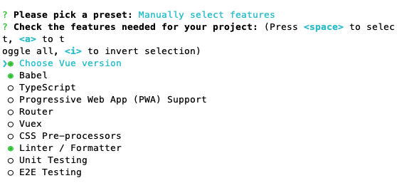

# Vue CLI构建项目时选择不同的eslint规则会有什么区别？

当我们使用 vue create xxx 时，会让选择是否需要某个模块，如下图



如果有使用空格选择 Linter / Formatter，那么后面的流程会让你选择一种eslint规则
```bash
? Pick a linter / formatter config: (Use arrow keys)
❯ ESLint with error prevention only 
  ESLint + Airbnb config 
  ESLint + Standard config 
  ESLint + Prettier 
```
加上不使用Linter / Formatter，总共有 5 种情况，我们都逐一试试，看生成的package.json有什么不同

> 注意除了eslint规则选择不一样外，其他都一样。vue-cli 版本 4.5.0，vue 版本 2.x

```js
// 统一选择 lint on save，配置放到package.json，不单独生成elsint配置文件
? Pick additional lint features: Lint on save
? Where do you prefer placing config for Babel, ESLint, etc.? In package.json
```

## 不使用eslint时
package.json里面只有 vue 依赖的一些基础模块
```js
  "scripts": {
    "serve": "vue-cli-service serve",
    "build": "vue-cli-service build"
  },
  "devDependencies": {
    "@vue/cli-plugin-babel": "~4.5.0",
    "@vue/cli-plugin-router": "~4.5.0",
    "@vue/cli-plugin-vuex": "~4.5.0",
    "@vue/cli-service": "~4.5.0",
    "less": "^3.0.4",
    "less-loader": "^5.0.0",
    "vue-template-compiler": "^2.6.11"
  },
```
## ESLint with error prevention only 
下面是除了 vue 必要模块外，新增的 eslint 相关配置
```js
"scripts": {
  "lint": "vue-cli-service lint"
},
"devDependencies": {
    "@vue/cli-plugin-eslint": "~4.5.0",
    "babel-eslint": "^10.1.0",
    "eslint": "^6.7.2",
    "eslint-plugin-vue": "^6.2.2",
  },
  "eslintConfig": {
    "root": true,
    "env": {
      "node": true
    },
    "extends": [
      "plugin:vue/essential",
      "eslint:recommended"
    ],
    "parserOptions": {
      "parser": "babel-eslint"
    },
    "rules": {}
  },
```
## ESLint + Airbnb config 
```js
 "devDependencies": {
    "@vue/cli-plugin-eslint": "~4.5.0",
    "@vue/eslint-config-airbnb": "^5.0.2",
    "babel-eslint": "^10.1.0",
    "eslint": "^6.7.2",
    "eslint-plugin-import": "^2.20.2",
    "eslint-plugin-vue": "^6.2.2",
  },
  "eslintConfig": {
    "root": true,
    "env": {
      "node": true
    },
    "extends": [
      "plugin:vue/essential",
      "@vue/airbnb"
    ],
    "parserOptions": {
      "parser": "babel-eslint"
    },
    "rules": {}
  },
```
多了一个.editorconfig
```js
[*.{js,jsx,ts,tsx,vue}]
indent_style = space
indent_size = 2
end_of_line = lf
trim_trailing_whitespace = true
insert_final_newline = true
max_line_length = 100
```
## ESLint + Standard config 
```js
 "devDependencies": {
    "@vue/cli-plugin-eslint": "~4.5.0",
    "@vue/eslint-config-standard": "^5.1.2",
    "babel-eslint": "^10.1.0",
    "eslint": "^6.7.2",
    "eslint-plugin-import": "^2.20.2",
    "eslint-plugin-node": "^11.1.0",
    "eslint-plugin-promise": "^4.2.1",
    "eslint-plugin-standard": "^4.0.0",
    "eslint-plugin-vue": "^6.2.2",
  },
  "eslintConfig": {
    "root": true,
    "env": {
      "node": true
    },
    "extends": [
      "plugin:vue/essential",
      "@vue/standard"
    ],
    "parserOptions": {
      "parser": "babel-eslint"
    },
    "rules": {}
  },
```
多了一个.editorconfig
```js
[*.{js,jsx,ts,tsx,vue}]
indent_style = space
indent_size = 2
trim_trailing_whitespace = true
insert_final_newline = true
```
## ESLint + Prettier 
```js
  "devDependencies": {
    "@vue/cli-plugin-eslint": "~4.5.0",
    "@vue/eslint-config-prettier": "^6.0.0",
    "babel-eslint": "^10.1.0",
    "eslint": "^6.7.2",
    "eslint-plugin-prettier": "^3.1.3",
    "eslint-plugin-vue": "^6.2.2",
    "prettier": "^1.19.1",
  },
  "eslintConfig": {
    "root": true,
    "env": {
      "node": true
    },
    "extends": [
      "plugin:vue/essential",
      "eslint:recommended",
      "@vue/prettier"
    ],
    "parserOptions": {
      "parser": "babel-eslint"
    },
    "rules": {}
  },
```

我们使用上面相同的配置，只是不选择将eslint配置放到paackage.json，而是选择 In dedicated config files 使用专门的配置文件，他会额外生成一个 .eslintrc.js 存放对应的eslint配置

```js
// .eslintrc.js
module.exports = {
  root: true,
  env: {
    node: true
  },
  extends: ["plugin:vue/essential", "eslint:recommended", "@vue/prettier"],
  parserOptions: {
    parser: "babel-eslint"
  },
  rules: {
    "no-console": process.env.NODE_ENV === "production" ? "warn" : "off",
    "no-debugger": process.env.NODE_ENV === "production" ? "warn" : "off"
  }
};
```
## ESLint配置配置对比总结
```js
// 1. ESLint with error prevention only 
// - devDependencies
"@vue/cli-plugin-eslint": "~4.5.0",
"babel-eslint": "^10.1.0",
"eslint": "^6.7.2",
"eslint-plugin-vue": "^6.2.2",
// - eslintConfig
"extends": [
  "plugin:vue/essential",
  "eslint:recommended"
],

// 2. ESLint + Airbnb config 
// - devDependencies
"@vue/cli-plugin-eslint": "~4.5.0",
"babel-eslint": "^10.1.0",
"eslint": "^6.7.2",
"eslint-plugin-vue": "^6.2.2",
"@vue/eslint-config-airbnb": "^5.0.2",
"eslint-plugin-import": "^2.20.2",
// - eslintConfig
"extends": [
  "plugin:vue/essential",
  "@vue/airbnb"
],

// 3. ESLint + Standard config 
// - devDependencies
"@vue/cli-plugin-eslint": "~4.5.0",
"babel-eslint": "^10.1.0",
"eslint": "^6.7.2",
"eslint-plugin-vue": "^6.2.2",
"@vue/eslint-config-standard": "^5.1.2",
"eslint-plugin-import": "^2.20.2",
"eslint-plugin-node": "^11.1.0",
"eslint-plugin-promise": "^4.2.1",
"eslint-plugin-standard": "^4.0.0",

// - eslintConfig
"extends": [
  "plugin:vue/essential",
  "@vue/standard"
],

// 4. ESLint + Prettier
// - devDependencies
"@vue/cli-plugin-eslint": "~4.5.0",
"babel-eslint": "^10.1.0",
"eslint": "^6.7.2",
"eslint-plugin-vue": "^6.2.2",
"@vue/eslint-config-prettier": "^6.0.0",
"eslint-plugin-prettier": "^3.1.3",
"prettier": "^1.19.1",
// - eslintConfig
"extends": [
  "plugin:vue/essential",
  "eslint:recommended",
  "@vue/prettier"
],
```