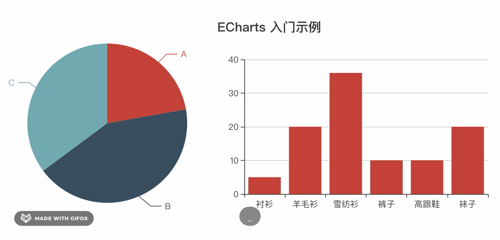

---
{
  "title": "Vue实用echarts组件封装",
  "staticFileName": "vue_echarts.html",
  "author": "guoqzuo",
  "createDate": "2020/10/31",
  "description": "vue中使用echarts可以自己封装一个简单的组件。实现每次更新数据只需要修改options的值即可，并自带loading、暂无数据slot。先来看看使用demo",
  "keywords": "Vue echarts组件封装,echarts组件",
  "category": "Vue"
}
---
# Vue实用echarts组件封装

vue中使用echarts可以自己封装一个简单的组件。实现每次更新数据只需要修改options的值即可，并自带loading、暂无数据slot。先来看看使用demo



```js
// main.js 全局引入
import VueChart from "@guoqzuo/vue-chart";
Vue.use(VueChart);
```
然后在任意组件里可以直接使用 z-echart
```html
<!-- 固定宽柱状图，不自动resize -->
<div style="width:300px; height: 300px">
  <z-chart :options="bar" :loading="loading" :autoResize="false"> </z-chart>
</div>
<!-- 宽高自适应，resize后自动渲染，当hasData为false时显示暂无数据的slot内容-->
<div style="width: 50%; height: 50vh">
  <z-chart :options="pie" :hasData="hasData">
    暂无数据
  </z-chart>
</div>
```

来看看z-chart组件的实现细节，这里把echart单独用一个组件处理，在z-echart组件里引入，并加入loading、无数据的slot显示处理
```html
<template>
  <!-- z-chart -->
  <div class="z-chart-container">
    <base-chart
      v-if="!loading && hasData"
      :options="options"
      v-on="$listeners"
      v-bind="$attrs"
    ></base-chart>
    <base-loading v-if="loading"></base-loading>

    <!-- no data slot -->
    <slot v-if="!loading && !hasData"></slot>
  </div>
</template>
```
base-chart代码如下，它主要做了三个操作

- 使用options初始化图表
- 如果是百分比大小的图，resize时，自动重绘
- 使用watch监听options改动，如果有改动为了防止渲染异常，直接dispose销毁echart实例，重新加载

```html
<template>
  <!-- base chart -->
  <div class="z-chart" ref="z-echart"></div>
</template>

<script>
import echarts from "echarts";
import { addListener, removeListener } from "resize-detector";
import { debounce } from "lodash-es";

export default {
  name: "BaseChart",

  props: {
    options: {
      type: Object,
      required: false
    },
    autoResize: {
      type: Boolean,
      required: false,
      default: true
    }
  },

  data() {
    return {};
  },

  created() {
    // 监听 options 改动，改动后重绘数据
    this.$watch(
      "options",
      () => {
        this.refresh();
      },
      { deep: true }
    );
  },

  mounted() {
    this.init();
  },

  beforeDestroy() {
    this.destroy();
  },

  methods: {
    init() {
      let chart = echarts.init(this.$refs["z-echart"]);
      chart.setOption(this.options || {});
      this.chart = chart;

      // 当元素宽高改变时resize执行重绘
      if (this.autoResize) {
        this.__resizeHanlder = debounce(
          () => {
            chart.resize();
          },
          100,
          { leading: true }
        );
        addListener(this.$el, this.__resizeHanlder);
      }
    },

    destroy() {
      // 销毁实例，防止 柱状图 动态切换到 饼图 时，柱状图部分属性依旧留存的问题
      this.chart.dispose();
      this.chart = null;
      this.autoResize && removeListener(this.$el, this.__resizeHanlder);
    },

    // 销毁后重绘，用于options变更后刷新图表
    refresh() {
      this.destroy();
      this.init();
    }
  }
};
</script>

<style lang="less" scoped>
.z-chart {
  width: 100%;
  height: 100%;
}
</style>
```

- [完整测试demo地址 | github](https://github.com/zuoxiaobai/vue-chart/tree/master/examples/src/views/zchart)
- [z-chart组件源码 | github](https://github.com/zuoxiaobai/vue-chart/packages/z-chart/)
- 更加高级的封装，可以查看 [ve-charts源码](https://github.com/vueblocks/ve-charts)
