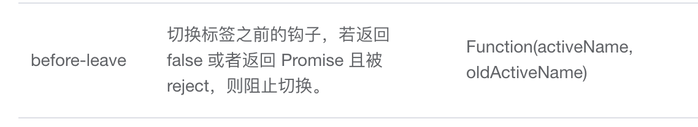

# el-tabs跳转之前先弹窗确认后再切到tab页

增加 before-leave 钩子函数，如果返回 false，就不会跳转过去。它的返回值除了支持true，false外，还支持 promise 的 resolve 和 reject。我们可以将调用js弹窗组件函数改为promise，如果非提交表单关闭弹窗就返回 reject。否则 resove 表单数据。调用该函数时使用try catch可以很好的处理筛选组件弹窗确定后再跳转到对应tab的逻辑。

参考：[Tabs Attributes | Tab标签页](https://element.eleme.cn/#/zh-CN/component/tabs)