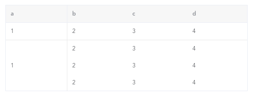

---
{
  "title": "element合并单元格，自定义表格border",
  "staticFileName": "element_merge_cells.html",
  "author": "guoqzuo",
  "createDate": "2020/10/01",
  "description": "有个较为特殊的表格，需要合并单元格，且改变表格border，下面来看看element el-table怎么实现这种表格。先来分析下怎么做，1. 第一列中第二行以后的行是需要合并的，el-table 提供了一个 span-method 属性，用于传入合并单元格方法，在里面可以根据 rowspan、colspan 合并行或列 2. 第 2、3、4 列需要改变表格 border，需要使用 `/deep/` 修改 element 默认的颜色，使用 nth-child、first-child 等找到对应的行或列，修改border",
  "keywords": "element合并单元格,element表格合并单元格",
  "category": "Vue"
}
---
# element合并单元格，自定义表格border
有个较为特殊的表格，需要合并单元格，且改变表格border，下面来看看element el-table怎么实现这种表格



先来分析下怎么做
1. 第一列中第二行以后的行是需要合并的，el-table 提供了一个 span-method 属性，用于传入合并单元格方法，在里面可以根据 rowspan、colspan 合并行或列
2. 第 2、3、4 列需要改变表格 border，需要使用 `/deep/` 修改 element 默认的颜色，使用 nth-child、first-child 等找到对应的行或列，修改border

具体实现代码如下

```html
<template>
  <div class="table-test">
    <el-table
      :data="dataList"
      border
      size="mini"
      :span-method="arraySpanMethod"
      :header-cell-style="{ background: '#f7f7f7' }"
    >
      <el-table-column
        v-for="item in ['a', 'b', 'c', 'd']"
        :key="item"
        :prop="item"
        :label="item"
      ></el-table-column>
    </el-table>
  </div>
</template>

<script>
export default {
  data() {
    return {
      dataList: []
    };
  },
  mounted() {
    this.dataList = [1, 2, 3, 4].map(() => {
      return { a: "1", b: "2", c: "3", d: 4 };
    });
  },
  methods: {
    arraySpanMethod({ row, column, rowIndex, columnIndex }) {
      console.log(row, column, rowIndex, columnIndex);
      // 只是遍历表格td内容，不包含th表头
      // 对第一列，进行合并列
      if (columnIndex === 0) {
        if (rowIndex === 0) {
          // 第一列，第一行，默认
          return {
            rowspan: 1,
            colspan: 1
          };
        } else if (rowIndex === 1) {
          // 第一列，第二行，合并，占this.dataList.length - 1行
          return {
            rowspan: this.dataList.length - 1,
            colspan: 1
          };
        } else if (rowIndex >= 2) {
          // 第一列，剩余行，为空
          return {
            rowspan: 0,
            colspan: 0
          };
        }
      }
    }
  }
};
</script>

<style lang="less" scoped>
.table-test {
  width: 500px;
  margin: 100px;
  // border处理
  // 去掉表头单元格th右边框
  /deep/ .el-table th:not(:first-child) {
    border-right: 0;
  }
  // 去掉表格内容单元格td的右侧边框、底部边框
  /deep/ .el-table td {
    border-right: 0;
    border-bottom: 0;
  }
  // 为第一行td增加底部border
  /deep/ .el-table__row:first-child td {
    border-bottom: 1px solid #eaeaea;
  }
  // 为第一行第一列td增加右侧border
  /deep/ .el-table__row:first-child td:first-child,
  // 为第二行（合并后的）第一列td设置右侧border
  /deep/ .el-table__row:nth-child(2) td:first-child {
    border-right: 1px solid #eaeaea;
  }
}
</style>
```

完整demo参见：[element合并单元格demo | github](https://github.com/dev-zuo/fedemo/blob/master/src/vuecli-demo/src/views/table/index.vue)