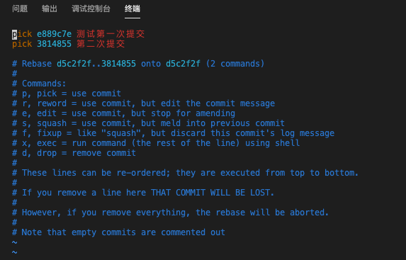
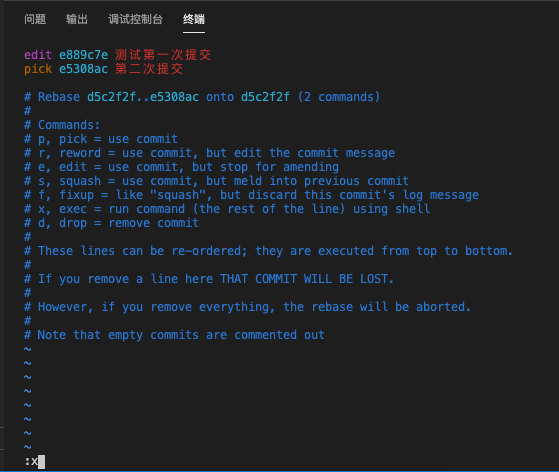
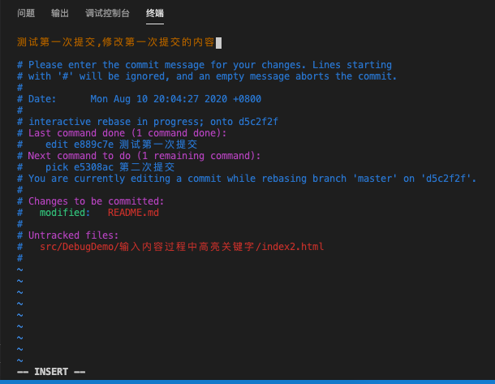

# git修改上上次的commit信息
由于提交代码时有钩子函数，信息里面没有包含前置的 code 会无法提交。所以如果 commit 信息写的有问题需要修改后才能提交

对于修改上一次 commit 备注信息，我们可以使用 `git commit --amend -m 'xxx'` 来修改。但它无法修改上上次提交信息，这种情况我们可以使用 rebase 来做处理，下面来做一个测试

本地做两次提交，第一次提交信息为"测试第一次提交"， 第二次提交信息为 "第二次提交"，先不push，我们需要修改上上次的提交信息，也就是修改"测试第一次提交"的内容
```bash
# 查看git记录
guoqzuo-mac:fedemo kevin$ git log
commit 3814855781da539d21e2072e42a53558587497c6 (HEAD -> master)
Author: guoqzuo <guoqzuo@gmail.com>
Date:   Mon Aug 10 22:28:15 2020 +0800

    第二次提交

commit e889c7ecbcb024037701eb48c9bfe3b9c22f9490
Author: guoqzuo <guoqzuo@gmail.com>
Date:   Mon Aug 10 20:04:27 2020 +0800

    测试第一次提交

commit d5c2f2f3193cf02d6ac1ae995ca00c4082e36cad (origin/master, origin/HEAD)
Author: guoqzuo <guoqzuo@gmail.com>
Date:   Mon Aug 10 00:56:34 2020 +0800

    update cookie研究,合并单元格研究demo
:
```

执行 `git rebase -i HEAD~2`，如下图可以看到最近两次提交，进入一个 vim 编辑页面



按ESC, 再按 a 进入INSERT模式, 将上上次提交的信息前的 pick 改为 edit，如下图，按ESC，再按 shift + : 进入命令模式，输入x 或wq保存，不熟悉vim操作的可以搜索下vim教程



保存后，终端里会看到下面 log 信息
```js
guoqzuo-mac:fedemo kevin$ git rebase -i HEAD~2
Stopped at e889c7e...  测试第一次提交
You can amend the commit now, with

  git commit --amend 

Once you are satisfied with your changes, run

  git rebase --continue
guoqzuo-mac:fedemo kevin$ 
```

运行 `git commit --amend` 会进入下面的修改页面，可以修改上上次的信息



这里我们把上上次信息改为 "测试第一次提交,修改第一次提交的内容"，保存后，结果如下

```js
[detached HEAD 45f5911] 测试第一次提交,修改第一次提交的内容
 Date: Mon Aug 10 20:04:27 2020 +0800
 1 file changed, 2 insertions(+)
guoqzuo-mac:fedemo kevin$ 
```
然后运行 `git rebase --continue`，这样就修改好了
```js
guoqzuo-mac:fedemo kevin$ git rebase --continue
Successfully rebased and updated refs/heads/master.
guoqzuo-mac:fedemo kevin$ 
```
再来 git log 看看提交记录，修改上上次的提交信息已ok
```js
guoqzuo-mac:fedemo kevin$ git log
commit e498bcabf2d2e4c97f47320e1d72693cb82d9db8 (HEAD -> master)
Author: guoqzuo <guoqzuo@gmail.com>
Date:   Mon Aug 10 22:28:15 2020 +0800

    第二次提交

commit 45f591157be44100073de14f5808b816104a8f2b
Author: guoqzuo <guoqzuo@gmail.com>
Date:   Mon Aug 10 20:04:27 2020 +0800

    测试第一次提交,修改第一次提交的内容

```

参考：[修改上上次的commit信息](https://www.jianshu.com/p/0f1fbd50b4be)
