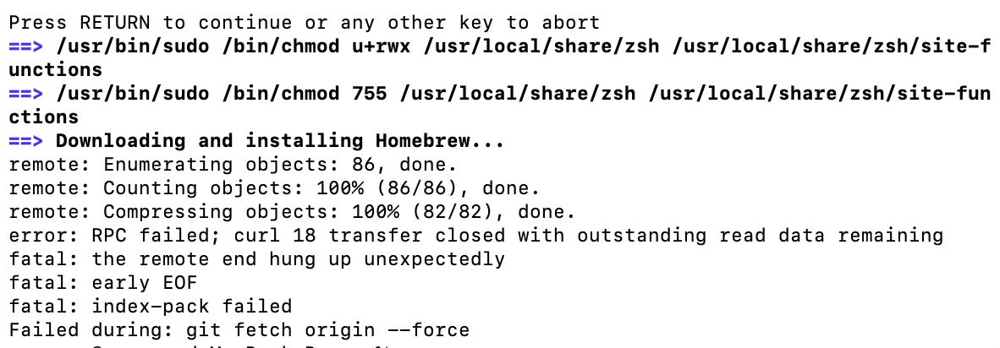
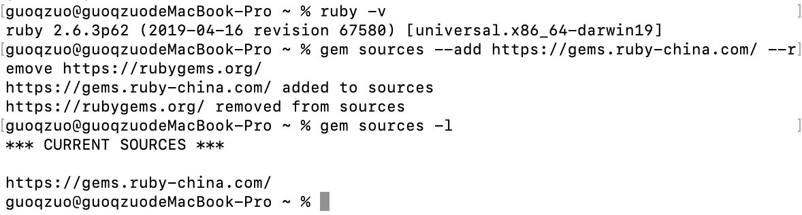

# mac安装brew下载慢，安装异常，切换成ruby-china源
mac下使用brew可以很方便的安装svn、nginx等常用的工具。

什么是brew [bruː]，它的全称是 [Homebrew](https://brew.sh/)，The Missing Package Manager for macOS (or Linux)。它可以安装macOS或linux下没有的包(Package)。

一般使用ruby来安装
```bash
ruby -e "$(curl -fsSL https://raw.githubusercontent.com/Homebrew/install/master/install)"
```
mac自带ruby，但如果直接安装，他会比较慢，直接卡死，安装不上。



这就需要使用国内的 ruby 源了。类似与npm与cnpm的概念，这里使用ruby-china的源，具体参考：[RubyGems - Ruby China](https://gems.ruby-china.com/)

```bash
# 设置ruby源
gem sources --add https://gems.ruby-china.com/ --remove https://rubygems.org/
# 查看ruby源
gem sources -l
```



**这样，再重新运行安装brew的命令就可以安装成功了，虽然也慢，但至少可以安装成功。安装包就快了。**

参考：
- [Mac必备神器Homebrew](https://zhuanlan.zhihu.com/p/59805070)
- [taobao Gems 源已停止维护，现由 ruby-china 提供镜像服务](https://ruby-china.org/topics/29250)