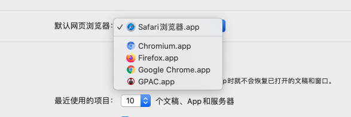

---
{
  "title": "mac设置vscode默认打开的浏览器",
  "staticFileName": "mac_default_browser.html",
  "author": "guoqzuo",
  "createDate": "2020/10/25",
  "description": "vscode中，安装 Live Server 插件后，在html文件里，右键 open with Live Server，可以将网页使用http服务在浏览器里面打开。我电脑里面默认打开的是 safari，但我一般习惯用Chrome，这个默认浏览器的设置需要在mac系统里设置，点击屏幕左上角苹果标志 => 系统偏好设置 => 通用 => 默认网页浏览器 选择 Google Chrome 即可",
  "keywords": "vscode默认浏览器,mac设置默认浏览器",
  "category": "计算机基础与开发工具"
}
---
# mac设置vscode默认打开的浏览器
vscode中，安装 Live Server 插件后，在html文件里，右键 open with Live Server，可以将网页使用http服务在浏览器里面打开。

我电脑里面默认打开的是 safari，但我一般习惯用Chrome，这个默认浏览器的设置需要在mac系统里设置

点击屏幕左上角苹果标志 => 系统偏好设置 => 通用 => 默认网页浏览器 选择 Google Chrome 即可

