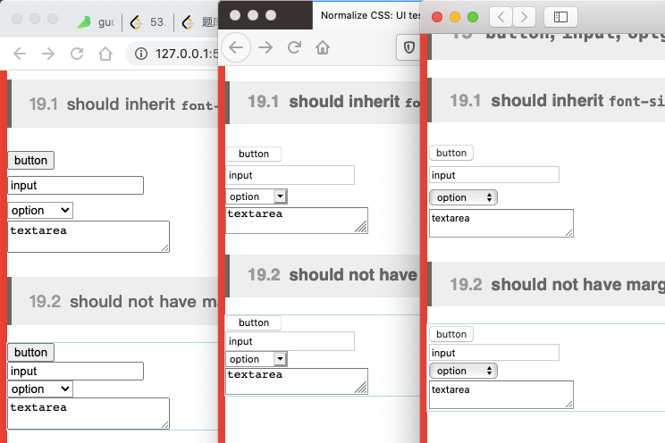
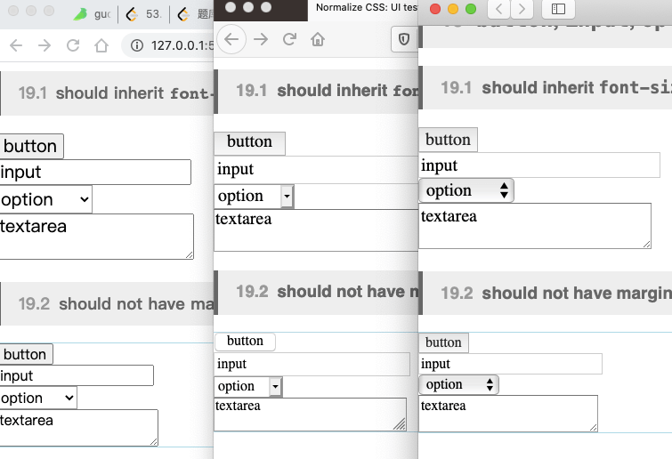

---
{
  "title": "normalize.css浏览器样式差异抹平",
  "staticFileName": "normalize.html",
  "author": "guoqzuo",
  "createDate": "2020/10/31",
  "description": "normalize.css, A modern alternative to CSS resets 一个用于CSS重置的现代替代方法。主要用于解决不同浏览器默认样式之间的差异。What does it do? - Preserves useful defaults, unlike many CSS resets. 保留有用的默认样式，重置许多不一样的CSS - Normalizes styles for a wide range of elements. 为许多各种各样的元素标准化样式",
  "keywords": "浏览器样式差异抹平,normalize.css",
  "category": "CSS"
}
---
# normalize.css浏览器样式差异抹平

[normalize.css](https://github.com/necolas/normalize.css), A modern alternative to CSS resets 一个用于CSS重置的现代替代方法

主要用于解决不同浏览器默认样式之间的差异

What does it do?
- Preserves useful defaults, unlike many CSS resets. 保留有用的默认样式，重置许多不一样的CSS
- Normalizes styles for a wide range of elements. 为许多各种各样的元素标准化样式
- Corrects bugs and common browser inconsistencies. 修正bug和常见的浏览器不一致样式
- Improves usability with subtle modifications. 通细微的修改提高可用性
- Explains what code does using detailed comments. 使用详细的注释来解释代码的作用

下面来看看 Chrome、Safari、Firefox 三个浏览器之间的差异

使用 normalize.css 后的效果 

现有的UI框架也抹平了这些差异
