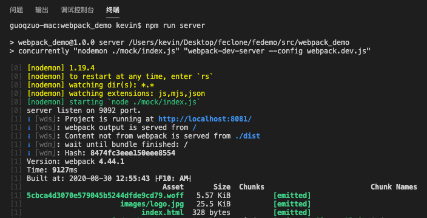

---
{
  "title": "npm run 运行多条命令 && 不生效的问题",
  "staticFileName": "npm_run_multi.html",
  "author": "guoqzuo",
  "createDate": "2020/10/25",
  "description": "在项目中除了默认的 webpack-dev-server 外，我们还想同时运行 mock 接口的 node 服务，，会使用 && 同时执行两条命令。在有些使用实际运行 npm run server 时，只运行了第一条命令，我的是mac，不知道是不是node版本的问题。网上找了下， && 存在兼容性问题。建议使用 concurrently 来代替，concurrently 跨平台兼容",
  "keywords": "npm run &&多条命令不生效",
  "category": "前端工程化"
}
---
# npm run 运行多条命令 && 不生效的问题
在项目中除了默认的 webpack-dev-server 外，我们还想同时运行 mock 接口的 node 服务，会使用 && 同时执行两条命令
```js
// npm run 同时执行下面的两条命令
// webpack-dev-server --config webpack.dev.js
// nodemon ./mock/index.js
```
一般 & 表示并列执行，&& 表示两条命令顺序执行。使用 && 的形式设置对应的script，如下
```js
"scripts": {
  "server": "nodemon ./mock/index.js && webpack-dev-server --config webpack.dev.js"
}
```
但实际运行 npm run server 时，只运行了第一条命令，我的是mac，不知道是不是node版本的问题。网上找了下， && 存在兼容性问题。建议使用 concurrently 来代替，concurrently 跨平台兼容
```js
// 先安装 concurrently
// npm install concurrently --save
// 修改 package.json 如下
"server": "concurrently \"nodemon ./mock/index.js\" \"webpack-dev-server --config webpack.dev.js\""
```

这样就可以了，运行效果如下



注意：&& 是按顺序执行多条命令， concurrently 是并列执行多条命令，对于跨平台的顺序执行，可以使用 npm-run-all

参考：[npm并行&串行执行多个scripts命令](https://blog.csdn.net/ligang2585116/article/details/105909789/)
