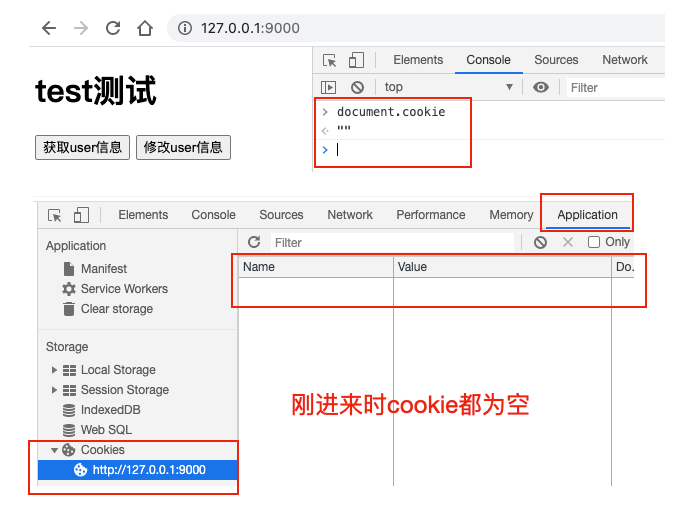
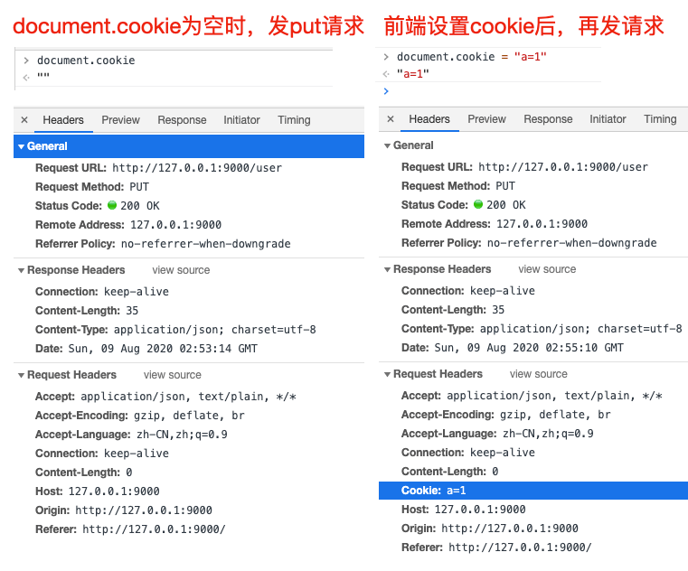
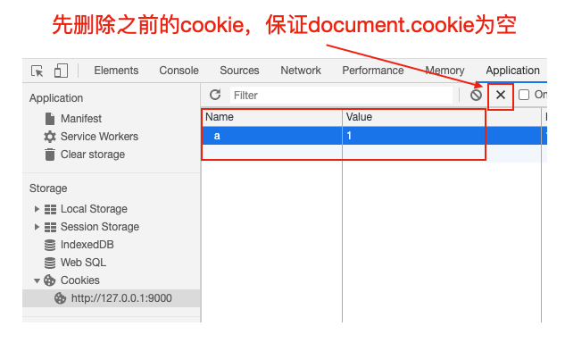
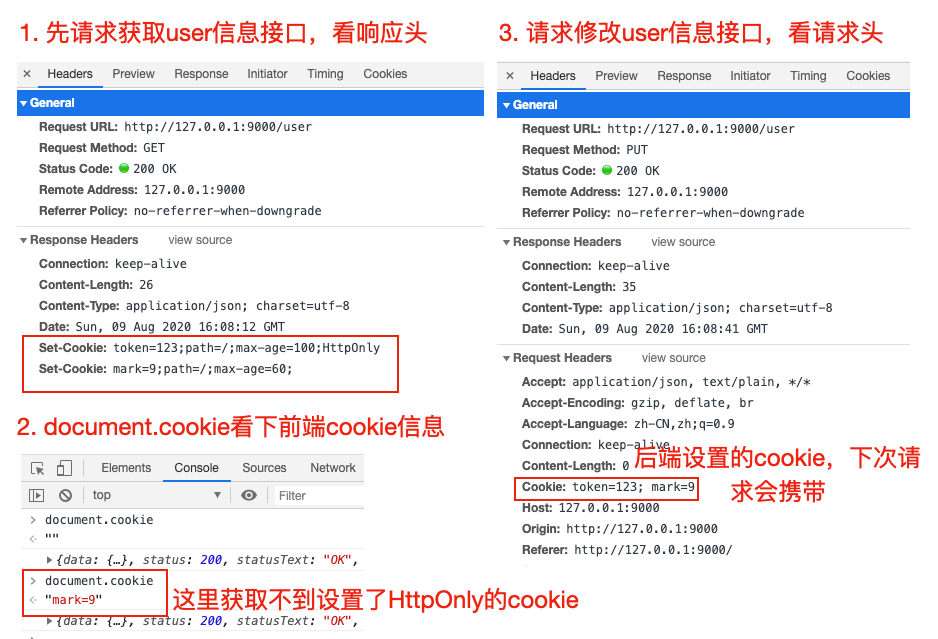
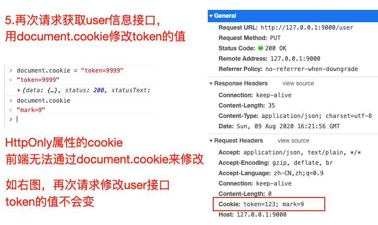

---
{
  "title": "前端通过document.cookie设置cookie，相关改动会传到后台吗？",
  "staticFileName": "document_cookie_edit.html",
  "author": "guoqzuo",
  "createDate": "2020/10/01",
  "description": "首先我们来捋一捋，什么是cookie？与cookie相关的知识点有两个：1. 前端获取/设置cookie，使用 document.cookie 2. HTTP请求与响应相关cookie，我们先下个结论：他们之间是相互关联的，接口响应头设置cookie，会对document.cookie的值产生影响；前端设置docuemnt.cookie也会对请求头cookie值产生影响，但如果后端写到前端的cookie如果使用了HttpOnly属性，前端是无法通过document.cookie做修改的",
  "keywords": "document.cookie设置cookie对接口影响",
  "category": "http与https"
}
---
# 前端通过document.cookie设置cookie，相关改动会传到后台吗？

首先我们来捋一捋，什么是cookie？与cookie相关的知识点有两个：
1. 前端获取/设置cookie，使用 document.cookie
2. HTTP请求与响应相关cookie

我们先下个结论：他们之间是相互关联的，接口响应头设置cookie，会对document.cookie的值产生影响；前端设置docuemnt.cookie也会对请求头cookie值产生影响，**但如果后端写到前端的cookie如果使用了HttpOnly属性，前端是无法通过document.cookie做修改的**

## 根据功能点写测试demo
纸上得来终觉浅，这里为了弄懂这里面的关系，我们来写一个demo做测试，将涉及的知识点都串起来，首先要有一个html页面，有两个用处
1. 在该页面打开F12，在console里通过命令查看或设置document.cookie信息
2. 在该页面中请求接口，在F12 Network里观察请求头，响应头里cookie的信息

另外需要写两个接口，用户观察请求响应头里cookie的信息，这里我们用koa来写两个简单的接口。

下面是demo目录层级，完整demo参见 [前端改变cookie后之后的请求会携带上吗demo | github](https://github.com/dev-zuo/fedemo/tree/master/src/DebugDemo/%E5%89%8D%E7%AB%AF%E6%94%B9%E5%8F%98cookie%E5%90%8E%E4%B9%8B%E5%90%8E%E7%9A%84%E8%AF%B7%E6%B1%82%E4%BC%9A%E6%90%BA%E5%B8%A6%E4%B8%8A%E5%90%97)

```bash
# demo 目录层级
├── public
│   └── index.html # 静态页面
├── index.js # 接口
└── package.json # npm init 创建，用于安装index.js引入的koa等npm包
```

index.html代码如下
```html
<body>
  <h1>test测试</h1>
  <button id="userInfoBtn">获取user信息</button>
  <button id="editInfoBtn">修改user信息</button>
  <script src="https://unpkg.com/axios/dist/axios.min.js"></script>
  <script>
    let userInfoBtn = document.querySelector('#userInfoBtn')
    let eidtInfoBtn = document.querySelector('#userInfoBtn')
    // 请求获取用户信息接口
    // 用于测试响应头设置 'Set-Cookie' 对前端docuemnt.cookie的影响
    userInfoBtn.onclick = () => {
      axios.get('/user').then((res) => {
        console.log(res)
      }).catch((e) => {
        console.error(e.message)
      })
    }
    // 请求修改用户信息接口
    // 用于测试document.cookie设置后或者第一次请求响应头设置Set-Cookie后，对下次接口请求头的影响
    editInfoBtn.onclick = () => {
      axios.put('/user').then((res) => {
        console.log(res)
      }).catch((e) => {
        console.error(e.message)
      })
    }
  </script>
</body>
```

index.js接口代码
```js
const Koa = require('koa')
const Router = require('koa-router')
const app = new Koa()
const router = new Router()

// 静态服务，用于使用 http://127.0.0.1:9000/ 访问 public下的index.html页面
app.use(new require('koa-static')('./public'))

// GET /user  接口，设置Set-Cookie响应头测试
router.get('/user', ctx => {
  ctx.set({
    // 'Set-Cookie': 'token=123;path=/;max-age=100;HttpOnly',
    'Set-Cookie': ['token=123;path=/;max-age=100;HttpOnly','mark=9;path=/;']
  })
  ctx.body = {
    name: '张三',
    age: 20
  }
})

// PUT /user  接口，用于观察接口请求头
router.put('/user', ctx => {
  ctx.body = {
    code: 0,
    data: {},
    msg: '成功'
  }
})

app.use(router.routes())

// 开启本地HTTP服务，9000端口
app.listen(9000, () => {
  console.log('server listen on 9000 port')
})
```

## document.cookie设置对请求头的影响
首先我们可以先看 [Document.cookie - Web API 接口参考 | MDN](https://developer.mozilla.org/zh-CN/docs/Web/API/Document/cookie) 这个文档，对document.cookie有一个大概的了解。

我们先运行demo，nodemon index.js，访问 `http://127.0.0.1:9000/` 进入页面，查看cookie信息，如下图



这时，我们发送一个put请求，看接口请求头信息。再通过 document.cookie = "a=1" 设置cookie，然后再发送一个put请求，对比请求头之前的区别，如下图，我们初步得出结论：**前端设置cookie后，下次请求，在请求头里会携带这个cookie**



## document.cookie操作方法
document.cookie API的设计不怎么友好，一般会使用一个库，来操作docuemnt.cookie，需要注意
```js
document.cookie = "a=1" // 如果cookie中没有a这个key，可以添加key为a，值为1的cookie，否则修改对应的值为1
document.cookie = "" // 不会清空cookie，对cookie基本无影响
// 怎么删除 a=1 的cookie呢？将该cookie的有效时间设置为过去的时间即可
document.cookie = "a=1;expires=" + new Date('1970-1-1')
```
MDN document.cookie文档里有推荐的一个操作cookie的封装方法，可以参考下
```js
/*\
|*|
|*|  :: cookies.js ::
|*|
|*|  A complete cookies reader/writer framework with full unicode support.
|*|
|*|  https://developer.mozilla.org/en-US/docs/DOM/document.cookie
|*|
|*|  This framework is released under the GNU Public License, version 3 or later.
|*|  http://www.gnu.org/licenses/gpl-3.0-standalone.html
|*|
|*|  Syntaxes:
|*|
|*|  * docCookies.setItem(name, value[, end[, path[, domain[, secure]]]])
|*|  * docCookies.getItem(name)
|*|  * docCookies.removeItem(name[, path], domain)
|*|  * docCookies.hasItem(name)
|*|  * docCookies.keys()
|*|
\*/

var docCookies = {
  getItem: function (sKey) {
    return decodeURIComponent(document.cookie.replace(new RegExp("(?:(?:^|.*;)\\s*" + encodeURIComponent(sKey).replace(/[-.+*]/g, "\\$&") + "\\s*\\=\\s*([^;]*).*$)|^.*$"), "$1")) || null;
  },
  setItem: function (sKey, sValue, vEnd, sPath, sDomain, bSecure) {
    if (!sKey || /^(?:expires|max\-age|path|domain|secure)$/i.test(sKey)) { return false; }
    var sExpires = "";
    if (vEnd) {
      switch (vEnd.constructor) {
        case Number:
          sExpires = vEnd === Infinity ? "; expires=Fri, 31 Dec 9999 23:59:59 GMT" : "; max-age=" + vEnd;
          break;
        case String:
          sExpires = "; expires=" + vEnd;
          break;
        case Date:
          sExpires = "; expires=" + vEnd.toUTCString();
          break;
      }
    }
    document.cookie = encodeURIComponent(sKey) + "=" + encodeURIComponent(sValue) + sExpires + (sDomain ? "; domain=" + sDomain : "") + (sPath ? "; path=" + sPath : "") + (bSecure ? "; secure" : "");
    return true;
  },
  removeItem: function (sKey, sPath, sDomain) {
    if (!sKey || !this.hasItem(sKey)) { return false; }
    document.cookie = encodeURIComponent(sKey) + "=; expires=Thu, 01 Jan 1970 00:00:00 GMT" + ( sDomain ? "; domain=" + sDomain : "") + ( sPath ? "; path=" + sPath : "");
    return true;
  },
  hasItem: function (sKey) {
    return (new RegExp("(?:^|;\\s*)" + encodeURIComponent(sKey).replace(/[-.+*]/g, "\\$&") + "\\s*\\=")).test(document.cookie);
  },
  keys: /* optional method: you can safely remove it! */ function () {
    var aKeys = document.cookie.replace(/((?:^|\s*;)[^\=]+)(?=;|$)|^\s*|\s*(?:\=[^;]*)?(?:\1|$)/g, "").split(/\s*(?:\=[^;]*)?;\s*/);
    for (var nIdx = 0; nIdx < aKeys.length; nIdx++) { aKeys[nIdx] = decodeURIComponent(aKeys[nIdx]); }
    return aKeys;
  }
};
```

## HTTP cookies后端接口向前端页面写入cookie
可以先看下面两个文档，对http cookie有一个基本的了解
1. http请求头或响应头参数cookie [Cookie - HTTP Headers | MDN](https://developer.mozilla.org/zh-CN/docs/Web/HTTP/Headers/Cookie)
2. http cookies [HTTP cookies - HTTP | MDN](https://developer.mozilla.org/zh-CN/docs/Web/HTTP/Cookies)

> An HTTP cookie (web cookie, browser cookie) is a small piece of data that a server sends to the user's web browser. The browser may store it and send it back with later requests to the same server. Typically, it's used to tell if two requests came from the same browser — keeping a user logged-in, for example. It remembers stateful information for the stateless HTTP protocol.（HTTP Cookie 是服务器发送到用户浏览器并保存在本地的一小块数据，它会在浏览器下次向同一服务器再发起请求时被携带并发送到服务器上。通常，它用于告知服务端两个请求是否来自同一浏览器，如保持用户的登录状态。Cookie 使基于无状态的HTTP协议记录稳定的状态信息成为了可能。）

Cookies are mainly used for three purposes(cookie主要由以下三个应用场景):

- Session management (会话管理) 
  - Logins, shopping carts, game scores, or anything else the server should remember(用户登录状态、购物车、游戏分数或其它需要记录的信息)
- Personalization (个性化)
  - User preferences, themes, and other settings（用户自定义配置，主题或其他设置）
- Tracking (用户行为跟踪)
  - Recording and analyzing user behavior （用于记录和分析用户行为）

## cookie设置属性详解
服务端通过在接口响应头设置 'Set-Cookie' ，将对应的cookie写到前端，先来看看设置cookie的格式

Set-Cookie: “name=value;domain=.domain.com;path=/;expires=Sat, 11 Jun 2016 11:29:42 GMT;HttpOnly;secure;samesite”

属性 | 说明 | 默认值
--- | --- | ---
name | 一个唯一确定的cookie名称。如有特殊字符需要编码(encodeURIComponent) | /
value | 存储在cookie中的字符串值。如有特殊字符需要编码 | 空字符串
domain | cookie对于哪个域是有效，如果指定了一个域，那么子域也包含在内。.xx.com，对于xx.com的所有子域都有效 | 当前url所在的域名
path | 表示这个cookie影响到的路径，浏览器跟会根据这项配置，像指定域中匹配的路径在请求头发送cookie信息 | 当前url所在的path
expires | 失效时间，是一个具体的时间，这个值是GMT时间格式，expires=" + new Date('1970-1-1') 这种即可。如果客户端和服务器端时间不一致，使用expires就会存在偏差。注意两点：1.设置一个过去的时间，可用于删除该cookie 2.当Cookie的过期时间被设定时，设定的日期和时间只与客户端相关，而不是服务端。max-age也是如此 | 如果没有定义，cookie会在对话结束时(关闭浏览器)过期
max-age | 与expires作用相同，用来告诉浏览器此cookie多久过期（单位是秒），而不是一个固定的时间点。正常情况下，max-age的优先级高于expires。| 同上面的expires
HttpOnly | 告知浏览器不允许通过脚本document.cookie去更改这个值，同样这个值在document.cookie中也不可见。但在http请求张仍然会携带这个cookie。注意这个值虽然在脚本中不可获取，但仍然在浏览器安装目录中以文件形式存在。这项设置通常在服务器端设置。有助于缓解跨站点脚本（XSS）攻击。 | 不设置
secure | 安全标志，指定后，只有在使用SSL链接（https）时候才能发送到服务器，如果是http链接则不会传递该信息。就算设置了secure 属性也并不代表他人不能看到你机器本地保存的 cookie 信息，因此未加密的重要信息尽量不要放cookie了 | 不设置
samesite | 当跨域请求是浏览器是否发送cookie，可以阻止跨站请求伪造攻击CSRF。1. 值为None: 浏览器会在同站请求、跨站请求下继续发送 cookies，不区分大小写。2.Strict：浏览器将只在访问相同站点时发送 3.Lax：与 Strict 类似，但用户从外部站点导航至URL时（例如通过链接）除外。  Same-site cookies 将会为一些跨站子请求保留，如图片加载或者 frames 的调用，但只有当用户从外部站点导航到URL时才会发送。如 link 链接 | 以默认值都是None，现在基本新的浏览器基本都是Lax了

## 后端设置'Set-Cookie'响应头对前端的影响
我们在 GET /user 接口做了处理，当访问这个接口时，向前端设置cookie, 一个HttpOnly的，一个非httpOnly，看看效果
```js
ctx.set({
  // 单个cookie设置
  // 'Set-Cookie': 'token=123;domain=;path=/;max-age=100;HttpOnly', 
  // 多个cookie设置
  'Set-Cookie': ['token=123;path=/;max-age=100;HttpOnly','mark=9;path=/;max-age=60;']
})
```
先删除之前的cookie，保证document.cookie为空



1. 先请求获取user信息接口，在F12里看响应头，Respons e Headers可以看到HttpOnly的cookie
2. 使用document.cookie看下前端cookie信息。这里获取不到设置了HttpOnly的cookie
3. 请求修改user信息接口，看请求头。后端设置的cookie，下次请求会携带
4. 100秒后，发现document.cookie以及application面板都没有cookie值了，因为我们设置了有效时间，再次发送修改user的put请求，请求头不会携带任何cookie信息



5. 再次请求获取user信息接口，然后用document.cookie修改token的值，发现HttpOnly属性的cookie前端无法通过document.cookie来修改，且再次请求put接口，token值还是原先后端设置的值，**所以HttpOnly属性的cookie前端无法修改**



## 参考文档
- [Document.cookie - Web API 接口参考 | MDN](https://developer.mozilla.org/zh-CN/docs/Web/API/Document/cookie)
- [Cookie - HTTP Headers | MDN](https://developer.mozilla.org/zh-CN/docs/Web/HTTP/Headers/Cookie)
- [HTTP cookies - HTTP | MDN](https://developer.mozilla.org/zh-CN/docs/Web/HTTP/Cookies)
- [Node.js 设置 Set-Cookie 响应头信息 | Node.js v8.17.0 Documentation](https://nodejs.org/dist/latest-v8.x/docs/api/http.html#http_response_setheader_name_value)
- [HTTP-服务器端CooKie与浏览器端Cookie](https://blog.csdn.net/qq_39207066/article/details/80970668)
