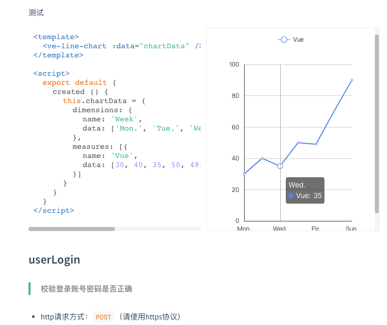
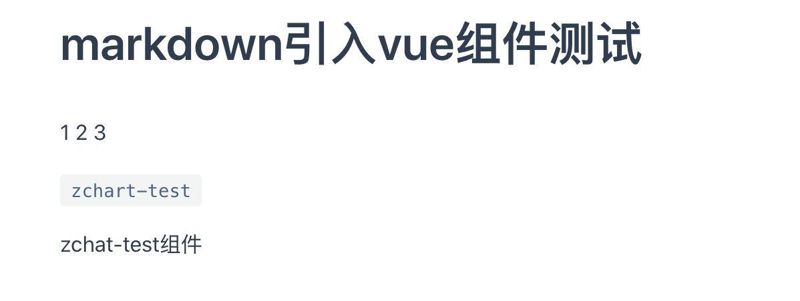
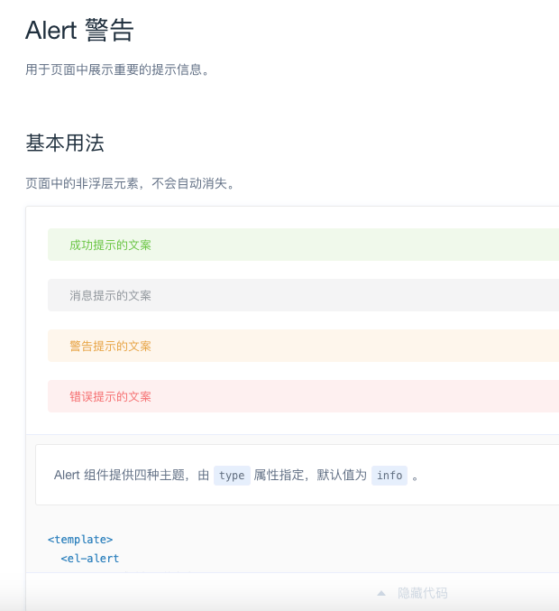

# 怎么写出类似element官网那样可以看代码运行效果的文档

对于UI组件、echarts 图表相关文档来说，能够实时看具体显示效果是必须的。它是将文档和 demo 合并在一起，这样更有说服力。那怎么写出类似的文档呢？这里来介绍三种方法：
1. dosify 
2. vuepress 
3. element官网源码

## docsify
一个神奇的文档网站生成器，支持 markdown 语法，可嵌入 vue 代码。基础用法可以参考文档: [docsify ](https://docsify.js.org/#/quickstart)，这里介绍下嵌入vue代码需要注意的问题

由于 docsify 入口是 index.html，本身不支持 ES modules，假设 vue 示例代码中，需要引入 echarts 模块，是无法 import 直接运行的。需要通过在 index.html 引入 js 来引入组件。有一个比较好的示例，可以参考 [ve-charts](https://vueblocks.github.io/ve-charts/#/chart-line), 可以把源码 clone 下来跑一跑。通过 `npm run build:lib` 打包生成 umd 形式的 js文件，直接引入即可。

```html
<!-- index.html部分代码 -->
<script src="//cdn.jsdelivr.net/npm/vue/dist/vue.min.js"></script>
<!-- vuep docsify插件，用于实时编辑、显示代码 -->
<script src="//cdn.jsdelivr.net/npm/vuep/dist/vuep.min.js"></script>
<!-- vuep默认是CommonJS规范，需要使用 module.exports，加babel后可以使用ES Modules的export default -->
<script src="https://unpkg.com/babel-standalone/babel.min.js"></script>
<script src="//unpkg.com/echarts@latest/dist/echarts.min.js"></script>
<!-- ve-echarts组件库输出的umd形式js文件，只载入这个js即可完整引入ve-echarts组件库 -->
<script src="./lib/ve-charts.umd.min.js"></script>
```
README.md

```markdown
<!-- README.md 里面嵌入vue代码 -->
<vuep template="#basicLine" :options="{ theme: 'vue', lineNumbers: false }"></vuep>

<script v-pre type="text/x-template" id="basicLine">
<template>
  <ve-line-chart :data="chartData" />
</template>

<script>
  export default {
    created () {
      this.chartData = {
        dimensions: {
          name: 'Week',
          data: ['Mon.', 'Tue.', 'Wed.', 'Thu.', 'Fir.', 'Sat.', 'Sun.']
        },
        measures: [{
          name: 'Vue',
          data: [30, 40, 35, 50, 49, 70, 90]
        }]
      }
    }
  }
</script>
```
效果如下图



## vuepress
[vuepress](https://vuepress.vuejs.org/) 是一个静态站点生成器，用于vue官网文档生成。可以内嵌vue代码，[Using Vue in Markdown](https://vuepress.vuejs.org/guide/using-vue.html#browser-api-access-restrictions) 

一般vue组件需要在 `.vuepress/components/` 下实现，在 markdown 语法中才能使用。下面是一个实例

```markdown
# markdown引入vue组件测试

<span v-for="i in 3">{{ i }} </span>

`zchart-test`

<zchart-test></zchart-test>
```



## element官网源码
它是自己写的一套构建程序，将 tpl 转 vue，markdown 解析时，内嵌 vue demo 会自动渲染代码，ElementUI官网源码: [ElementUI官网 examples | github](https://github.com/ElemeFE/element/tree/dev/examples)

下面以 [alert文档源码](https://github.com/ElemeFE/element/blob/dev/examples/docs/zh-CN/alert.md) 为例，来看看具体写法

```markdown
## Alert 警告

用于页面中展示重要的提示信息。

### 基本用法

页面中的非浮层元素，不会自动消失。

:::demo Alert 组件提供四种主题，由`type`属性指定，默认值为`info`。
<template>
  <el-alert
    title="成功提示的文案"
    type="success">
  </el-alert>
  <el-alert
    title="消息提示的文案"
    type="info">
  </el-alert>
  <el-alert
    title="警告提示的文案"
    type="warning">
  </el-alert>
  <el-alert
    title="错误提示的文案"
    type="error">
  </el-alert>
</template>
:::

### 主题
```

渲染效果如下




```js
// 将 官网.tpl单文件组件转.vue
// /examples/pages/template/component.tpl 就是element组件文档的入口
// https://github.com/ElemeFE/element/blob/dev/build/bin/i18n.js
'use strict';

var fs = require('fs');
var path = require('path');
var langConfig = require('../../examples/i18n/page.json');

langConfig.forEach(lang => {
  try {
    fs.statSync(path.resolve(__dirname, `../../examples/pages/${ lang.lang }`));
  } catch (e) {
    fs.mkdirSync(path.resolve(__dirname, `../../examples/pages/${ lang.lang }`));
  }

  Object.keys(lang.pages).forEach(page => {
    var templatePath = path.resolve(__dirname, `../../examples/pages/template/${ page }.tpl`);
    var outputPath = path.resolve(__dirname, `../../examples/pages/${ lang.lang }/${ page }.vue`);
    var content = fs.readFileSync(templatePath, 'utf8');
    var pairs = lang.pages[page];

    Object.keys(pairs).forEach(key => {
      content = content.replace(new RegExp(`<%=\\s*${ key }\\s*>`, 'g'), pairs[key]);
    });

    fs.writeFileSync(outputPath, content);
  });
});
```
/examples/pages/template/component.tpl 部分代码
```html
<el-scrollbar class="page-component__nav">
  <side-nav :data="navsData[lang]" :base="`/${ lang }/component`"></side-nav>
</el-scrollbar>
<div class="page-component__content">
  <!-- 像 alert、button 文档切换，就是切的这里的路由 -->
  <router-view class="content"></router-view>
  <footer-nav></footer-nav>
</div>
```
对应的路由代码
```js
// element/examples/route.config.js为alert等文档添加路由部分代码
function addRoute(page, lang, index) {
  const component = page.path === '/changelog'
    ? load(lang, 'changelog')
    : loadDocs(lang, page.path); // 根据path载入对应的docs/zh-CN/xx.md 
  let child = {
    path: page.path.slice(1),
    meta: {
      title: page.title || page.name,
      description: page.description,
      lang
    },
    name: 'component-' + lang + (page.title || page.name),
    component: component.default || component 
  };

  route[index].children.push(child);
}
```
