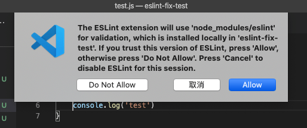
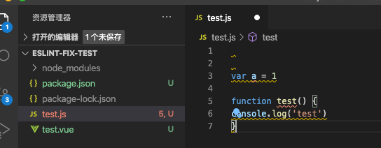
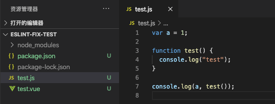

# 怎么在老项目中加入eslint规则，并可以保存后自动fix

在 "Vue CLI 构建项目时选择不同的 eslint 规则会有什么区别？" 中，我们有了解到，不同的 eslint 配置项，会对应不同的 npm 包，eslintConfig 中对应的 extends 也不一样。我们只要找出某个配置特有的 npm 包，以及配置，就可以在旧项目中，引入对应的 eslint 配置，结合 vscode eslint 插件就可以做到保存后自动 fix

1. 新建一个目录 eslint-fix-test，cd 到该目录，使用 npm init -y 创建一个新的 package.json
2. 我们把 ESLint + Prettier 的 package.json 配置拷贝到这个 package.json 中

```js
// ESLint + Prettier package.json配置
 "devDependencies": {
    "@vue/cli-plugin-eslint": "~4.5.0",
    "@vue/eslint-config-prettier": "^6.0.0",
    "babel-eslint": "^10.1.0",
    "eslint": "^6.7.2",
    "eslint-plugin-prettier": "^3.1.3",
    "eslint-plugin-vue": "^6.2.2",
    "prettier": "^1.19.1"
  },
  "eslintConfig": {
    "root": true,
    "env": {
      "node": true
    },
    "extends": [
      "plugin:vue/essential",
      "eslint:recommended",
      "@vue/prettier"
    ],
    "parserOptions": {
      "parser": "babel-eslint"
    },
    "rules": {}
  }
```

3. npm install 安装依赖
4. 在该目录下写一个 test.vue 文件，或 test.js 文件，特意写的很随意，看eslint是否报错

一般情况下，npm install 后，如果vscode eslint插件配置正确，会弹出如下弹窗，提示是否允许 eslint 修复



注意：
1. 如果没有安装配置好vscode的eslint插件，请先安装，可以参考我之前的笔记: [2020 vscode配置eslint保存后自动fix](http://www.zuo11.com/blog/2019/10/devtools_autofix.html)
2. 如果没有生效，可以尝试**新开一个vscode窗口，直接打开eslint-fix-test目录**，有时候目录层级深了，会不起作用
3. 如果还是没生效，可以尝试彻底关闭 vscode，再重新打开
4. 有时候刚打开项目，eslint插件可能需要时间加载，等个几秒钟才会工作

下面是我测试时，eslint插件工作正常的示例



保存后会自动fix，由于两个变量没使用还是会报警告，我用console.log打印了下，就没 warning了



综上，只要你知道某个 eslint 配置所需的npm包及 eslintConfig.extends 配置，那么就可以在项目中任意使用eslint了，完整测试 demo 可以从 github 下载 [eslint-fix-test | github](https://github.com/zuoxiaobai/fedemo/tree/master/src/DebugDemo/eslint-fix-test)

