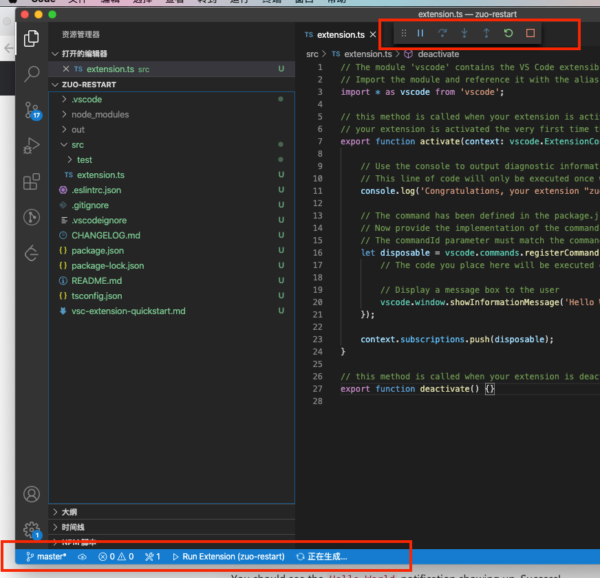
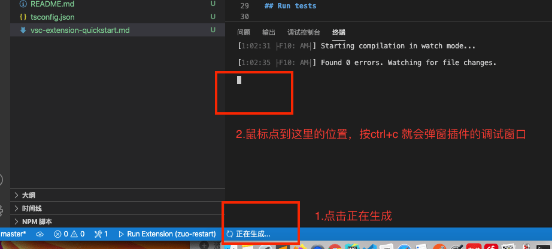
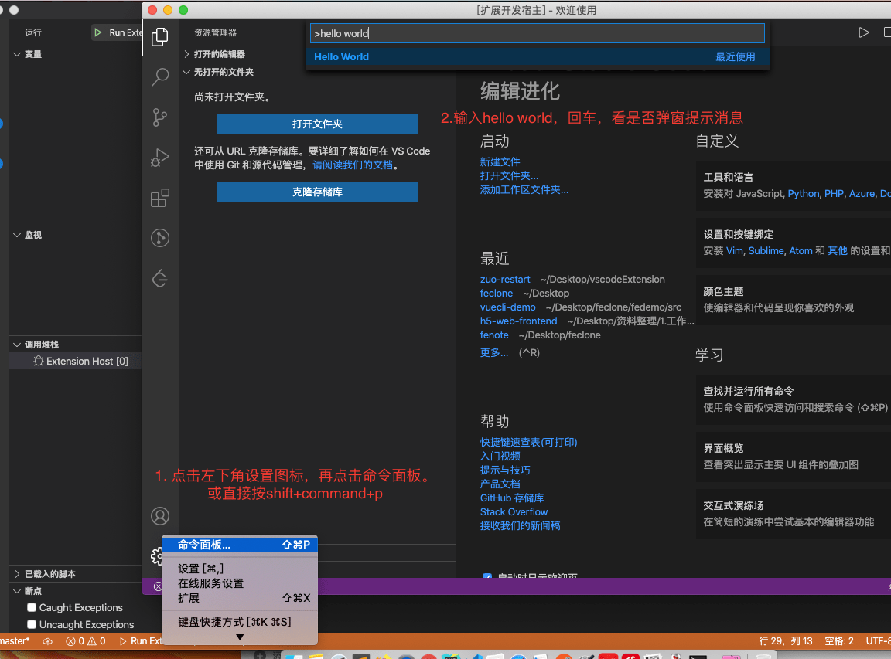
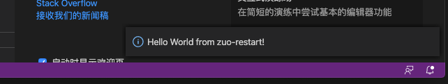

---
{
  "title": "怎么开发vscode插件",
  "staticFileName": "vscode_plugin.html",
  "author": "guoqzuo",
  "createDate": "2020/10/08",
  "description": "在vue-cli项目中，每次修改vue.config.js都需要手动停止在运行，怎么一键就搞定呢？能不能开发个vscode插件，带着这个问题，来看看vscode插件的开发。直接找vscode官方教程。按照文档先来跑一个hello word",
  "keywords": "vscode插件",
  "category": "计算机基础与开发工具"
}
---
# 怎么开发vscode插件
在vue-cli项目中，每次修改vue.config.js都需要手动停止在运行，怎么一键就搞定呢？能不能开发个vscode插件

带着这个问题，来看看vscode插件的开发。直接找vscode官方教程。按照文档先来跑一个hello word

```bash
# Install Yeoman and VS Code Extension Generator with:
npm install -g yo generator-code
```
运行yo code，生成一个脚手架项目
```bash
guoqzuo-mac:vscodeExtension kevin$ yo code

     _-----_     ╭──────────────────────────╮
    |       |    │   Welcome to the Visual  │
    |--(o)--|    │   Studio Code Extension  │
   `---------´   │        generator!        │
    ( _´U`_ )    ╰──────────────────────────╯
    /___A___\   /
     |  ~  |     
   __'.___.'__   
 ´   `  |° ´ Y ` 

? What type of extension do you want to create? New Extension (TypeScript)
? What's the name of your extension? zuo-restart
? What's the identifier of your extension? zuo-restart
? What's the description of your extension? A plugin use to auto restart vue.con
fig.js
? Initialize a git repository? Yes
? Which package manager to use? npm

Your extension zuo-restart has been created!

To start editing with Visual Studio Code, use the following commands:

     cd zuo-restart
     code .

Open vsc-extension-quickstart.md inside the new extension for further instructions
on how to modify, test and publish your extension.

For more information, also visit http://code.visualstudio.com and follow us @code.
```
这样会创建一个空的项目，只注册了helloworld命令，我们按照 vsc-extension-quickstart.md 里的说明运行demo

按F5，进入如下页面，但并没有像官网上的视频那样弹一个新的插件调试窗口，一直在运行中



网上说要装一个 run code的 vscode插件，也装了。后面发现还是不行，点击正在生成，ctrl + c 就弹出一个名为 "扩展开发宿主" 的新窗口了，里面可以调试插件，如下图



生成项目的入口是 extension.ts，他默认注册了一个helloword命令，我们输入命令就会显示一个弹窗消息

```js
// The module 'vscode' contains the VS Code extensibility API
// Import the module and reference it with the alias vscode in your code below
import * as vscode from 'vscode';

// this method is called when your extension is activated
// your extension is activated the very first time the command is executed
export function activate(context: vscode.ExtensionContext) {

	// Use the console to output diagnostic information (console.log) and errors (console.error)
	// This line of code will only be executed once when your extension is activated
	console.log('Congratulations, your extension "zuo-restart" is now active!');

	// The command has been defined in the package.json file
	// Now provide the implementation of the command with registerCommand
	// The commandId parameter must match the command field in package.json
	let disposable = vscode.commands.registerCommand('zuo-restart.helloWorld', () => {
		// The code you place here will be executed every time your command is executed

		// Display a message box to the user
		vscode.window.showInformationMessage('Hello World from zuo-restart!');
	});

	context.subscriptions.push(disposable);
}

// this method is called when your extension is deactivated
export function deactivate() {}

```
我们在插件调试窗口跑下hello world命令



出现如下弹窗消息，就说明跑的没问题了



这样hellowrod就跑起来了，vsc-extension-quickstart.md 里面有构架、发布插件的文档说明

官网提供了一些简单的demo，可以练练手，[vscode-extension-samples | github](https://github.com/microsoft/vscode-extension-samples)，后续有时间了继续研究

参考：
- [Extension API | Visual Studio Code Extension API](https://code.visualstudio.com/api)
- [Get Started - Your First Extension](https://code.visualstudio.com/api/get-started/your-first-extension)
- [VSCode插件开发入门](https://zhuanlan.zhihu.com/p/99198980)
