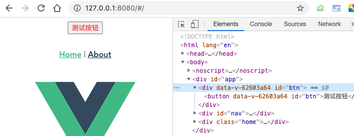
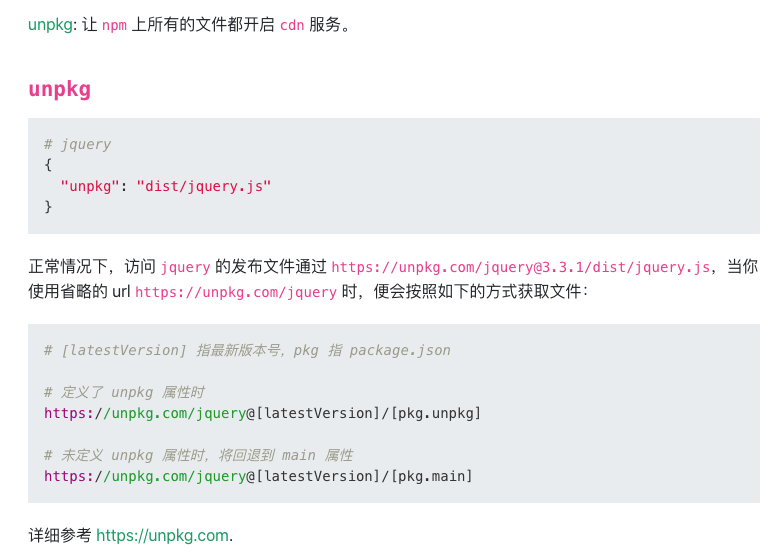

---
{
  "title": "怎么用vue写一个组件库，类似element",
  "staticFileName": "vue_ui_lib.html",
  "author": "guoqzuo",
  "createDate": "2020/10/25",
  "description": "下面通过一个简单的示例来看怎么写一个vue组件库，分为 6 步：1. 目录规划 2. 组件库入口文件 3. 本地测试组件 4. 打包构建 UMD 5. 上传 npm 包 6. dosify搭建官网",
  "keywords": "vue组件库,vue组件库编写流程",
  "category": "Vue"
}
---
# 怎么用vue写一个组件库，类似element

下面通过一个简单的示例来看怎么写一个vue组件库，分为 6 步
1. 目录规划
2. 组件库入口文件
3. 本地测试组件
4. 打包构建 UMD
5. 上传 npm 包
6. dosify搭建官网

## 1.组件库目录结构
以 element 为例，下面是一个简单的目录结构
```bash
├── examples # 用于测试组件，demo展示（可以直接是一个完整的vue项目）
├── packages # 用于存放编写的组件
│   └── my-button # 封装的组件，具体写法参见element源码
│       ├── src    
│       │   └── main.vue  # 单文件组件，组件
│       └── index.js  # install方法，用于Vue.use()引入单个组件
└── src
    └── index.js # 入口文件
```

## 2.导出组件库 
我们写好组件后，主要问题是要怎么导出(export)供其他项目使用，一般在 src/index.js 里进行处理
```js
// src/index.js 示例，主要是引入(import)组件再导出(export)，包括Vue.use所需的 install函数处理
import MyButton from "../packages/my-button/index.js";
const components = [MyButton];

// Vue.use() 一次性安装所有组件
const install = function(Vue) {
  if (install.installed) return;
  components.forEach(component => Vue.use(component));
  // 如果没有在src/index.js里实现install方法，就需要使用下面的
  // components.forEach(component => Vue.component(component.name, component))
};

// 直接给浏览器或 AMD loader 使用
if (typeof window !== undefined && window.Vue) {
  window.Vue.use(install);
  if (install.installed) {
    install.installed = false;
  }
}

export default {
  install, // 用于ES modules，import Vue 后直接使用 Vue.use()
  MyButton // 支持解构赋值按需引入单个组件
};
```

## 3.本地测试组件
假设我们这个组件命名为vue-chart，那可以在 examples/src/mian.js 直接使用
```js
// examples/src/mian.js
// 引入所有组件
import VueChart from '../../src/index.js'
Vue.use(VueChart)

// 按需引入单个组件
import { MyButton } from '../../src/index.js'
Vue.use(MyButton)
```
引入后，我们在 App.vue里直接使用该组件
```html
<!-- App.vue -->
<template>
  <div id="app">
    <my-button id="btn">测试按钮</my-button>
  </div>
</template>
```
这里可能涉及到 examples 目录 npm run serve 时，提示 eslint 错误


因为 examples 是一个独立的vue项目，引入了外部 packages 目录的文件，如果 packages 下组件不符合eslint规则就需要在项目根目录的package.json里配置eslint规则了，与examples项目的eslint规则保持一致。参考我之前的笔记："怎么在老项目中加入eslint规则，并可以保存后自动fix"

这样使用eslint处理 packages 目录下的代码，再运行 examples 目录下的 npm run serve 就可以正常加载组件了

## 4.打包构建umd
上面我们本地测试了，但他不能直接在普通网页中通过引入某个js文件来使用，这就需要使用Vue CLI来打包构建了

使用 vue-cli 打包成 lib，参考文档 [构建目标 | Vue CLI](https://cli.vuejs.org/zh/guide/build-targets.html#%E5%BA%94%E7%94%A8)

由于我们的项目结构不是通过vue-cli生成的，所以就算使用`npm install @vue/cli --save`，安装 @vue/cli，也无法使用 vue-cli-service 服务，因为 @vue/cli 这个包是一个用于生成脚手架项目的。你没有用它生成项目，如果不安装对应的 npm 包是无法使用 vue-cli-servie 的，我们直接从 vue create 生成的项目中把 devDependencies、dependencies，配置移动到根目录的 package.json 里，再npm install

```js
// dependencies
"dependencies": {
  "core-js": "^3.6.5",
  "vue": "^2.6.11"
},
// devDependencies
"@vue/cli-plugin-babel": "~4.5.0",
"@vue/cli-plugin-router": "~4.5.0",
"@vue/cli-plugin-vuex": "~4.5.0",
"@vue/cli-service": "~4.5.0",
"less": "^3.0.4",
"less-loader": "^5.0.0",
"vue-template-compiler": "^2.6.11"
// browserslist
"browserslist": [
  "> 1%",
  "last 2 versions",
  "not dead"
],
```
新增一个lib打包命令
```js
// --dest  lib 指定 output 目录文 lib，默认为 dist 目录
// src/index.js 最后为入口文件，默认为 src/App.vue。
"scripts": {
  "build:lib": "vue-cli-service build --mode lib --target lib --dest lib src/index.js"
}   
```
理论上 npm run build:lib 会在当前目录下创建lib目录，且包含4个文件

- lib/myLib.common.js：一个给打包器用的 CommonJS 包 (不幸的是，webpack 目前还并没有支持 ES modules 输出格式的包)
- lib/myLib.umd.js：一个直接给浏览器或 AMD loader 使用的 UMD 包
- lib/myLib.umd.min.js：压缩后的 UMD 构建版本
- lib/myLib.css：提取出来的 CSS 文件 (可以通过在 vue.config.js 中设置 css: { extract: false } 强制内联)

实际我这里打包后没有生成css文件，因为我们多加了一个 --mode lib 参数


一般将打包后的文件 xx.umd.js 引入到项目中就可以使用了，来看看示例
```html
<!-- docs/index.html -->
<body>
    <div id="app">
        <my-button>我的按钮</my-button>
    </div>
    <script src="https://unpkg.com/vue"></script>
    <script src="../lib/vue-chart.umd.js"></script>
    <script>
        const app = new Vue({
            el: '#app'
        })
    </script>
</body>
```


vue项目中引用
```js
// examples/src/main.js
import VueChart from "../../lib/vue-chart.umd.js";
Vue.use(VueChart);
```

效果如下



## 5.上传npm包
我们可以把包弄成npm包，在其他vue项目中，可以直接引入，将 package.json 的 main.js 设置为umd模块地址，并加上unpkg参数，用于cdn直接引入

```js
// package.json
"name": "@guoqzuo/vue-chart", // 将项目名称改为加上自己作用域的包
"version": "0.0.2", // 设置项目版本，注意每次修改版本，package-lock.json的版本也要改
// 指定npm包入口，当我们import某个npm包时，导入的文件就是这个main指定的文件
"main": "lib/vue-chart.umd.min.js"
// cdn相关
"unpkg": "lib/vue-chart.umd.min.js",
```

关于unpkg



修改好后，我们来发布这个npm包，注意：需要先有对应的npm账号，我的npm账号是 guoqzuo，这里在项目根目录新建一个publish.sh脚本来发布

```sh
#!/usr/bin/env bash
npm config get registry # 检查仓库镜像库
npm config set registry=http://registry.npmjs.org
echo '请进行登录相关操作：'
npm login # 登陆
# npm login --scope=@guoqzuo # 设置登录作用域
echo "-------publishing-------"
npm publish --access public # 发布
npm config set registry=https://registry.npm.taobao.org # 设置为淘宝镜像
echo "发布完成"
exit
```

一般新建的publish.sh是没有执行权限的，使用 `chmod +x publish.sh` 添加可执行权限，再 `./publish.sh` 执行发布，发布过程中，需要登录npm账号、密码等即可


我们这里examples目录也跟着发布上传了，可以加参数来限定上传到npm包的文件。细节方面后面在优化。我们可以看到npm官网有我们刚上传的 [@guoqzuo/vue-chart](https://www.npmjs.com/package/@guoqzuo/vue-chart) 了


测试npm包，在vue项目中先安装

```bash
# 这里建议加@latest，因为有时候发布后有延时
# 直接npm i @guoqzuo/vue-chart 后可能还是原来的旧版本
npm i @guoqzuo/vue-chart@latest
```
安装完成后，再在 main.js 里引入，npm run serve 后可正常渲染
```js
// examples/src/main.js
import VueChart from "@guoqzuo/vue-chart";
Vue.use(VueChart);
```

另外，我们再测试下 unpkg cdn是否生效
```html
<!-- docs/index.html -->
<body>
    <div id="app">
        <my-button>我的按钮</my-button>
    </div>
    <script src="https://unpkg.com/vue"></script>
    <!-- <script src="../lib/vue-chart.umd.js"></script> -->
     <script src="https://unpkg.com/@guoqzuo/vue-chart@latest/lib/vue-chart.umd.min.js"></script>
    <script>
        const app = new Vue({
            el: '#app'
        })
    </script>
</body>
```

测试可正常运行，以上完成了一个基本vue组件库的开发流程，后面再慢慢优化。


## 6. dosify官网搭建
使用 dosify 写一个组件库官网，参考 [怎么写出类似element官网那样可以实时看运行效果的文档](http://www.zuo11.com/blog/2020/10/ui_doc.html)

完整代码已上传github，参见 [zuoxiaobai/vue-chart](https://github.com/zuoxiaobai/vue-chart)

使用 dosify 写的对应的官网 [@guoqzuo/vue-chart官网](https://vuechart.zuo11.com)

参考：
- [如何用vue写一个组件库](https://segmentfault.com/a/1190000014924557)
- [写一个vue组件库_跟着element学习写组件](http://www.fly63.com/article/detial/2631)
- [Vue Loader](https://vue-loader.vuejs.org/zh/#vue-loader)
- [package.json 非官方字段集合 - 前端小站 - SegmentFault 思否](https://segmentfault.com/a/1190000016365409)