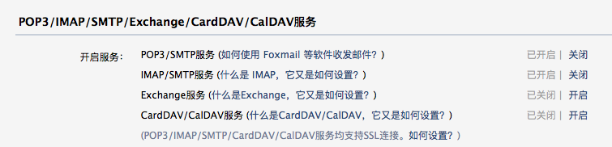
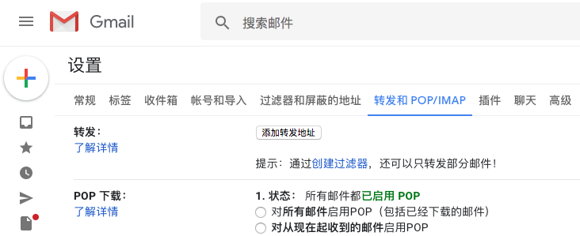
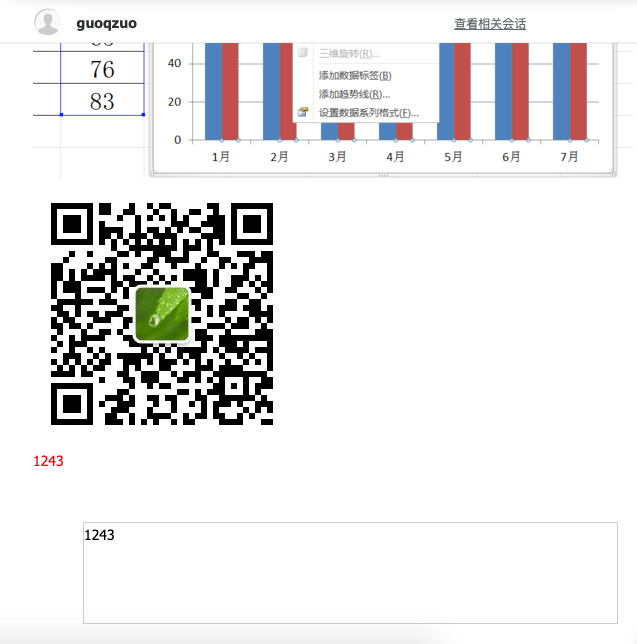
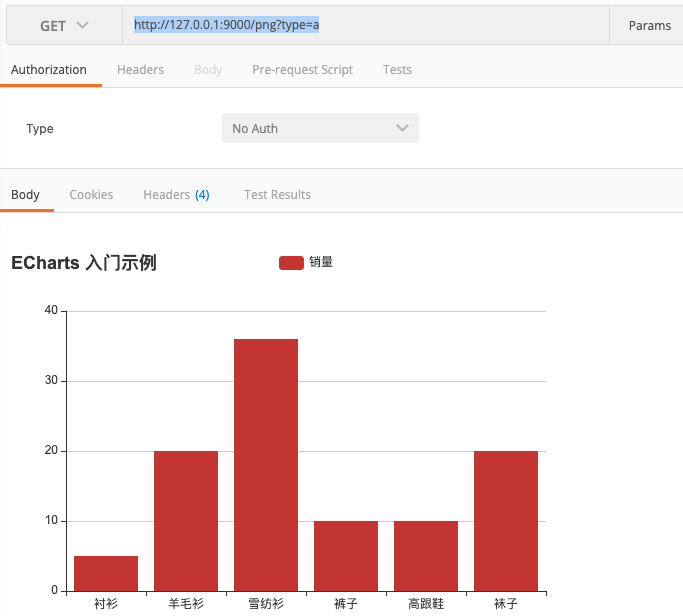

# 用node实现发送包含echarts图表的邮件
在之前我用node研究过怎么收发邮件，但没有研究过邮件里面是否能包含图表，这次来研究下

首先，我们来看看怎么发邮件

## 准备工作：配置发件人邮箱
我们发送邮件，首先需要有一个邮箱作为发件人，以QQ邮箱为例，我们发邮件使用 `916707888@qq.com` 作为发件人，我们需要使用程序自动发邮件，所以需要配置发邮件的服务，开启发邮件的POP3/SMTP服务，得到授权码在操作，下面来看看具体过程

登录到qq邮箱，进入管理页面，在设置 - POP3/IMAP/SMTP/Exchange/CardDAV/CalDAV服务位置，开启POP3/SMTP服务

开启服务后，会得到POP3和IMAP授权码，一个用来收邮件一个用来发邮件，保存好



gmail邮箱配置



## 使用nodemailer来发送邮件
使用 [nodemailer](https://github.com/nodemailer/nodemailer) 来发送邮件，首先开一个koa demo

```js
const Koa = require('koa')
const Router = require('koa-router')
const app = new Koa()
const router = new Router()

/**
 * @description 使用nodemailer发送邮件
 * @example
 * POST http://127.0.0.1:9000/sendEmail
 */
router.get('/sendEmail', async ctx => {
  try {
    let sendEmail = require('./sendEmail/index.js')
    await sendEmail()
    ctx.body = {
      msg: '成功'
    }
  } catch (e) {
    ctx.body = {
      msg: e.message
    }
  }
})

app.use(router.routes())
app.listen('9000', () => {
  console.log('server start on 9000 port')
})
```

发邮件核心代码 sendEmail/index.js

```js
const nodemailer = require('nodemailer');

function sendEmail() {
  return new Promise((resolve, rejected) => {
    // create reusable transport method (opens pool of SMTP connections)
    let smtpTransport = nodemailer.createTransport({
      host: "smtp.qq.com", //qq smtp服务器地址, 如果是其他邮箱需要修改为对应的服务器
      secureConnection: false, //是否使用安全连接，对https协议的
      port: 465, //qq邮件服务所占用的端口
      auth: {
        user: "916707888@qq.com", //开启SMTP的邮箱，有用发送邮件
        pass: "rorvinuqemsybccc" // qq POP3/SMTP授权码，如果是gmail，直接填密码
      }
    });

    // setup e-mail data with unicode symbols
    let mailOptions = {
      from: "guoqzuo <i@zuoguoqing.com>", // sender address
      to: "i@zuoguoqing.com, zuoguoqing@aliyun.com", // list of receivers
      subject: "邮箱验证码", // Subject line
      text: `Hello，您的验证码是 1212323`, // plaintext body
      // html body
      html: `
            Hello，您的验证码是
            
            

            <div>
              <span style="color:red;">1243</span>
              <div style="margin:50px;border:1px solid #ccc;height: 100px;widht:100px;">1243</div>
            </div>
            <!-- 为ECharts准备一个具备大小（宽高）的Dom -->
            <div id="main" style="width: 600px;height:400px;"></div>
            <script crossorigin="anonymous" integrity="sha384-i+fXrQ+G3+h2478EWpSpIXivtKbbze+0SNOXJGizkAp6DVG/m2fE6hiWeDwskVvp" src="https://lib.baomitu.com/echarts/4.7.0/echarts.js"></script>
            <script type="text/javascript">
                // 基于准备好的dom，初始化echarts实例
                var myChart = echarts.init(document.getElementById('main'));
        
                // 指定图表的配置项和数据
                var option = {
                    title: {
                        text: 'ECharts 入门示例'
                    },
                    tooltip: {},
                    legend: {
                        data:['销量']
                    },
                    xAxis: {
                        data: ["衬衫","羊毛衫","雪纺衫","裤子","高跟鞋","袜子"]
                    },
                    yAxis: {},
                    series: [{
                        name: '销量',
                        type: 'bar',
                        data: [5, 20, 36, 10, 10, 20]
                    }]
                };
        
                // 使用刚指定的配置项和数据显示图表。
                myChart.setOption(option);
            </script>
          `
    }

    // send mail with defined transport object
    smtpTransport.sendMail(mailOptions, function (error, response) {
      if (error) {
        rejected(error);
      } else {
        console.log("Message sent: " + response.message);
        // 发送成功
        console.log('邮件发送成功');
        resolve('发送成功');
      }
      // if you don't want to use this transport object anymore, uncomment following line
      smtpTransport.close(); // shut down the connection pool, no more messages
    });
  });
}

module.exports = sendEmail
```

上面发送的是html富文本，发送后，可以看到，简单的css样式，图片是可以发送的，但js是无法执行，如下图



## 使用接口生成echarts图片
在上面的例子中，我们知道无法执行js，也就是无法直接在邮箱使用canvas绘图，那么我们可以换个思路，通过一个src，get请求在后端生成echarts图片

怎么在后端用node把echart渲染出来并生成图片呢？这里用到了 `node-charts` 模块，它使用 puppeteer 来进行渲染截图
```js
/**
 * @description 根据接口生成echarts图片
 * @example
 * GET http://127.0.0.1:9000/png?type=a
 * GET http://127.0.0.1:9000/png?type=b
 */
router.get('/png', async ctx => {
  try {
    let getEchartsPng = require('./echartsPng/index.js')
    let optionsA = require('./echartsPng/optionsA.js')
    let optionsB = require('./echartsPng/optionsB.js')
    let data = await getEchartsPng(ctx.query.type === 'a' ? optionsA : optionsB)
    ctx.set({
      'content-type': 'image/png'
    })
    ctx.body = data
  } catch (e) {
    console.log(e)
    ctx.body = {
      msg: e.message
    }
  }
})
```
渲染相关逻辑，这样通过接口就可以直接访问一张echart的图片了
```js
const NodeCharts = require('node-charts');

function getEchartsPng(options) {
  return new Promise((resolve, reject) => {
    let nc = new NodeCharts();
    //监听全局异常事件
    nc.on('error', (err) => {
      reject(err)
    });
    nc.render(options, (err, data) => {
      if (err) {
        reject(err)
      }
      resolve(data)
    }, {
      type: 'echarts'
    })
  })
}

module.exports = getEchartsPng
```

请求截图




完成demo，参见github: [用邮件发送echarts图表](https://github.com/zuoxiaobai/fedemo/tree/master/src/DebugDemo/%E7%94%A8%E9%82%AE%E4%BB%B6%E5%8F%91%E9%80%81echarts%E5%9B%BE%E8%A1%A8)
