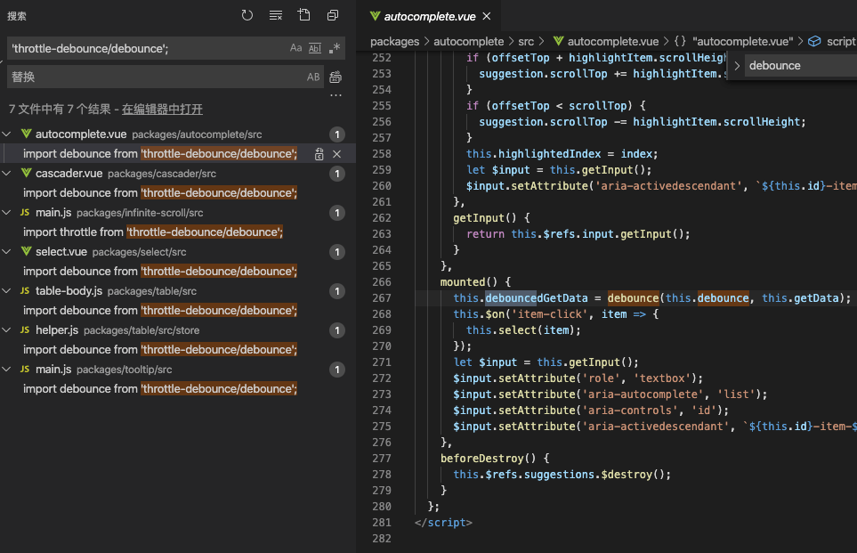

# 节流与防抖理解以及element源码中节流与防抖的应用

> 该内容存在理解错误，最新修正笔记参考：[用游戏中的场景理解节流与防抖，最简单的 js 实现](/blog/2021/4/easy_throttle_debounce.html)

理论上 throttle 节流一般用于监听类似 resize 方法，想要减少执行频率的场景。对于点击按钮提交，防止短时间内多次点击可以用 debounce 防抖

但实际使用时可根据具体情况来看，本质上都是利用 setTimeout 来处理执行频率或执行间隔。下面是一个简单的 lodash 防抖示例，300ms 内放置重复点击
```js
import { debounce } from 'lodash'
export default {
  methods: {
    submitFormDebounce: debounce(function() {
      console.log('submit', +new Date())
      this.submitForm()
    }, 300, {trailing: true}),

    submitForm() {

    }
  }
}
```

## element源码中节流与防抖的应用
在做input搜索时，由于input change后需要请求接口，这里el-autocomplete有个默认的300豪秒debounce，可以减少请求频率。理论上这里减少频率需要使用节流，但为什么是防抖呢？

我们把 element 源码中对节流防抖的使用都找一找。可以看到element使用的节流防抖库是 `throttle-debounce`

发现节流 throttle 用的比较少，只找到了三个地方：
```js
// Backtop 回到顶部
// packages/backtop/src/main.vue  滚动监听时用到了节流
import throttle from 'throttle-debounce/throttle';
mounted() {
  this.init();
  this.throttledScrollHandler = throttle(300, this.onScroll);
  this.container.addEventListener('scroll', this.throttledScrollHandler);
},

// Carousel 走马灯 
// packages/carouse/src/main.vue 鼠标hover，箭头点击使用了节流
import throttle from 'throttle-debounce/throttle';
created() {
  this.throttledArrowClick = throttle(300, true, index => {
    this.setActiveItem(index);
  });
  this.throttledIndicatorHover = throttle(300, index => {
    this.handleIndicatorHover(index);
  });
},

// Image 图片 滚动到区域懒加载时，使用了节流
if (_scrollContainer) {
  this._scrollContainer = _scrollContainer;
  this._lazyLoadHandler = throttle(200, this.handleLazyLoad);
  on(_scrollContainer, 'scroll', this._lazyLoadHandler);
  this.handleLazyLoad();
}
```

再来看看防抖的地方



**总结：涉及到接口请求次数限制的基本都是防抖，对于滚动类别防止多次执行的情况才用节流，其他请求一律防抖**