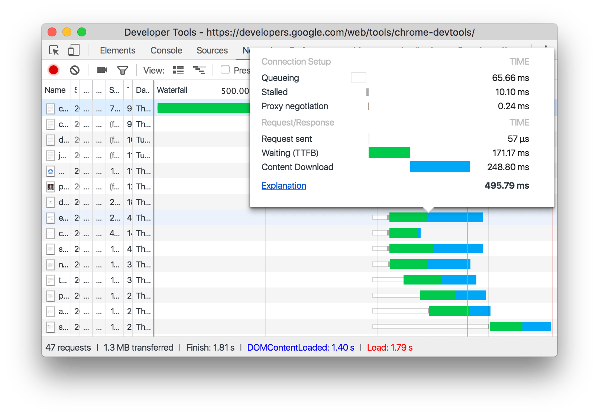

# Chrome DevTools Network Waterfall 瀑布图各阶段详解
在 Chrome 调试工具 Network tab 下，每个请求都有一个 Waterfal diagrams(瀑布图)，点击具体接口，Timming(时序)位置会有具体描述。它记录了网络请求各个阶段的耗时，可以用于分析页面加载性能。

Timing breakdown phases explained（时序分解阶段明细）

Here's more information about each of the phases you may see in the Timing tab:（下面是在Timing标签页中能看到的各个阶段的更多信息）

**1. Resource Scheduling(资源调度)**

- **Queueing(排队)**. The browser queues requests when:（浏览器在以下情况会排队请求）
  - There are higher priority requests.（有更高优先级的请求）
  - There are already six TCP connections open for this origin, which is the limit. Applies to HTTP/1.0 and HTTP/1.1 only. (当前请求的 origin/domain，已经有 6 个 TCP 连接打开，这是限制。仅应用于 HTTP/1.0 and HTTP/1.1)
  - The browser is briefly allocating space in the disk cache（浏览器正在磁盘缓存中短暂分配空间）

**2. Connecttion Start(连接开始)**

- **Stalled(停滞/暂缓)**. The request could be stalled for any of the reasons described in Queueing. （处于排队中描述的任何原因，请求都有可能停滞/暂缓）
- **DNS Lookup(DNS查询)**. The browser is resolving the request's IP address. （域名解析成IP。在浏览器和服务器进行通信之前, 必须经过DNS查询, 将域名转换成IP地址. 在这个阶段, 你可以处理的东西很少. 但幸运的是, 并非所有的请求都需要经过这一阶段.）
- **Initial connection(初始化连接)**. The browser is establishing a connection, including TCP handshakes/retries and negotiating an SSL.（浏览器正在创建一个连接，包括握手/重试）和 协商SSL。在浏览器发送请求之前, 必须建立TCP连接. 这个过程仅仅发生在瀑布图中的开头几行, 否则这就是性能问题.
- **SSL(SSL协商)** SSL/TLS Negotiation  如果你的页面是通过SSL/TLS这类安全协议加载资源, 这段时间就是浏览器建立安全连接的过程. 
- **Proxy negotiation(代理协商)**. The browser is negotiating the request with a proxy server. （浏览器正在与代理服务器协商请求）

**3. Request/Response(请求/响应)**

- **Request sent(请求发送)**. The request is being sent. 请求开始发送
- **ServiceWorker Preparation(ServiceWorker准备)**. The browser is starting up the service worker. （浏览器正在启动 Service Worker）
- **Request to ServiceWorker(请求到ServiceWorker)**. The request is being sent to the service worker.（请求被发送到 service worker）
- **Waiting (TTFB) 等待**. The browser is waiting for the first byte of a response. TTFB stands for **Time To First Byte**. This timing includes 1 round trip of latency and the time the server took to prepare the response.（浏览器正在等待响应的第一个字节。 TTFB代表到第一个字节的时间。 此时间包括一次往返延迟和服务器准备响应所花费的时间） TTFB 是浏览器请求发送到服务器的时间+服务器处理请求时间+响应报文的第一字节到达浏览器的时间. 我们用这个指标来判断你的web服务器是否性能不够, 或者说你是否需要使用CDN.
- **Content Download**. The browser is receiving the response. （浏览器正在接收响应），这是浏览器用来下载资源所用的时间. 这段时间越长, 说明资源越大. 理想情况下, 你可以通过控制资源的大小来控制这段时间的长度.

- **Receiving Push**. The browser is receiving data for this response via HTTP/2 Server Push.（浏览器正在通过HTTP / 2服务器推送接收此响应的数据）
- **Reading Push**. The browser is reading the local data previously received.（浏览器正在读取先前接收的本地数据。）

参考资料及扩展：
- [Timing breakdown phases explained - Network Analysis Reference  |  Chrome DevTools](https://developers.google.com/web/tools/chrome-devtools/network/reference?utm_source=devtools#timing-explanation)
- [Chrome 开发者工具中文文档](https://www.html.cn/doc/chrome-devtools/)
- [教你读懂网络请求的瀑布图](https://blog.csdn.net/csdn_girl/article/details/54911632)
- [The SEO Professional's Guide to Waterfall Diagrams](https://moz.com/blog/the-seo-professional-s-guide-to-waterfall-diagrams)
- [理解 Service Workers](https://github.com/xitu/gold-miner/blob/master/TODO/understanding-service-workers.md)
