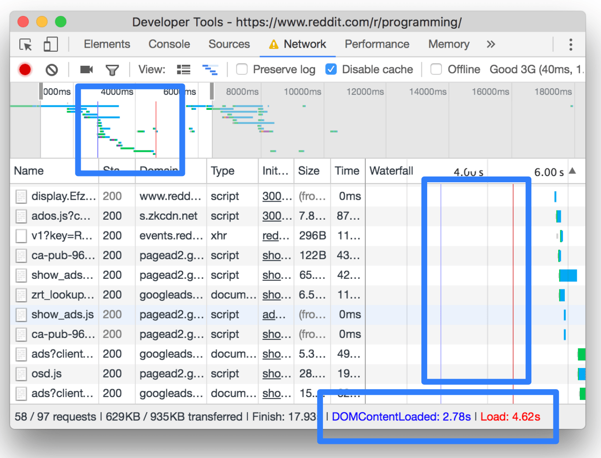
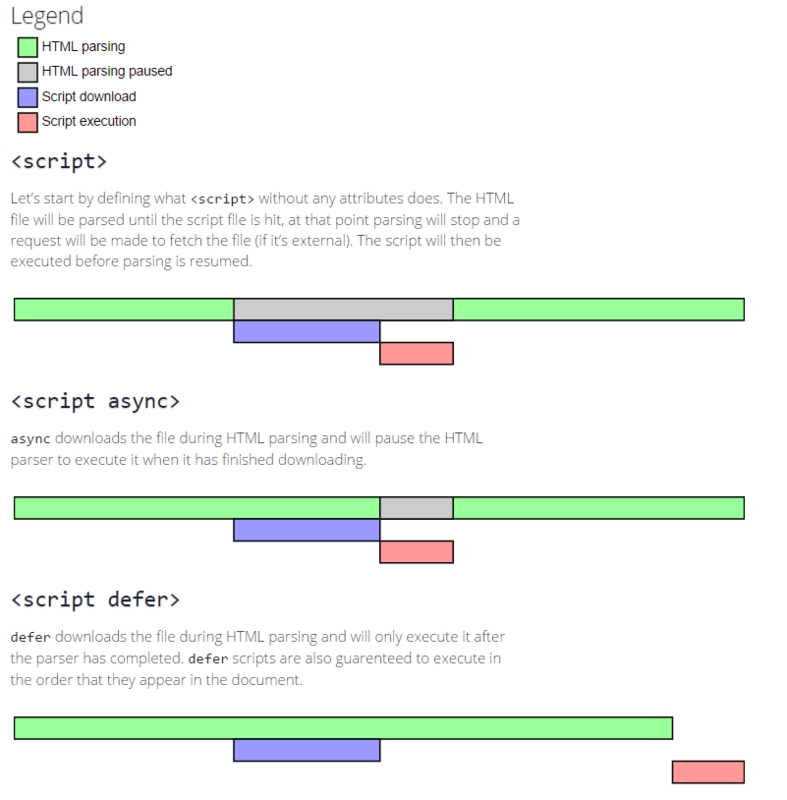

# DOMContentLoaded 与 Load 时间具体指的是什么时间？
在 [Chrome DevTools 官网 Network Reference](https://developers.google.com/web/tools/chrome-devtools/network/reference#load) 里是这样介绍的：

View load events

> DevTools displays the timing of the DOMContentLoaded and load events in multiple places on the Network panel. The DOMContentLoaded event is colored blue, and the load event is red.

这两个时间是从页面开始到 DOMContentLoaded 与 load 事件触发的时间



来看看 `DOMContentLoaded` 和 `load` 事件在 MDN 的解释

**DOMContentLoaded事件：window 和 document 上都可以监听，意思一致**

```js
window.addEventListener('DOMContentLoaded', (event) => {
  console.log('DOM fully loaded and parsed');
});
document.addEventListener('DOMContentLoaded', (event) => {
  console.log('DOM fully loaded and parsed');
});
```

> The DOMContentLoaded event fires when the initial HTML document has been completely loaded and parsed, without waiting for stylesheets, images, and subframes to finish loading.

`DOMContentLoaded` 事件：**当 DOM (HTML document) 完成加载并解析，而不用等 css样式、图片和子 frame 完全加载完成时触发** 

同步 JS 会使 DOM 的解析暂停，如果希望用户在请求页面后尽快解析DOM，你可以把 JS 使用异步加载，并优化 css 样式加载方式。如果按照惯例加载，样式表和 JS 是并行加载的，会减慢 DOM 解析，窃取主 html 文档解析速度。下面是 head 中 script 默认加载以及加上 async, defer 参数的对比，一般把 script 放到 body 末尾，基本等价于 header 中 defer 的效果



**load事件：window**

```js
window.addEventListener('load', (event) => {
  console.log('page is fully loaded');
});
// 或
window.onload = (event) => {
  console.log('page is fully loaded');
};
```

> The load event is fired when the whole page has loaded, including all dependent resources such as stylesheets and images. This is in contrast to DOMContentLoaded, which is fired as soon as the page DOM has been loaded, without waiting for resources to finish loading.

**当整个页面加载完成时（包括所有相关资源，例如css样式表和图片），这与 `DOMContentLoaded` 相反，它在页面DOM被加载后立即触发，而无需等待资源完成加载。**

参考:
- [Window: DOMContentLoaded event | MDN](https://developer.mozilla.org/en-US/docs/Web/API/Window/DOMContentLoaded_event)
- [Document: DOMContentLoaded event](https://developer.mozilla.org/en-US/docs/Web/API/Document/DOMContentLoaded_event)
- [优化 css 加载方式 | Google developers](https://developers.google.com/speed/docs/insights/OptimizeCSSDelivery)
- [Window: load event | MDN](https://developer.mozilla.org/en-US/docs/Web/API/Window/load_event)
