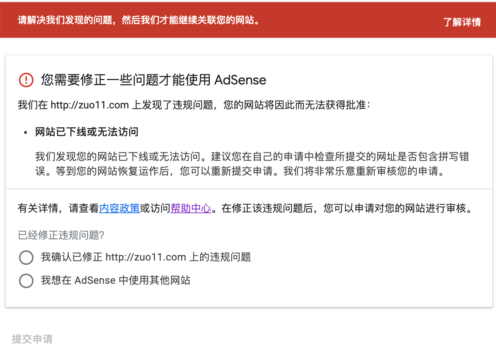
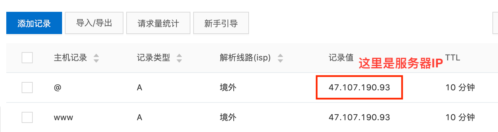

---
{
  "title": "Google AdSense被拒理由网站已下线或无法访问怎么解决",
  "staticFileName": "adsense_cannot_found.html",
  "author": "guoqzuo",
  "createDate": "2020/11/16",
  "description": "在自己网站的 head 部分加入 AdSense 的校验代码后，会有一段审核的时间。在这个过程中，网站可能会有来自福建龙岩的 203.208.60.* IP段蜘蛛来爬取你的网页。蜘蛛会爬取JS渲染后的效果，可以触发百度统计等js代码。不用屏蔽，这属于 Google 蜘蛛正常爬取，Google Analytics 在计算访客时会忽略这一部分访客信息。蜘蛛爬完的第二天，就收到了邮件，说审核不通过，看了下原因：'网站已下线或无法访问怎么解决' ，如下图所示。但我的网站是确定可以正常访问的。",
  "keywords": "AdSense网站已下线或无法访问",
  "category": "网站建设与SEO"
}
---
# Google AdSense被拒理由网站已下线或无法访问怎么解决？
在自己网站的 head 部分加入 AdSense 的校验代码后，会有一段审核的时间。在这个过程中，网站可能会有来自福建龙岩的 203.208.60.* IP段蜘蛛来爬取你的网页。蜘蛛会爬取JS渲染后的效果，可以触发百度统计等js代码。不用屏蔽，这属于 Google 蜘蛛正常爬取，Google Analytics 在计算访客时会忽略这一部分访客信息。

蜘蛛爬完的第二天，就收到了邮件，说审核不通过，看了下原因："网站已下线或无法访问怎么解决" ，如下图所示。但我的网站是确定可以正常访问的。

网上查了下，这种情况，需要在域名解析里增加两条解析记录，解析路线设置为境外。然后重新提交审核，等待即可。**但我加了解析后，等了一段时间，又是同样的理由被拒绝，于是找到了官方的回复。首页不能重定向，比如 xx.com 不能重定向到 xx.com/home，或者 `www.xx.com`**，再次修改后，重新提交审核，大概5、6天后审核通过。参考 [为什么一直提示找不到adsense代码和网站已下线或无法访问？ - AdSense Community](https://support.google.com/adsense/thread/43647550?hl=zh-Hans)

主机记录 | 记录类型 | 解析路线 | 记录值 | TTL
--- | --- | --- | --- | --- 
@ | A | 境外 | 服务器IP地址 | 10分钟(默认) 
www | A | 境外 | 服务器IP地址 | 10分钟(默认) 

www 和 @ 这样的主机记录是什么意思?
- www：解析后的域名为 `www.xx.com`。
- @：直接解析主域名 xx.com。
- *：泛解析，匹配其他所有域名 *.xx.com。

关闭 zuo11.com 到 `www.zuo11.com` 的重定向，大概是09月27，再次提交后，10月02号收到审核通过邮件。如下图

