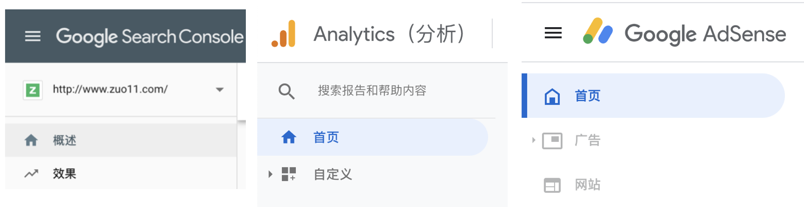

# Google Analytics、Google AdSense、Google Search Console分别是干什么的?
在站点管理这一块，Google的工具有好几个，我现在知道的有三个，他们分别对应不同的功能，下面来看看他们的介绍、区别

平台 | 功能
--- | ---
[Google Search Console](https://search.google.com/search-console)  搜索控制台| 站长工具、sitemap提交，展现量/点击量简单查看，死链提交等
[Google Analytics](https://analytics.google.com/analytics/) 分析 | 偏数据分析，统计实时用户/累计用户/会话时长/跳出率等，受众群体、流量来源、转化率、页面价值等
[Google AdSense](https://www.google.com/adsense) 广告联盟 | 用于在自己站点投放 Google 广告，赚取收益

百度统计类似 Google Search Console 和 Google Analytics 的结合体，但 Google Analytics 的细分功能更加强大

关于 Google AdSense，有一本书可以参考下：《Google AdSense 实战宝典》