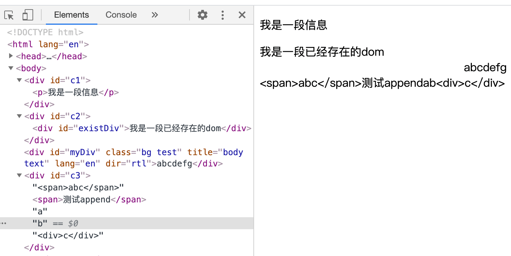

# JS append 和 appendChild 的区别

在JS高程3中，并没有讲到 append()，基本都是用的 appendChild()，所以有知识盲点，这里对比下 append() 和 apendChiild() 的区别，如下表所示：append 用于在元素内容里追加一个 Node 节点，appendChiled() 用于在元素内容里追加一个或多个 Node 节点或 String 。

方法 | 所属对象 | 功能 | 返回值|  兼容性 
--- | --- | --- | --- | ---
[appendChild](https://developer.mozilla.org/en-US/docs/Web/API/Node/appendChild) | [Node](https://developer.mozilla.org/zh-CN/docs/Web/API/Node) | 在元素内容里追加一个 Node 节点 | append的节点 | 基本都兼容
[append](https://developer.mozilla.org/en-US/docs/Web/API/ParentNode/append) | [ParentNode](https://developer.mozilla.org/en-US/docs/Web/API/ParentNode) | 在元素内容里追加一个或多个 Node 节点或 String | undefined | 实验性功能 [不支持 IE](https://developer.mozilla.org/zh-CN/docs/Web/API/ParentNode#%E6%B5%8F%E8%A7%88%E5%99%A8%E5%85%BC%E5%AE%B9%E6%80%A7)

注意，如果 append 或 appendChild 的元素是已经存在的，会移动该元素，如果需要保持原来的不移动，需要先 cloneNode, 下面来看一个例子

```html
<body>
  <div id="c1"></div>
  <div id="existDiv">我是一段已经存在的dom</div>
  <div id="c2"></div>
  <div id="c3"></div>
  <script>
    // 1.测试基本功能：创建节点，并 appendChild 到 c1元素
    let p = document.createElement('p')
    let text = document.createTextNode('我是一段信息')
    p.appendChild(text)
    console.log(p, p.__proto__) // HTMLParagraphElement
    document.querySelector('#c1').appendChild(p)
    // document.querySelector('#c1').appendChild('1212') // Error, Node

    // 2.测试 appendChild 一个已存在的节点，移动节点，而不是copy
    let existDiv = document.querySelector('#existDiv')
    console.log(existDiv, existDiv.__proto__)  // HTMLDivElement
    console.log('测试appendChild 返回', document.querySelector('#c2').appendChild(existDiv))
    // console.log('测试append 返回', document.querySelector('#c2').append(existDiv))

    // 4.测试append
    let span = document.createElement('span')
    // 不要写成链式调用，它返回的是成功appendChild的节点
    span.appendChild(document.createTextNode('测试append'))
    document.querySelector('#c3').append('<span>abc</span>')
    document.querySelector('#c3').append(span, 'a', 'b', '<div>c</div>')
  </script>
</body>
```

执行效果如下图



关于 Node 节点 Element 元素对象的一些值

```js
<div id="myDiv" class="bg test" title="body text" lang="en" dir="rtl">abcdefg</div>
// 3.测试节点类型、对象信息 HTMLDivElement => HTMLElement => Element => Node
// 参考：DOM https://www.yuque.com/guoqzuo/js_es6/hoglme#6bbee863
var div = document.getElementById("myDiv"); // HTMLDivElement
console.log(div.nodeType) // 1 Node.ELEMENT_NODE
console.log(div.nodeName) // DIV
console.log(div.id); // myDiv
console.log(div.className); // bg test
console.log(div.title); // body text
console.log(div.lang); // en
console.log(div.dir); // rtl   
```