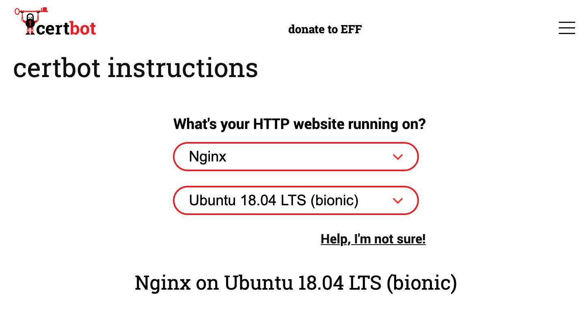
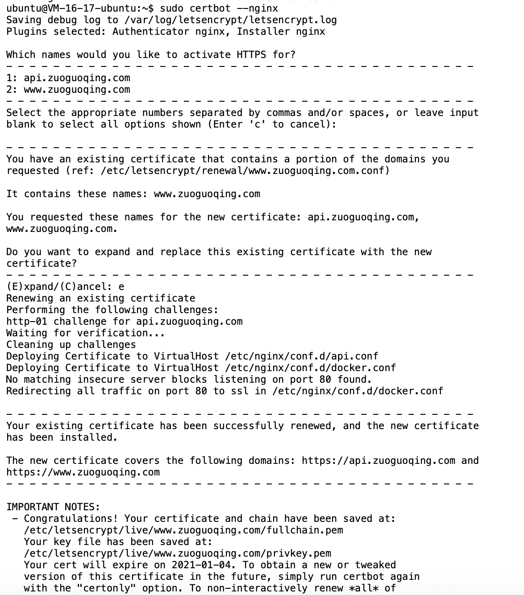

---
{
  "title": "Let’s Encrypt 免费HTTPS证书",
  "staticFileName": "free_https.html",
  "author": "guoqzuo",
  "createDate": "2020/11/23",
  "description": "Let’s Encrypt 是一个非盈利TLS（Transport Layer Security) 证书颁发机构（CA），免费提供 https 证书。 由于 Let’s Encrypt 证书的有效期为 3 个月，所以一般使用程序来自动续期更换证书。官方推荐使用 Certbot 来管理，它可以一站式申请、续期证书。在 Certbot 官网选择部署服务器使用的软件及系统，会自动列出需要操作的步骤，如下图",
  "keywords": "免费https,https",
  "category": "http与https"
}
---
# Let’s Encrypt 免费HTTPS证书
[Let’s Encrypt](https://letsencrypt.org/) 是一个非盈利TLS（Transport Layer Security) 证书颁发机构（CA），免费提供 https 证书。 

由于 Let’s Encrypt 证书的有效期为 3 个月，所以一般使用程序来自动续期更换证书。官方推荐使用 Certbot 来管理，它可以一站式申请、续期证书。

在 [Certbot 官网](https://certbot.eff.org/) 选择部署服务器使用的软件及系统，会自动列出需要操作的步骤，如下图



注意文档里面分了两种：
1. 单个域名，仅单个 https 比如 `https://xx.com` 或 `https://www.xx.com`
2. 通配符(Wildcard)证书，支持多个二级域名 `https://*.xx.com`，但不支持 `https://xx.com`

一般我们写好 nginx.conf 的配置，certbot 会根据 server_name 自动识别域名，并申请安装证书

这里把两个域名进行 https 处理，分别是 `https:/www.zuoguoqing.com` 和 `https://api.zuoguoqing.com`

需要写两个 nginx 配置文件，分别对应下面两个文件，如果还有其他二级域名可以再增加配置文件
- /etc/nginx/conf.d/docker.conf  这里是 www 二级域名
- /etc/nginx/conf.d/api.conf 这里是 api 二级域名的nginx配置

```bash
# /etc/nginx/conf.d/docker.conf 
server
{
    listen 80;
    server_name www.zuoguoqing.com;
}

# /etc/nginx/conf.d/api.conf 
server
{
    listen 80;
    server_name api.zuoguoqing.com;
}
```
开始安装 certbot，并执行
```bash
# 登录到 ubuntu linux 服务器
sudo apt update
sudo apt install snapd
sudo snap install core; sudo snap refresh core
sudo apt-get remove certbot
sudo dnf remove certbot
sudo snap install --classic certbot
sudo ln -s /snap/bin/certbot /usr/bin/certbot
# 获取并安装证书
sudo certbot --nginx
```



```bash
# 测试续订
sudo certbot renew --dry-run
```

3个月有效期自动续订测试，提示了个 `Python 3.8 OSError: [Errno 101] Network is unreachable`，但提示又是续订测试成功。只有后面再看是否有问题

来看看 certbot 自动修改的 nginx 配置，会有 managed by Certbot 注释，后面我又加了一些基本的重定向配置

/etc/nginx/conf.d/docker.conf
```bash
# /etc/nginx/conf.d/docker.conf 
server
{
    server_name www.zuoguoqing.com;

    location / {
      # root   html;
      # index  index.html index.htm;
      proxy_pass http://127.0.0.1:3000;
    }

    listen 443 ssl http2; # managed by Certbot
    ssl_certificate /etc/letsencrypt/live/www.zuoguoqing.com/fullchain.pem; # managed by Certbot
    ssl_certificate_key /etc/letsencrypt/live/www.zuoguoqing.com/privkey.pem; # managed by Certbot
    include /etc/letsencrypt/options-ssl-nginx.conf; # managed by Certbot
    ssl_dhparam /etc/letsencrypt/ssl-dhparams.pem; # managed by Certbot


}

server
{
    server_name zuoguoqing.com;

    if ($host = zuoguoqing.com) {
      return 301 https://www.$host$request_uri;
    }

    listen 443 ssl; # managed by Certbot
}

server
{ 
    if ($host = zuoguoqing.com) {
      return 301 https://www.$host$request_uri;
    }
    listen 80;
    server_name zuoguoqing.com;
    return 404;
}

server
{
    if ($host = www.zuoguoqing.com) {
        return 301 https://$host$request_uri;
    } # managed by Certbot


    listen 80;
    server_name www.zuoguoqing.com;
    return 404; # managed by Certbot


}
```
/etc/nginx/conf.d/api.conf 
```bash
#  /etc/nginx/conf.d/api.conf 
server
{
    server_name api.zuoguoqing.com;

    location / {
      # root   html;
      # index  index.html index.htm;
      proxy_pass http://127.0.0.1:8700;
    }

    listen 443 ssl; # managed by Certbot
    ssl_certificate /etc/letsencrypt/live/www.zuoguoqing.com/fullchain.pem; # managed by Certbot
    ssl_certificate_key /etc/letsencrypt/live/www.zuoguoqing.com/privkey.pem; # managed by Certbot
    include /etc/letsencrypt/options-ssl-nginx.conf; # managed by Certbot
    ssl_dhparam /etc/letsencrypt/ssl-dhparams.pem; # managed by Certbot

}

server {
    server_name api.zuoguoqing.com;
    if ($host = 'api.zuoguoqing.com') {
        return 301 https://$host$request_uri;
    }
    listen 80;
}
```

参考:
- [教你快速撸一个免费HTTPS证书 | FunDebug](https://blog.fundebug.com/2018/07/06/apply-lets-encrypt-certificate/)
