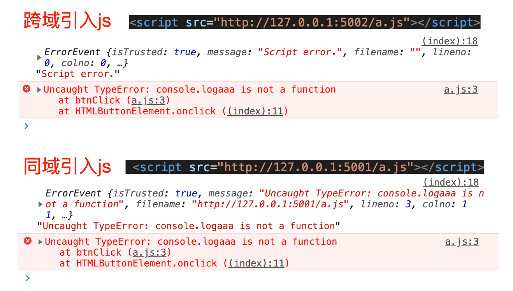
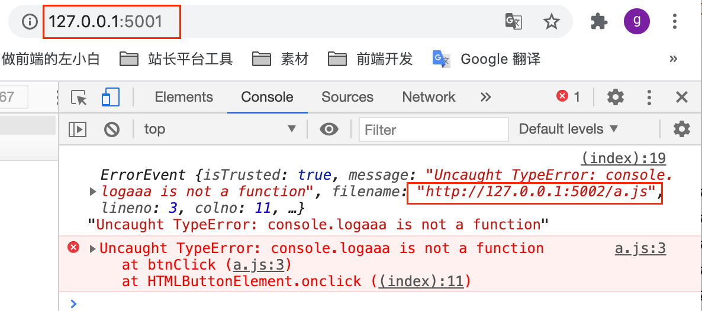

---
{
  "title": "Script error产生原因与解决方法、调试技巧",
  "staticFileName": "script_error.html",
  "author": "guoqzuo",
  "createDate": "2020/11/23",
  "description": "一般为了安全起见，如果当前页面引入了跨域的 js 文件，当这个 js 文件出现错误，监听错误会无法获取对应的行号、真实的错误message。这种情况错误信息就是 Script error。本地来做一个试验，重现该问题，用 koa 写两个服务，分别监听 5001/5002端口，同时开启服务",
  "keywords": "script error,script error是什么错误",
  "category": "JavaScript"
}
---
# Script error产生原因与解决方法、调试技巧
一般为了安全起见，如果当前页面引入了跨域的 js 文件，当这个 js 文件出现错误，监听错误会无法获取对应的行号、真实的错误message。这种情况错误信息就是 Script error.

本地来做一个试验，重现该问题，用 koa 写两个服务，分别监听 5001/5002端口，同时开启服务
```js
/**
 * index_a.js
 * index_b.js 代码和下面的基本一致，只是将 5001 改为 5002
 */
const Koa = require('koa')
const app = new Koa()

app.use(require('koa-static')(__dirname + '/public'))

app.listen('5001', () => {
  console.log('server listen on 5001 port')
})
```
public/index.html 测试页面中，我们引入 5001端口的 a.js 或 5002 端口的 a.js，看具体 error 信息
```html
<body>
  <button onclick="btnClick()">点击</button>
  <script src="http://127.0.0.1:5001/a.js"></script>
  <!-- <script src="http://127.0.0.1:5002/a.js"></script> -->
  <script>
    window.addEventListener('error', e => {
      console.log(e, e.message)
    })
  </script>
</body>
<!-- 
// a.js代码
function btnClick() {
  console.logaaa('aaa') // 故意制造一个错误
}
-- >
```
访问 `http://127.0.0.1:5001/index.html`，然后测试不同端口下执行情况，具体如下图



知道问题后，我们可以通过使用同域的方式引入 js。如果一定要使用跨域的，需要设置下面两点

1. script引入时加入 crossorigin="anonymous"，anonymous 即不发送 Cookie 和 HTTP 认证信息
2. 服务器对应的js，增加允许跨域

```js
// html里
// <script src="http://127.0.0.1:5002/a.js" crossorigin="anonymous"></script>
// index_b.js 5002端口增加允许跨域

const Koa = require('koa')
const app = new Koa()
// 允许跨域
app.use(async (ctx, next) => {
  ctx.set({
    'Access-Control-Allow-Origin': '*',
    'Access-Control-Allow-Headers': '*',
    'Access-Control-Allow-Methods': '*',
    'Access-Control-Allow-Credentials': 'true', // 允许携带cookie
    'Access-Control-Max-Age': 3600 // 对于相同的请求，仅在第一次发送options预检请求，之后1小时内不需要预检请求
  })
  await next()
})
app.use(require('koa-static')(__dirname + '/public'))
app.listen('5002', () => {
  console.log('server listen on 5002 port')
})
```
设置好后，我们再测试就会发现可以正常显示跨域的信息了。如下图，完整demo参见 [跨域Script_error测试demo | github](https://github.com/zuoxiaobai/fedemo/tree/master/src/DebugDemo/%E8%B7%A8%E5%9F%9FScript_error%E6%B5%8B%E8%AF%95)



参考：[Script error.全面解析 | Fundebug](https://blog.fundebug.com/2017/04/05/understand-script-error/)