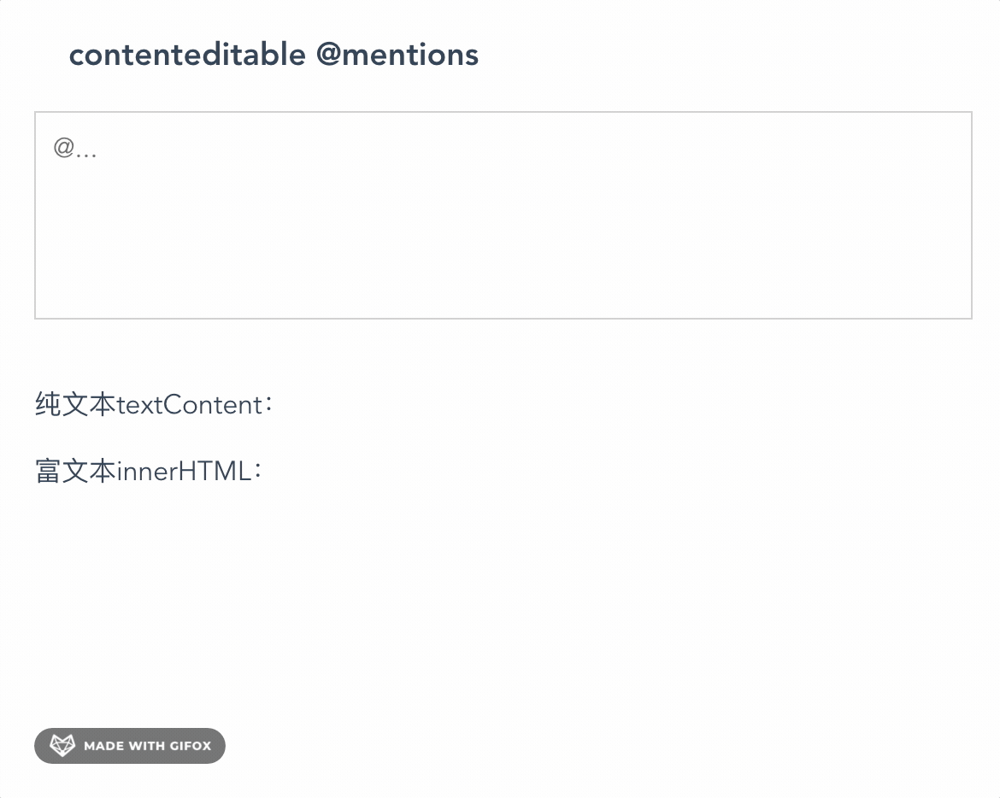

---
{
  "title": "Vue @功能实现",
  "staticFileName": "vue_mentions.html",
  "author": "guoqzuo",
  "createDate": "2020/11/30",
  "description": "如果自己写一个 @ 功能会比较麻烦，在 github 上找了一个现成的开源库 Tribute - ES6 Native @mentions，它是 ES 原生的实现，社区有各种框架的实现。这里我们使用它的 Vue 实现 vue-tribute。下图是实现效果",
  "keywords": "@实现,@功能实现,@下拉选择实现,Vue @功能实现",
  "category": "Vue"
}
---
# Vue @功能实现
如果自己写一个 @ 功能会比较麻烦，在 github 上找了一个现成的开源库：[Tribute](https://github.com/zurb/tribute) - ES6 Native @mentions，它是ES 原生的实现，社区有各种框架的实现。这里我们使用它的 vue 实现 [vue-tribute](https://github.com/syropian/vue-tribute)。下图是实现效果



在线示例：[Vue @功能在线示例](https://www.zuoguoqing.com/at) 对应的 vue 代码如下，需要注意的地方
1. 我们引入 vue-tribute 组件，传入 options 即可
2. 样式方面，需要写弹出选择框的样式，不然就没有样式
3. options 的配置完全是 Tribute 的配置，到对应的 github 上查找即可，options 的可选值支持动态渲染，支持从接口取

```html
<template>
  <div class="container">
    <h3>contenteditable @mentions</h3>
    <vue-tribute :options="options">
      <div
        class="content-editable"
        contenteditable="true"
        @input="valueChange"
        placeholder="@..."
      ></div>
    </vue-tribute>
    <br />
    <div>
      <p>纯文本textContent：</p>
      <p>{{ textContent }}</p>
    </div>
    <div>
      <p>富文本innerHTML：</p>
      <p>{{ innerHTML }}</p>
    </div>
  </div>
</template>
<script>
import VueTribute from "vue-tribute";
export default {
  components: {
    VueTribute
  },
  computed: {},
  data() {
    return {
      textContent: "",
      innerHTML: "",
      options: {
        trigger: "@",
        // specify whether a space is required before the trigger string
        requireLeadingSpace: false,
        noMatchTemplate: "<li>暂无数据</li>",
        values: [
          { key: "张三 zhangsan", value: "张三" },
          { key: "李四 lisi", value: "李四" },
          { key: "王五 wangwu", value: "王五" },
          { key: "周杰伦 zhoujielun", value: "周杰伦" }
        ],
        positionMenu: true,
        selectTemplate: function(item) {
          return (
            '<span contenteditable="false"><a>' +
            "@" +
            item.original.value +
            "</a></span>"
          );
        }
      }
    };
  },
  methods: {
    noMatchFound() {
      console.log("暂无数据");
    },
    valueChange(e) {
      console.log(e.target.innerHTML, e.target.textContent);
      this.textContent = e.target.textContent;
      this.innerHTML = e.target.innerHTML;
    }
  }
};
</script>
<style lang="less">
// Tribute-specific styles 略
</style>
```

完整代码参见：[vue @功能实现demo | github](https://github.com/zuoxiaobai/fedemo/blob/master/src/vuecli-demo/src/views/at/index.vue)
