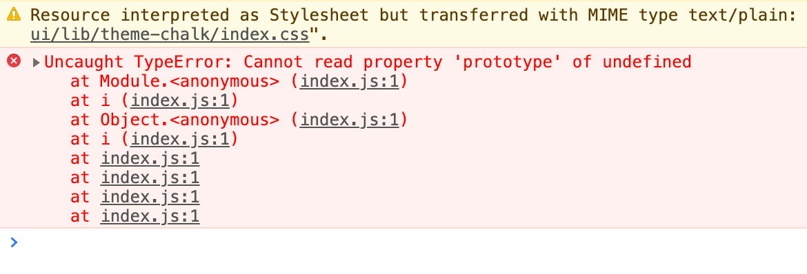

---
{
  "title": "Vue ElementUI Cannot read property 'prototype' of undefined",
  "staticFileName": "vue_element_err.html",
  "author": "guoqzuo",
  "createDate": "2020/11/30",
  "description": "由于 vue 项目 npm run build 打包时 ElementUI 体积较大，因此把他单独抽离出去。放到 public/index.html 里直接引入。但抽离出去后发现启动后控制台会报这样一个错误：Cannot read property 'prototype' of undefined。网上查了下，是因为在 public/index.html 中引入 ElementUI 的 js 时，前面没有加 Vue.js 的引入。这里我们在前面加入 Vue.js 的引入即可。",
  "keywords": "element cannot read property 'prototype' of undefined",
  "category": "Vue"
}
---
# Vue ElementUI Cannot read property 'prototype' of undefined
由于 vue 项目 npm run build 打包时 ElementUI 体积较大，因此把他单独抽离出去。放到 public/index.html 里直接引入。但抽离出去后发现启动后控制台会报这样一个错误：Cannot read property 'prototype' of undefined。



网上查了下，是因为在 public/index.html 中引入 ElementUI 的 js 时，前面没有加 Vue.js 的引入。这里我们在前面加入 Vue.js 的引入即可。

```html
<!-- public/index.html -->
<!-- 引入element组件js前加入vue的引入 -->
<script src="https://cdn.jsdelivr.net/npm/vue"></script>
<script src="https://cdn.bootcdn.net/ajax/libs/element-ui/2.9.2/index.js"></script>
```
在 vue.config.js 里设置 ElementUI以及JS使用外部引入
```js
module.exports = {
  configureWebpack: {
    externals: {
      // 需要使用外部引入的包名：包名
      vue: "Vue",
      "element-ui": "ELEMENT"
    }
  }
};
```