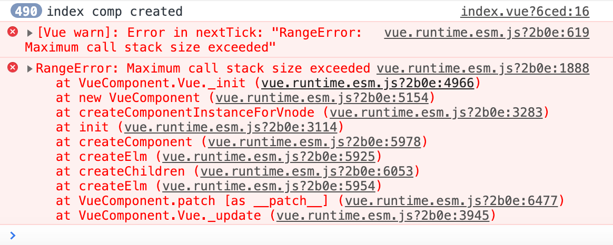

---
{
  "title": "Vue 子组件名称与父组件name相同时死循环的问题",
  "staticFileName": "vue_stacksize_exceeded.html",
  "author": "guoqzuo",
  "createDate": "2020/11/08",
  "description": "在vue项目中，假设父组件name与子组件名称一致，会造成死循环，出现 Error in nextTick: 'RangeError: Maximum call stack size exceeded' 的错误，template在编译时，不会去找 components 引入的组件，而是直接引入自己，形成一个循环引用、递归组件，要特别注意。",
  "keywords": "vue组件循环引用,vue递归组件,Maximum call stack size exceeded",
  "category": "Vue"
}
---

# Vue 子组件名称与父组件name相同时死循环的问题
在vue项目中，假设父组件name与子组件名称一致，会造成死循环，出现 `Error in nextTick: "RangeError: Maximum call stack size exceeded"` 的错误，template在编译时，不会去找 components 引入的组件，而是直接引入自己，形成一个循环引用、递归组件，要特别注意。
```js
<template>
  <div>
    <p>我是index组件</p>
    <test-a></test-a>
  </div>
</template>

<script>
export default {
  components: {
    TestA: () => import("./TestA")
  },
  // name: "testA",
  name: "TestA",
  created() {
    console.log("index comp created");
  }
};
</script>
```



完成demo地址，参考 [subcomp_samename demo| github](https://github.com/dev-zuo/fedemo/tree/master/src/vuecli-demo/src/views/subcomp_samename)