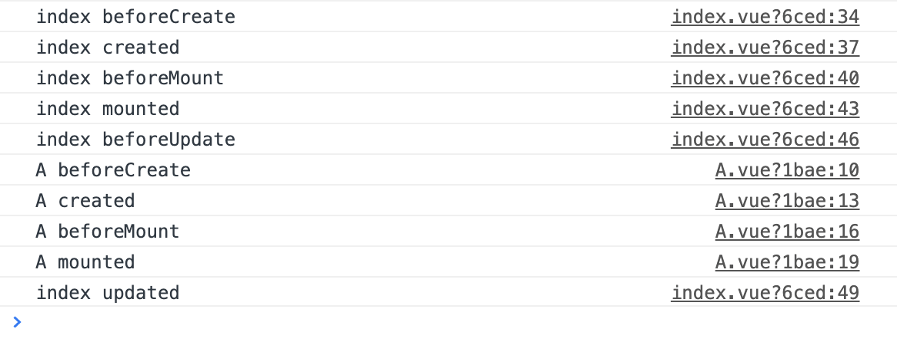

# Vue 父组件在什么时候开始加载子组件，父子组件的钩子函数顺序是什么？
一般父组件会在自身组件 mounted 后，开始加载子组件，下面来通过一个例子来看完整的父子组件钩子函数。下面的例子中在 index.vue 以及 compA.vue 父子组件中都加了对应的钩子函数 console
```html
<!-- index.vue -->
<template>
  <div>
    <comp-a></comp-a>
  </div>
</template>
```
运行后，对应的 console.log 信息如下

- index beforeCreate
- index.vue index created
- index.vue index beforeMount
- index.vue index mounted
- index.vue index beforeUpdate
- A.vue A beforeCreate
- A.vue A created
- A.vue A beforeMount
- A.vue A mounted
- index.vue index updated


父组件 beforeCreate => 父组件 created => 父组件 beforeMount => 父组件 mounted => 父组件 beforeUpdate => 子组件 beforeCreate => 子组件 created => 子组件 beforeMount => 子组件 mounted => 父组件 index updated

如下图，完整demo参见 [父子组件钩子函数demo ｜ github](https://github.com/zuoxiaobai/fedemo/tree/master/src/vuecli-demo/src/views/vuehooks)


