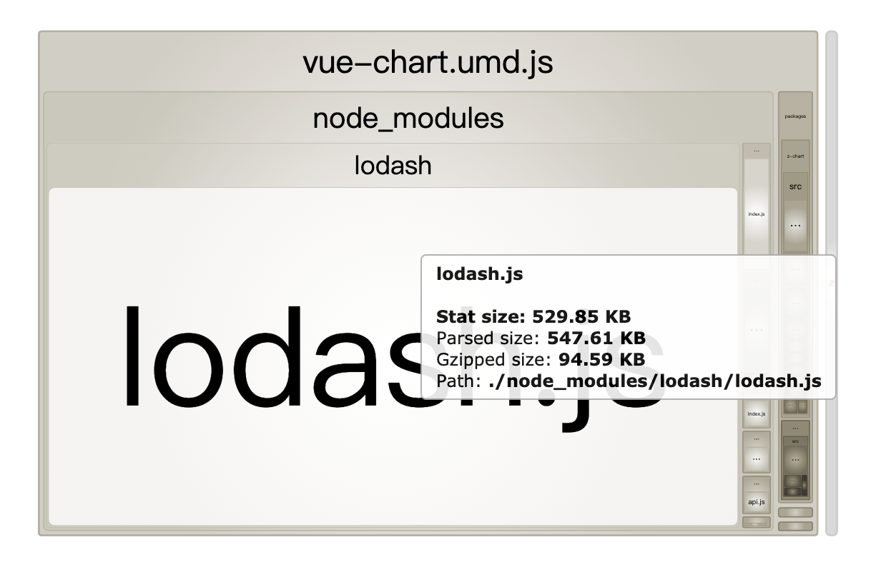

---
{
  "title": "lodash.js 打包后默认是整包，怎么按需打包，减少包体积",
  "staticFileName": "loadsh_as_demand.html",
  "author": "guoqzuo",
  "createDate": "2020/11/30",
  "description": "在 vue-cli 打包 lib 项目时，发现包体积较大有 600多KB，于是使用 `-- report` 参数看具体是哪个包较大，发现尽管只用到了 lodash 的一个函数，但打包体积却有几百k，如下图，应该是整包打的，没有按需打包。 以下是 打开 lib/项目名.umd-report.html 后，显示的各模块大小示意图。这里借助 babel 的 loadsh 插件来进行按需打包。如果没有babel的配置文件，新建 .babelrc 文件，加入如下内容：",
  "keywords": "loadsh按需打包,loadsh tree shaking,loadsh摇树",
  "category": "前端工程化"
}
---
# lodash.js 打包后默认是整包，怎么按需打包，减少包体积
在 vue-cli 打包 lib 项目时，发现包体积较大有 600多KB，于是使用 `-- report` 参数看具体是哪个包较大，发现尽管只用到了 lodash 的一个函数，但打包体积却有几百k，如下图，应该是整包打的，没有按需打包。


```bash
# 以 src/index.js 为入口，以库的形式打包到lib目录下，并生成 report.html
vue-cli-service build --mode lib --target lib --dest lib --report src/index.js
```

以下是 打开 lib/项目名.umd-report.html 后，显示的各模块大小示意图




这里借助 babel 的 loadsh 插件来进行按需打包。如果没有babel的配置文件，新建 .babelrc 文件，加入如下内容：
```js
// .babelrc  使用 lodash 的babel插件
{
  "plugins": ["lodash"]
}
```
lodash 的 babel 插件就是 babel-plugin-lodash，需要先 npm 安装下

```bash
npm install babel-plugin-lodash -D
```
ok后，重新打包，就是按需打包了。如下图，体积只有 100 多 KB 了。


再来看看 report 信息，可以看到，只打包了使用到的函数


