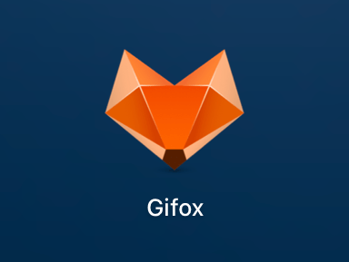
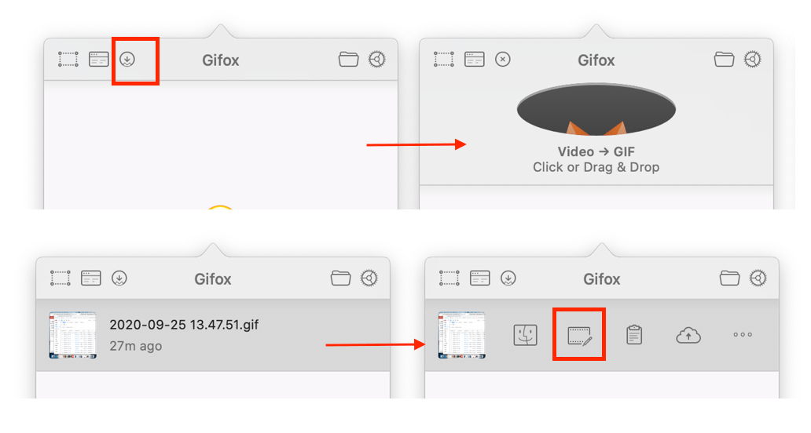
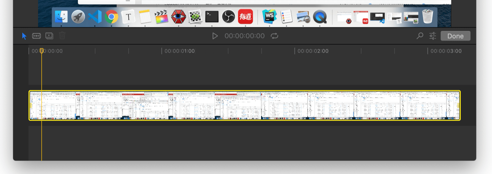

---
{
  "title": "mac下怎么截取屏幕gif图：Gifox",
  "staticFileName": "mac_gif_tools.html",
  "author": "guoqzuo",
  "createDate": "2020/11/08",
  "description": "之前在 windows 下用过一款比较好用的免费 gif 工具。后面在 mac 上，就没怎么做 gif 图了。最开始在 mac 上尝试做 gif 图是使用 QuickTime 录制屏幕后，再搜索在线视频转 gif 图的网站进行转换，比较麻烦。最近发现一个比较好的软件 [Gifox](https://gifox.io/)，我使用的是免费版的，有水印，最大长度限制为10s。升级付费的版本可以去水印(watermark)，且没有10s限制。它功能强大，录制gif很方便",
  "keywords": "mac gif,mac好用的gif工具,mac做gif图",
  "category": "计算机基础与开发工具"
}
---
# mac下怎么截取屏幕gif图：Gifox
之前在 windows 下用过一款比较好用的免费 gif 工具。后面在 mac 上，就没怎么做 gif 图了。最开始在 mac 上尝试做 gif 图是使用 QuickTime 录制屏幕后，再搜索在线视频转 gif 图的网站进行转换，比较麻烦。

最近发现一个比较好的软件 [Gifox](https://gifox.io/)，我使用的是免费版的，有水印，最大长度限制为10s。升级付费的版本可以去水印(watermark)，且没有10s限制。它功能强大，录制gif很方便

功能如下:

1. shift + command + 6 即可录制选中区域进行录制。
2. 录制完成后，可以像剪辑视频一样剪辑gif图，操作简单
3. 导出时，可以调整参数，压缩文件大小
4. 可以直接把QuickTime录制的视频转为gif，并可以剪辑

